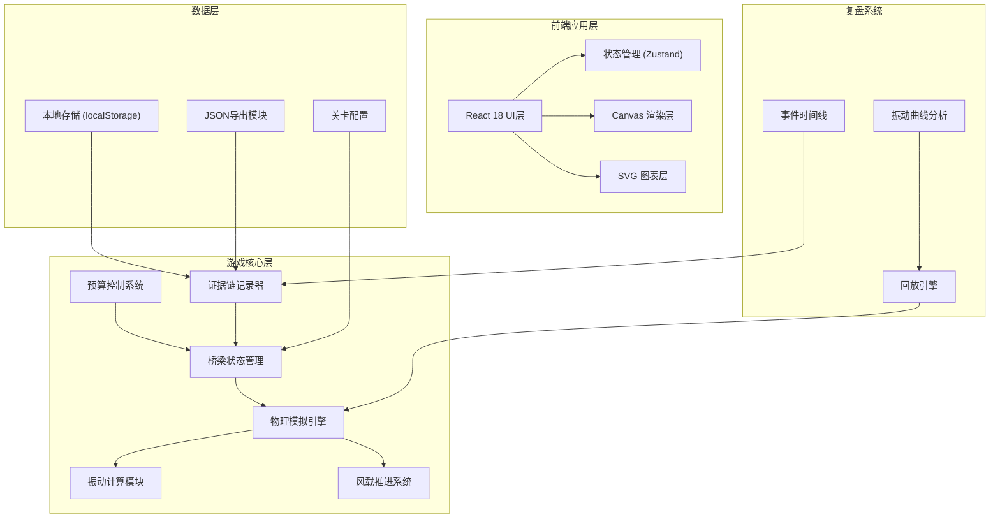

## 1. 架构设计



---

## 2. 技术栈说明

| 层级 | 技术选型 | 版本 | 用途 |
|------|---------|------|------|
| 前端框架 | React | 18.x | 组件化UI开发 |
| 构建工具 | Vite | 5.x | 快速开发构建 |
| 样式方案 | Tailwind CSS | 3.x | 原子化样式 |
| 状态管理 | Zustand | 4.x | 轻量级状态管理 |
| 类型系统 | TypeScript | 5.x | 类型安全 |
| 物理渲染 | Canvas API | - | 桥梁结构实时渲染 |
| 图表渲染 | SVG + Recharts | 2.x | 振动波形图 |
| 图标库 | Lucide React | 0.344.x | 工程风格图标 |

---

## 3. 目录结构

```
src/
├── components/           # React组件
│   ├── game/            # 游戏核心组件
│   │   ├── BridgeCanvas.tsx    # 桥梁画布
│   │   ├── ControlPanel.tsx    # 控制面板
│   │   ├── BudgetBar.tsx       # 预算条
│   │   └── VibrationChart.tsx  # 振动图表
│   ├── menu/            # 菜单组件
│   │   └── LevelSelect.tsx     # 关卡选择
│   ├── replay/          # 复盘组件
│   │   ├── ReplayPlayer.tsx    # 回放播放器
│   │   ├── EventTimeline.tsx   # 事件时间线
│   │   └── ExportPanel.tsx     # 导出面板
│   └── common/          # 公共组件
├── store/               # 状态管理
│   ├── useGameStore.ts       # 游戏状态
│   ├── useBridgeStore.ts     # 桥梁状态
│   └── useReplayStore.ts     # 回放状态
├── engine/              # 游戏引擎
│   ├── PhysicsEngine.ts      # 物理引擎
│   ├── WindSystem.ts         # 风载系统
│   └── EvidenceRecorder.ts   # 证据记录器
├── types/               # 类型定义
│   ├── game.ts              # 游戏类型
│   ├── bridge.ts            # 桥梁类型
│   └── replay.ts            # 回放类型
├── data/                # 配置数据
│   └── levels.ts            # 关卡配置
└── utils/               # 工具函数
    ├── export.ts            # JSON导出
    └── storage.ts           # 本地存储
```

---

## 4. 核心数据模型

### 4.1 桥梁结构数据

```typescript
interface BridgeNode {
  id: string;
  x: number;
  y: number;
  fixed: boolean;      // 是否为固定节点
  mass: number;        // 节点质量
  remark?: string;     // 节点备注
  version: number;     // 版本号
  modifiedAt: number;  // 修改时间戳
  modifier: 'user' | 'system';  // 修改者
}

interface BridgeMember {
  id: string;
  startNodeId: string;
  endNodeId: string;
  type: 'beam' | 'damper' | 'spring';  // 杆件类型
  stiffness: number;   // 刚度系数
  damping: number;     // 阻尼系数
  maxStress: number;   // 最大应力
  currentStress: number;  // 当前应力
  cost: number;        // 成本
}
```

### 4.2 游戏状态数据

```typescript
interface GameState {
  levelId: string;
  phase: 'edit' | 'simulating' | 'paused' | 'success' | 'failed';
  windLevel: number;       // 当前风载等级
  maxWindLevel: number;    // 目标风载等级
  budget: {
    total: number;
    used: number;
    history: BudgetRecord[];
  };
  failReason?: 'resonance' | 'overload' | 'overbudget';
  failDetail?: string;
}

interface BudgetRecord {
  timestamp: number;
  action: string;
  amount: number;
  balance: number;
  remark?: string;
  version: number;
}
```

### 4.3 证据链数据

```typescript
interface EvidenceRecord {
  timestamp: number;
  type: 'node_modify' | 'member_add' | 'member_remove' | 
        'budget_change' | 'wind_level_up' | 'vibration_peak' | 'failure';
  data: Record<string, any>;
  version: number;
  remark?: string;
}

interface ReplayData {
  gameId: string;
  levelId: string;
  startTime: number;
  endTime: number;
  finalScore: number;
  evidenceChain: EvidenceRecord[];
  vibrationHistory: VibrationFrame[];
  budgetHistory: BudgetRecord[];
  bridgeSnapshots: BridgeSnapshot[];
}
```

---

## 5. 物理模拟核心算法

### 5.1 振动微分方程

```typescript
// M·x'' + C·x' + K·x = F(t)
// M: 质量矩阵, C: 阻尼矩阵, K: 刚度矩阵, F: 风载力

function calculateVibration(
  nodes: BridgeNode[],
  members: BridgeMember[],
  windForce: number,
  dt: number
): NodeDisplacement[] {
  // 1. 构建系统矩阵
  const M = buildMassMatrix(nodes);
  const K = buildStiffnessMatrix(nodes, members);
  const C = buildDampingMatrix(K, M);
  
  // 2. 风载时程函数
  const F = windForce * Math.sin(windFrequency * t);
  
  // 3. 纽马克积分法求解
  return newmarkBetaIntegration(M, C, K, F, dt);
}
```

### 5.2 共振检测

```typescript
function detectResonance(
  vibrationHistory: VibrationFrame[],
  threshold: number = 2.5
): boolean {
  const recentAmplitudes = vibrationHistory.slice(-50).map(f => f.amplitude);
  const avgAmplitude = recentAmplitudes.reduce((a, b) => a + b) / recentAmplitudes.length;
  const naturalFreq = calculateNaturalFrequency();
  
  // 当风载频率接近固有频率且振幅超过阈值
  return Math.abs(windFreq - naturalFreq) < 0.1 && avgAmplitude > threshold;
}
```

---

## 6. 证据链导出格式

```json
{
  "gameId": "bridge_game_20240531_142356",
  "levelId": "level_1",
  "timestamp": 1717155836000,
  "result": "success",
  "finalScore": 850,
  "maxWindLevel": 10,
  "budget": {
    "total": 10000,
    "used": 8750,
    "records": [...]
  },
  "bridge": {
    "nodes": [...],
    "members": [...]
  },
  "evidenceChain": [
    {
      "timestamp": 1717155836000,
      "type": "node_modify",
      "version": 1,
      "data": {
        "nodeId": "n1",
        "oldRemark": "初始节点",
        "newRemark": "改为左侧支点",
        "modifiedBy": "user"
      }
    }
  ],
  "vibrationAnalysis": {
    "peakAmplitude": 3.2,
    "resonanceDetected": false,
    "maxStressRatio": 0.78
  }
}
```

---

## 7. 性能优化策略

1. **Canvas分层渲染**：静态桥梁结构与动态振动分离
2. ** requestAnimationFrame 同步**：物理计算与渲染帧同步
3. **振动数据采样**：高频数据降采样存储
4. **Web Worker 物理计算**：复杂矩阵运算移至Worker线程
5. **虚拟滚动**：长事件时间线虚拟渲染

