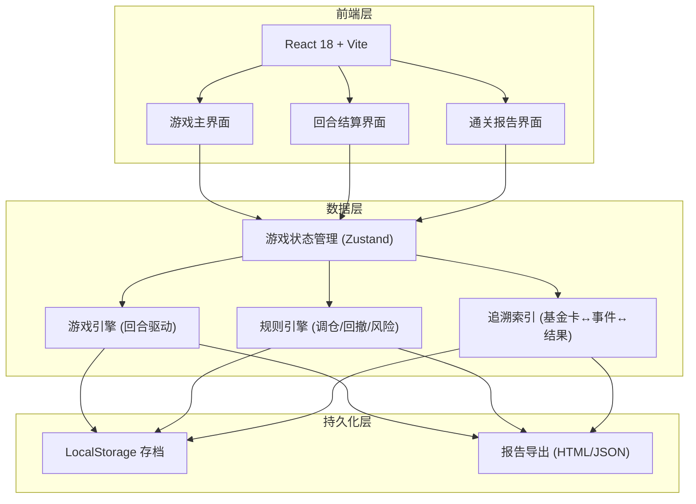
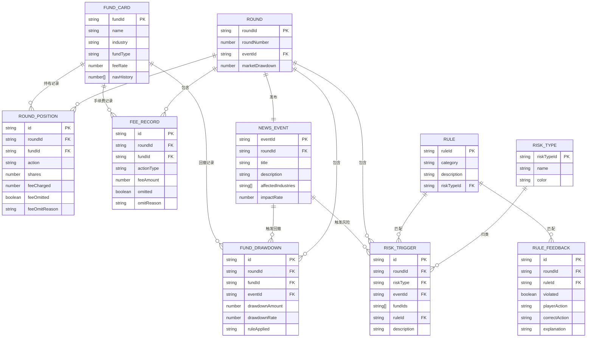

## 1. 架构设计



## 2. 技术说明

- 前端：React@18 + TailwindCSS@3 + Vite
- 状态管理：Zustand（轻量、可序列化存档）
- 初始化工具：Vite
- 后端：无（纯前端，本地运算）
- 数据持久化：LocalStorage + 报告导出

## 3. 路由定义

| 路由 | 用途 |
|------|------|
| / | 游戏入口页，选择开始新局或继续存档 |
| /game | 游戏主界面（基金卡牌+风险槽+新闻事件+操作面板） |
| /settlement/:roundId | 回合结算界面（回撤明细+手续费明细+规则反馈） |
| /report | 通关报告界面（分项风险+追溯链路+导出） |

## 4. 核心数据模型

### 4.1 数据模型定义



### 4.2 数据定义

```typescript
interface FundCard {
  fundId: string;
  name: string;
  industry: string;
  fundType: "股票型" | "混合型" | "债券型" | "货币型";
  feeRate: number;
  navHistory: number[];
}

interface NewsEvent {
  eventId: string;
  roundId: string;
  title: string;
  description: string;
  affectedIndustries: string[];
  impactRate: number;
}

interface Round {
  roundId: string;
  roundNumber: number;
  eventId: string;
  marketDrawdown: number;
}

interface RoundPosition {
  id: string;
  roundId: string;
  fundId: string;
  action: "买入" | "卖出" | "持有";
  shares: number;
  feeCharged: number;
  feeOmitted: boolean;
  feeOmitReason: string;
}

interface FundDrawdown {
  id: string;
  roundId: string;
  fundId: string;
  eventId: string;
  drawdownAmount: number;
  drawdownRate: number;
  ruleApplied: string;
}

interface FeeRecord {
  id: string;
  roundId: string;
  fundId: string;
  actionType: string;
  feeAmount: number;
  omitted: boolean;
  omitReason: string;
}

interface RiskTrigger {
  id: string;
  roundId: string;
  riskType: "行业集中" | "手续费漏扣" | "恐慌卖出";
  eventId: string;
  fundIds: string[];
  ruleId: string;
  description: string;
}

interface RuleFeedback {
  id: string;
  roundId: string;
  ruleId: string;
  violated: boolean;
  playerAction: string;
  correctAction: string;
  explanation: string;
}

interface TraceLink {
  fundId: string;
  eventId: string;
  drawdownId: string;
  feeRecordId: string;
  roundId: string;
}

interface GameReport {
  totalScore: number;
  riskBreakdown: {
    industryConcentration: RiskSection;
    feeOmission: RiskSection;
    panicSelling: RiskSection;
  };
  traceLinks: TraceLink[];
  rounds: RoundReport[];
}

interface RiskSection {
  totalTriggers: number;
  triggers: RiskTrigger[];
  affectedFunds: string[];
  affectedRounds: string[];
}

interface RoundReport {
  roundId: string;
  roundNumber: number;
  drawdowns: FundDrawdown[];
  fees: FeeRecord[];
  feedbacks: RuleFeedback[];
  riskTriggers: RiskTrigger[];
}
```

## 5. 规则引擎设计

### 5.1 回合调仓规则

| 规则ID | 规则描述 | 风险类型 |
|--------|----------|----------|
| REBAL-01 | 单回合买入同一行业基金超过2只，触发行业集中风险 | 行业集中 |
| REBAL-02 | 卖出操作未扣手续费，触发手续费漏扣风险 | 手续费漏扣 |
| REBAL-03 | 单回合卖出超过3只基金，触发恐慌卖出风险 | 恐慌卖出 |
| REBAL-04 | 调仓后债券型占比低于20%，增加回撤风险敞口 | 行业集中 |

### 5.2 回撤结算规则

| 规则ID | 规则描述 | 风险类型 |
|--------|----------|----------|
| DRAW-01 | 基金行业匹配新闻事件受影响行业时，按影响率计算回撤 | 行业集中 |
| DRAW-02 | 已触发行业集中的基金，回撤幅度额外增加30% | 行业集中 |
| DRAW-03 | 手续费漏扣的基金，结算时补扣漏扣金额+滞纳金 | 手续费漏扣 |
| DRAW-04 | 恐慌卖出的基金，按卖出时净值与回合末净值差计算额外损失 | 恐慌卖出 |

### 5.3 追溯索引

每条结算记录（FundDrawdown / FeeRecord / RiskTrigger）均保存 fundId + eventId + roundId，通关报告构建 TraceLink 表，支持：
- 正向追溯：基金卡 → 持仓操作 → 结算结果 → 新闻事件
- 反向追溯：新闻事件 → 受影响基金 → 结算结果 → 基金卡
