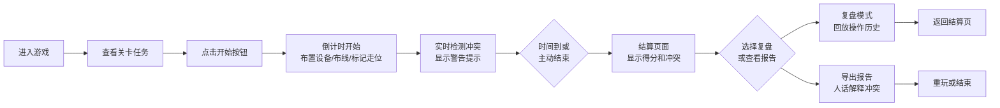

## 1. 产品概述

"乐队设备抢修夜"是一款面向演出制作团队的网格调度训练游戏，通过模拟演出前的设备布置场景，训练团队成员在有限时间内合理规划设备摆放、线缆布线和乐手走位的优先级决策能力。

- 核心目标：让演出制作老师通过游戏化方式训练设备调度和冲突预判能力
- 目标用户：演出制作人员、舞台技术团队、现场执行人员
- 产品价值：将抽象的现场调度经验转化为可重复训练的游戏关卡，降低现场事故率

## 2. 核心特征

### 2.1 用户角色

| 角色 | 注册方式 | 核心权限 |
|------|----------|----------|
| 演出制作人员 | 无需注册，浏览器直接访问 | 完整游戏体验、报告导出 |

### 2.2 功能模块

1. **游戏主界面**：舞台网格、设备工具箱、操作面板、计时系统
2. **冲突检测系统**：实时检测线缆穿越、设备遮挡、走位冲突
3. **游戏流程控制**：开始、暂停、继续、重开功能
4. **结算页面**：得分统计、冲突明细、扣分说明
5. **复盘模式**：回放操作历史、冲突点标记、优化建议
6. **报告导出**：人话版冲突解释、可分享的最终报告

### 2.3 页面详情

| 页面名称 | 模块名称 | 功能描述 |
|----------|----------|----------|
| 游戏主界面 | 舞台网格区域 | 8x6网格，可放置设备、布线缆、标记走位 |
| 游戏主界面 | 设备工具箱 | 音箱、麦克风架、效果器、DI盒等设备拖拽放置 |
| 游戏主界面 | 操作工具栏 | 选择、放置、删除、布线、走位标记工具 |
| 游戏主界面 | 状态面板 | 倒计时、当前得分、冲突数量实时显示 |
| 游戏主界面 | 控制按钮 | 开始、暂停、重开、结束按钮 |
| 结算页面 | 得分总览 | 基础分、扣分、最终得分展示 |
| 结算页面 | 冲突明细 | 按类型分类展示所有冲突及扣分原因 |
| 结算页面 | 复盘入口 | 进入复盘模式查看操作历史 |
| 复盘页面 | 时间轴回放 | 可逐步回放所有操作，高亮冲突发生时刻 |
| 报告页面 | 人话解释 | 将技术冲突转化为易懂的自然语言说明 |
| 报告页面 | 导出分享 | 复制报告文本、生成分享链接 |

## 3. 核心流程

玩家进入游戏后查看当前关卡的任务目标（需要放置的设备列表、需要连接的线缆、乐手走位要求），点击开始后倒计时启动。玩家通过工具栏选择工具，在舞台网格上放置设备、拉接线缆、标记走位路径。系统实时检测三类冲突并给出警告提示。时间结束或玩家主动结束后进入结算页，展示最终得分和所有冲突明细。玩家可选择进入复盘模式回放操作过程，或导出人话版报告分享给非技术同事。

## 4. 界面设计

### 4.1 设计风格

**设计方向：演唱会后台工业风 + 霓虹灯科技感**

- **主色调**：深灰蓝 (#0F172A) 作为背景主色，营造专业严肃的后台氛围
- **强调色**：霓虹紫 (#A855F7) 用于设备选中状态，霓虹橙 (#F97316) 用于冲突警告，霓虹绿 (#10B981) 用于正常状态
- **中性色**：石板灰系列用于边框、分割线、文字层级
- **字体**：展示字体使用 "Space Grotesk"，数字和等宽信息使用 "JetBrains Mono"，正文使用 "Noto Sans SC"
- **按钮风格**：直角切角设计，轻微3D凸起感，hover时有霓虹发光效果
- **布局风格**：仪表盘式布局，左侧工具箱，中间舞台网格，右侧状态面板
- **图标**：lucide-react 线性图标，配合霓虹色彩填充

### 4.2 页面设计概览

| 页面名称 | 模块名称 | UI元素 |
|----------|----------|----------|
| 游戏主界面 | 顶部标题栏 | 游戏logo、关卡名称、版本信息、帮助按钮 |
| 游戏主界面 | 左侧工具箱 | 设备分类标签、设备卡片（带图标和名称）、拖拽提示 |
| 游戏主界面 | 中央舞台区 | 8x6网格线、坐标标注、放置预览、冲突高亮闪烁 |
| 游戏主界面 | 底部工具栏 | 工具切换按钮（选择/放置/布线/走位/删除）、撤销/重做 |
| 游戏主界面 | 右侧状态栏 | 倒计时圆环、当前得分、冲突计数、任务清单 |
| 游戏主界面 | 控制按钮区 | 开始/暂停/重开/结束大按钮，带状态变色 |
| 结算页面 | 头部得分区 | 大字号最终得分、评级徽章、基础分/扣分明细 |
| 结算页面 | 冲突列表区 | 分类标签页（线缆/设备/走位）、冲突卡片、扣分标签 |
| 结算页面 | 操作区 | 复盘按钮、报告按钮、重玩按钮 |
| 复盘页面 | 时间轴 | 滑动条、关键帧标记、播放/暂停/上一帧/下一帧 |
| 复盘页面 | 舞台区 | 历史状态重现、冲突点放大高亮 |
| 报告页面 | 报告正文 | 人话解释段落、冲突示意图标注、改进建议清单 |
| 报告页面 | 操作区 | 复制全文、打印、返回 |

### 4.3 响应式设计

- **桌面优先**：主要面向1280px以上桌面设备，保证舞台网格有足够显示空间
- **平板适配**：1024px时自动调整工具箱为顶部横向排列，状态栏移至底部
- **触控优化**：按钮最小尺寸44x44px，拖拽操作支持触摸事件，增加触觉反馈

### 4.4 动画与交互

- **页面加载**：元素从四周向中心汇聚入场，霓虹灯逐一点亮效果
- **设备放置**：放置时网格单元有波纹扩散动画，设备图标弹性缩放
- **冲突检测**：冲突位置有红色闪烁边框，伴随轻微震动效果
- **布线过程**：线缆从起点到终点有绘制动画，转角处有节点高亮
- **按钮交互**：hover时按钮边框发光，点击时有按压缩放反馈
- **倒计时**：最后10秒数字变红并跳动，每秒有提示音
