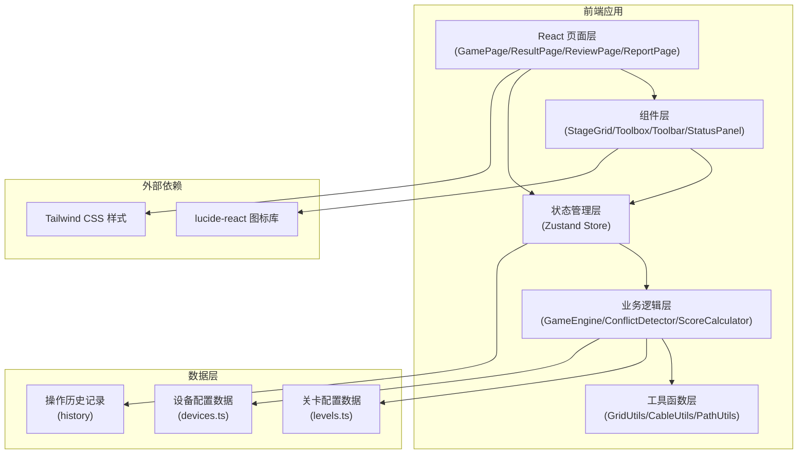

## 1. 架构设计



## 2. 技术选型说明

- **前端框架**：React@18 + TypeScript，提供类型安全和组件化开发体验
- **构建工具**：Vite，快速的开发服务器和构建性能
- **样式方案**：Tailwind CSS@3，原子化CSS配合自定义主题
- **状态管理**：Zustand，轻量级状态管理，适合游戏状态追踪
- **路由**：React Router DOM，管理游戏各页面跳转
- **图标**：lucide-react，统一的线性图标库

## 3. 路由定义

| 路由 | 页面组件 | 用途 |
|------|----------|------|
| / | GamePage | 游戏主界面，包含舞台网格、工具箱、操作面板 |
| /result | ResultPage | 结算页面，展示得分和冲突明细 |
| /review | ReviewPage | 复盘页面，操作历史回放 |
| /report | ReportPage | 报告页面，人话版冲突解释和导出 |

## 4. 数据模型

### 4.1 核心数据结构

```typescript
// 网格坐标
interface Position {
  x: number;
  y: number;
}

// 设备类型
interface Device {
  id: string;
  type: 'speaker' | 'mic_stand' | 'mixer' | 'effect_pedal' | 'di_box' | 'monitor';
  name: string;
  icon: string;
  size: { width: number; height: number };
  priority: number;
  score: number;
}

// 已放置的设备实例
interface PlacedDevice {
  id: string;
  deviceType: string;
  position: Position;
  placedAt: number;
}

// 线缆连接
interface Cable {
  id: string;
  from: Position;
  to: Position;
  color: string;
  points: Position[];
}

// 走位路径
interface WalkPath {
  id: string;
  musician: string;
  points: Position[];
  color: string;
}

// 冲突类型
interface Conflict {
  id: string;
  type: 'cable_cross' | 'device_block' | 'walk_conflict';
  severity: 'warning' | 'error';
  positions: Position[];
  description: string;
  penalty: number;
  involvedElements: string[];
}

// 操作记录
interface Action {
  id: string;
  type: 'place_device' | 'remove_device' | 'draw_cable' | 'remove_cable' | 'draw_path' | 'remove_path';
  timestamp: number;
  payload: any;
}

// 游戏状态
interface GameState {
  status: 'idle' | 'playing' | 'paused' | 'finished';
  timeLeft: number;
  totalTime: number;
  score: number;
  baseScore: number;
  penalties: number;
  level: Level;
  placedDevices: PlacedDevice[];
  cables: Cable[];
  walkPaths: WalkPath[];
  conflicts: Conflict[];
  history: Action[];
  currentTool: ToolType;
  selectedDevice: string | null;
}

// 关卡配置
interface Level {
  id: string;
  name: string;
  version: string;
  source: string;
  description: string;
  timeLimit: number;
  gridSize: { width: number; height: number };
  requiredDevices: { type: string; count: number }[];
  requiredCables: { from: string; to: string }[];
  requiredPaths: { musician: string; count: number }[];
  blockedAreas: Position[];
}
```

### 4.2 冲突检测算法

**线缆穿越检测**：
- 对每两条线缆，使用线段相交算法检测是否有交点
- 若交点不是线缆端点，则判定为穿越冲突
- 记录交叉点坐标、涉及的线缆ID、扣分

**设备遮挡检测**：
- 检查设备占用的网格单元是否与其他设备重叠
- 检查设备是否放置在禁止区域
- 检查线缆起点/终点是否有对应设备

**走位冲突检测**：
- 检查走位路径是否穿过设备占用区域
- 检查多条走位路径是否在同一网格交叉
- 检查走位路径是否与线缆密集区域重叠

## 5. 目录结构

```
src/
├── components/
│   ├── StageGrid.tsx          # 舞台网格组件
│   ├── Toolbox.tsx            # 设备工具箱
│   ├── Toolbar.tsx            # 操作工具栏
│   ├── StatusPanel.tsx        # 状态面板
│   ├── CountdownTimer.tsx     # 倒计时组件
│   ├── ConflictBadge.tsx      # 冲突标记组件
│   └── DeviceCard.tsx         # 设备卡片组件
├── pages/
│   ├── GamePage.tsx           # 游戏主页面
│   ├── ResultPage.tsx         # 结算页面
│   ├── ReviewPage.tsx         # 复盘页面
│   └── ReportPage.tsx         # 报告页面
├── store/
│   └── useGameStore.ts        # Zustand状态管理
├── engine/
│   ├── GameEngine.ts          # 游戏引擎核心
│   ├── ConflictDetector.ts    # 冲突检测器
│   └── ScoreCalculator.ts     # 分数计算器
├── utils/
│   ├── gridUtils.ts           # 网格计算工具
│   ├── cableUtils.ts          # 线缆计算工具
│   └── pathUtils.ts           # 路径计算工具
├── data/
│   ├── levels.ts              # 关卡配置
│   └── devices.ts             # 设备配置
├── types/
│   └── index.ts               # TypeScript类型定义
├── hooks/
│   └── useGameTimer.ts        # 游戏计时器Hook
├── App.tsx
├── main.tsx
└── index.css
```

## 6. 版本追踪设计

为满足"来源和版本要留住"的需求，设计如下元数据追踪机制：

- **关卡元数据**：每个关卡配置包含 `source`（来源，如"2024巡演北京站"）、`version`（版本号，如"v1.2"）、`createdAt`、`updatedAt`
- **操作历史**：每个操作记录包含精确时间戳、操作类型、操作人（可配置）
- **报告元数据**：导出的报告包含游戏版本、关卡版本、游戏时间戳、最终得分等信息
- **冲突溯源**：每个冲突记录关联到产生冲突的具体操作ID，可在复盘中定位
