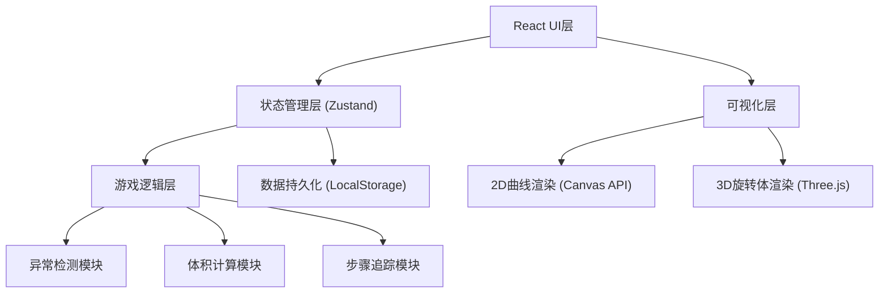
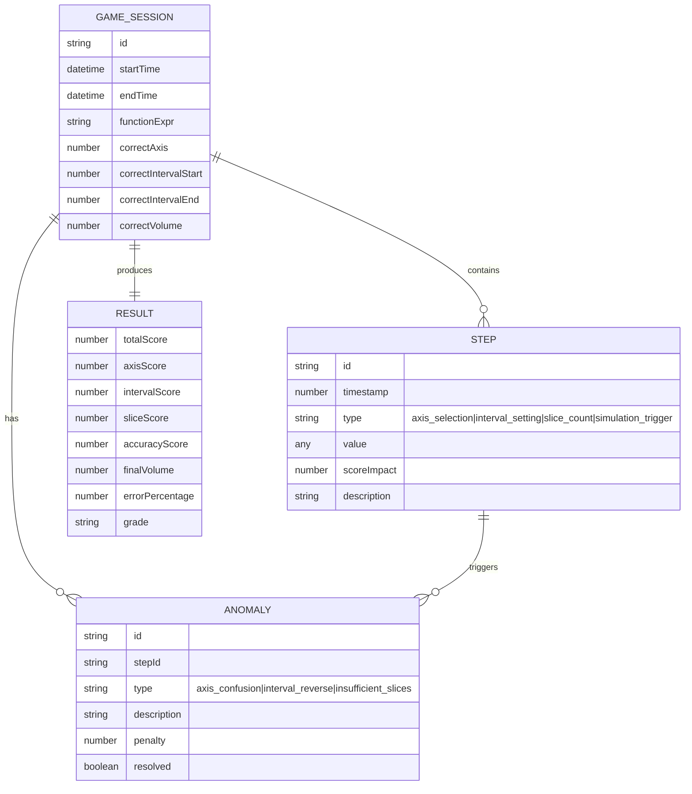

## 1. 架构设计

纯前端单页应用，采用分层架构设计，状态管理集中处理游戏逻辑，UI层与业务逻辑分离。



## 2. 技术描述

- **前端框架**：React 18 + TypeScript 5
- **构建工具**：Vite 5
- **样式方案**：TailwindCSS 3
- **状态管理**：Zustand（轻量级，适合游戏状态追踪）
- **3D渲染**：Three.js + @react-three/fiber + @react-three/drei
- **2D曲线**：原生Canvas API
- **动画**：Framer Motion（步骤过渡、异常提示动画）
- **图标**：Lucide React
- **后端**：无，纯前端应用
- **数据库**：LocalStorage 存储游戏历史记录

## 3. 路由定义

| 路由 | 页面组件 | 功能描述 |
|------|----------|----------|
| `/` | `GamePage` | 游戏主界面，包含曲线展示、操作面板、3D可视化 |
| `/result` | `ResultPage` | 结算页面，成绩明细、异常清单、步骤回放 |

## 4. 数据模型

### 4.1 数据模型定义



### 4.2 TypeScript 类型定义

```typescript
// 游戏会话
interface GameSession {
  id: string;
  startTime: number;
  endTime?: number;
  function: {
    expr: string;       // 函数表达式，如 "x^2"
    correctAxis: 'x' | 'y';
    correctInterval: [number, number];
    correctVolume: number;
  };
  playerInput: {
    selectedAxis?: 'x' | 'y';
    interval?: [number, number];
    sliceCount?: number;
  };
  steps: Step[];
  anomalies: Anomaly[];
  result?: GameResult;
  status: 'playing' | 'completed';
}

// 操作步骤
interface Step {
  id: string;
  timestamp: number;
  type: 'axis_selection' | 'interval_setting' | 'slice_count' | 'simulation_trigger';
  value: any;
  scoreImpact: number;
  description: string;
  isSimulationTrigger: boolean;
}

// 异常记录
interface Anomaly {
  id: string;
  stepId: string;
  type: 'axis_confusion' | 'interval_reverse' | 'insufficient_slices';
  description: string;
  penalty: number;
  resolved: boolean;
}

// 游戏结果
interface GameResult {
  totalScore: number;
  breakdown: {
    axisScore: number;
    intervalScore: number;
    sliceScore: number;
    accuracyScore: number;
  };
  calculatedVolume: number;
  errorPercentage: number;
  grade: 'A' | 'B' | 'C' | 'D' | 'F';
}

// 游戏状态
interface GameState {
  currentSession: GameSession | null;
  history: GameSession[];
  currentPhase: 'function' | 'axis' | 'interval' | 'slice' | 'simulation' | 'result';
}
```

## 5. 核心模块设计

### 5.1 异常检测模块

| 异常类型 | 检测条件 | 扣分 | 提示文案 |
|----------|----------|------|----------|
| 轴线混淆 | 选择的旋转轴与正确答案不一致 | -20分 | "⚠️ 轴线混淆：你选择了{selected}轴，但应该绕{correct}轴旋转" |
| 区间反向 | 区间起始值 > 区间结束值 | -15分 | "⚠️ 区间反向：积分上限应大于下限，已自动修正" |
| 切片过少 | 切片数量 < 10 | -10分 | "⚠️ 切片过少：少于10片会导致较大误差，建议增加切片数" |

### 5.2 体积计算模块

- **圆盘法**：V = π × ∫[a,b] f(x)² dx
- **圆柱壳法**：V = 2π × ∫[a,b] x × f(x) dx
- **数值积分**：使用 Simpson 法或 Riemann 和（根据切片数）
- **误差计算**：|计算值 - 真实值| / 真实值 × 100%

### 5.3 步骤追踪模块

- 每次用户操作自动记录 Step
- 标记触发切片模拟的关键节点
- 记录每步操作的得分影响
- 支持时间轴回放与单步重播
