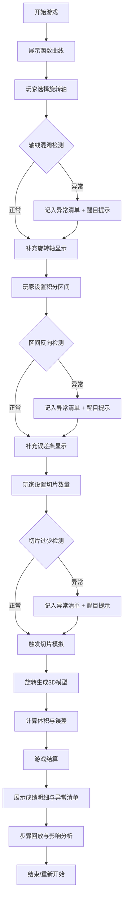

## 1. 产品概述

"微积分切片工厂"是一款面向大学微积分课堂的教育互动游戏，通过工厂流水线隐喻帮助学生理解旋转体体积计算原理，解决学生混淆旋转轴、区间方向判断错误等常见问题。

- 核心目标：让学生在模拟切片、旋转的过程中直观理解积分原理，每一步选择都会影响最终结果
- 目标用户：大学微积分课程学生与助教
- 独特价值：将"来源-判断-结果"串联，错误醒目提示，支持步骤回溯与成绩归因

## 2. 核心特征

### 2.1 用户角色

| 角色 | 注册方式 | 核心权限 |
|------|----------|----------|
| 学生玩家 | 无需注册，直接开始 | 完成游戏关卡、查看个人错误分析 |
| 助教观察者 | 无需注册，进入回放模式 | 查看完整步骤回放、分析学生错误分布 |

### 2.2 功能模块

1. **游戏主界面**：函数曲线展示区、控制面板、工厂流水线状态区
2. **切片模拟模块**：切片数量设置、厚度计算、可视化切片过程
3. **旋转操作模块**：旋转轴选择、360度旋转动画、体积计算
4. **异常检测模块**：轴线混淆检测、区间反向检测、切片过少检测
5. **步骤回放模块**：完整操作历史、触发节点标记、错误影响分析
6. **成绩报告模块**：得分明细、异常清单、错误原因解析

### 2.3 页面详情

| 页面名称 | 模块名称 | 功能描述 |
|----------|----------|----------|
| 游戏主页面 | 曲线展示区 | 动态绘制函数曲线，支持后续补充旋转轴和误差条，不覆盖已有判断 |
| 游戏主页面 | 操作控制面板 | 选择旋转轴、设置区间、调整切片数量，每步操作即时影响流水线状态 |
| 游戏主页面 | 工厂状态区 | 实时显示当前工序、异常警报、进度指示 |
| 游戏主页面 | 3D可视化区 | 展示旋转体生成过程、切片堆叠效果 |
| 结算页面 | 成绩明细 | 分项得分，正常与异常条目分开展示 |
| 结算页面 | 异常清单 | 醒目展示轴线混淆、区间反向、切片过少等问题 |
| 结算页面 | 步骤回放 | 时间轴回放，标记触发切片模拟的关键节点 |
| 结算页面 | 影响分析 | 展示每步操作如何影响最终成绩的因果链 |

## 3. 核心流程

玩家进入游戏后，首先看到函数曲线（旋转轴和误差条后续补充），需要依次选择旋转轴、确定积分区间、设置切片数量，系统实时检测操作异常，最终结算时展示完整步骤回放和错误分析。

## 4. 用户界面设计

### 4.1 设计风格

- **主色调**：工业深蓝 #165DFF 作为主色，警示红 #F53F3F 用于异常提示，工厂灰 #86909C 作为中性色
- **视觉主题**：工业工厂风格，流水线元素、齿轮装饰、警告灯效
- **按钮风格**：圆角矩形，带轻微阴影，异常按钮带脉冲动画
- **字体**：标题使用 JetBrains Mono（等宽技术感），正文使用 Helvetica Neue
- **布局风格**：三栏式布局，左侧曲线可视化，中间操作面板，右侧状态与异常区
- **异常醒目设计**：异常条目使用红底白字、闪烁边框、警告图标三重强调

### 4.2 页面设计概述

| 页面名称 | 模块名称 | UI元素 |
|----------|----------|--------|
| 游戏主页面 | 曲线展示区 | 坐标系网格、动态函数曲线、可拖拽区间手柄、旋转轴标注 |
| 游戏主页面 | 操作面板 | 单选按钮组（旋转轴）、数值输入框（区间）、滑块（切片数）、确认按钮 |
| 游戏主页面 | 工厂状态区 | 工序进度条、异常警报灯、当前得分预览 |
| 游戏主页面 | 3D可视化区 | Three.js 渲染的旋转体、切片动画、体积数值显示 |
| 结算页面 | 成绩总览 | 大号得分数字、评级徽章、完成时间 |
| 结算页面 | 明细区分栏 | 正常操作列表（浅色背景）、异常清单（红色背景+边框） |
| 结算页面 | 步骤回放 | 时间轴滑块、播放/暂停按钮、关键节点标记点 |
| 结算页面 | 影响分析 | 因果链流程图、每步操作得分变化箭头 |

### 4.3 响应式

- 桌面端优先，三栏布局
- 平板端改为上下布局，可视化区在上，操作区在下
- 移动端简化为单栏滚动，保留核心操作和异常提示
- 所有交互元素最小触摸尺寸 44x44px

### 4.4 3D场景指导

- **环境**：工业车间背景，轻微噪点纹理，冷色调光照
- **光照**：主光源45度角，辅助光填充阴影，边缘光勾勒旋转体轮廓
- **相机**：默认45度俯视，支持鼠标拖拽旋转、滚轮缩放
- **交互**：切片生成时有逐个出现的动画，旋转时有360度缓慢旋转展示
- **后处理**：轻微泛光效果突出数值显示，异常时屏幕边缘红色闪烁
