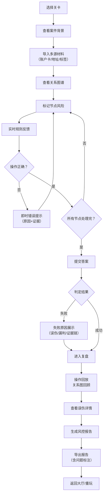

## 1. 产品概述
"风控黑名单追踪局"是一款面向金融风控培训师的互动教学游戏，通过模拟真实风控场景，帮助学员理解关系链过长、设备共享误伤、标签滞后三大核心痛点对风控结论的影响。产品采用关卡制设计，强调规则反馈的即时性、失败提示的明确性和复盘功能的完整性，让抽象的风控概念变得可感知、可操作。

- 核心价值：将复杂风控逻辑转化为可交互的游戏体验，降低培训成本，提升学习效果
- 目标用户：金融风控培训师、风控从业人员、银行/消金/支付机构风控部门新员工
- 解决问题：传统风控培训依赖理论讲解，学员难以直观理解关系链传导、设备关联误伤、标签时效性滞后等抽象概念

## 2. 核心特性

### 2.1 用户角色
| 角色 | 注册方式 | 核心权限 |
|------|----------|----------|
| 培训学员 | 无需注册，直接进入 | 完成关卡、查看复盘、导出报告 |
| 培训师 | 无需注册 | 可查看所有关卡答案、使用案例教学 |

### 2.2 功能模块
1. **首页大厅**：关卡选择、游戏说明、规则介绍
2. **游戏主界面**：关系图谱可视化、材料面板、操作区、规则反馈区
3. **复盘页面**：完整操作回放、关系图展示、误伤标记、报告导出
4. **报告预览**：风险报告生成、包含问题标注、可导出为文本/图片

### 2.3 页面详情
| 页面名称 | 模块名称 | 功能描述 |
|----------|----------|----------|
| 首页大厅 | 关卡列表 | 3个难度递进的关卡，分别侧重关系链过长、设备共享误伤、标签滞后 |
| 首页大厅 | 规则说明 | 三大核心知识点讲解：关系链传导逻辑、设备指纹原理、标签时效性 |
| 游戏主界面 | 关系图谱区 | 可视化展示账户、设备、地址之间的关联关系，节点可点击查看详情 |
| 游戏主界面 | 材料导入面板 | 区分原始材料（不同来源的账户卡、地址线索、风险标签）和处理结果（标记后的节点） |
| 游戏主界面 | 操作控制区 | 标记黑名单、标记安全、撤销操作、提交答案按钮 |
| 游戏主界面 | 规则反馈区 | 实时显示当前操作是否符合规则，错误操作即时提示原因 |
| 游戏主界面 | 失败提示层 | 标记错误时弹出明确的失败原因，标注是误伤还是漏判，展示证据链 |
| 复盘页面 | 操作时间线 | 完整回放玩家每一步操作，可暂停、快进、后退 |
| 复盘页面 | 关系图回顾 | 最终关系图谱展示，标注所有误判节点和漏判节点 |
| 复盘页面 | 误伤详情 | 专门展示设备共享误伤案例，说明为何某节点被误判 |
| 复盘页面 | 报告导出 | 生成完整风控报告，包含关系链过长说明、设备误伤标注、标签滞后提醒，支持导出 |
| 报告预览 | 报告内容 | 结构化展示：基本信息、关系链分析、风险标注、问题总结、培训要点 |

## 3. 核心流程
玩家从首页选择关卡进入游戏，首先阅读案件背景和初始材料。系统导入账户卡、地址线索、风险标签等多源材料，玩家需要在关系图谱上逐一标记每个节点的风险等级。标记过程中系统实时给出规则反馈，遇到典型错误（如误伤共享设备的正常用户、忽略关系链过长的传导风险、未考虑标签滞后）时即时提示。提交答案后系统判定结果，失败则展示明确的失败原因和证据链，无论成功失败都进入复盘页面，可回放操作过程、查看关系图、了解误伤详情，最后导出包含所有问题标注的风控报告。

## 4. 用户界面设计

### 4.1 设计风格
- **主色调**：深海军蓝 #0F172A（专业、稳重、金融属性），搭配警示红 #DC2626（风险）、安全绿 #059669（安全）、警告橙 #D97706（警告）
- **辅助色**：冷灰系列营造科技感，蓝色渐变用于关系连线
- **按钮风格**：方正带轻微圆角，按压态有明显深度变化，禁用态低透明度
- **字体**：标题使用 JetBrains Mono（等宽字体增强刑侦/分析氛围），正文使用 Inter（保持可读性）
- **布局风格**：左右分栏布局，左侧关系图谱为主区域，右侧材料和操作面板，底部状态栏
- **视觉元素**：点阵背景、网格辅助线、节点发光效果、关系连线脉冲动画
- **图标风格**：线性简约图标，账户用👤，设备用💻，地址用📍，风险用⚠️

### 4.2 页面设计概览
| 页面名称 | 模块名称 | UI元素 |
|----------|----------|--------|
| 首页大厅 | 关卡卡片 | 深色卡片、关卡编号、难度标签、核心知识点、悬停浮起效果、进入按钮 |
| 首页大厅 | 规则说明 | 折叠面板、知识点卡片、示例图示、Mermaid关系图示例 |
| 游戏主界面 | 关系图谱区 | SVG画布、节点拖拽、连线动画、节点状态颜色编码、点击详情弹窗 |
| 游戏主界面 | 材料面板 | Tab切换（原始材料/处理结果）、来源标签（不同颜色区分材料来源）、时间戳显示 |
| 游戏主界面 | 操作控制区 | 风险等级按钮组（黑名单/可疑/安全）、撤销/重做按钮、提交按钮、进度条 |
| 游戏主界面 | 规则反馈区 | Toast提示、错误原因高亮、证据链接、正确操作绿勾确认 |
| 游戏主界面 | 失败提示层 | 模态弹窗、大标题失败原因、证据链时间线、对比展示（玩家标记 vs 正确答案）、继续复盘按钮 |
| 复盘页面 | 时间轴 | 垂直时间线、每个操作节点可点击、播放控制按钮组、速度调节 |
| 复盘页面 | 关系图回顾 | 最终图谱、误判节点红圈闪烁、漏判节点黄圈标记、可放大缩小 |
| 复盘页面 | 误伤详情卡片 | 设备信息展示、关联账户列表、正常用户证据、误伤原因分析、教学要点 |
| 复盘页面 | 报告导出区 | 报告预览缩略图、导出格式选择（文本/图片）、导出按钮、包含问题清单 |
| 报告预览 | 结构化报告 | 分章节展示、问题高亮标注、关系链过长示意图、标签滞后时间线、培训要点总结 |

### 4.3 响应式
- 桌面端优先设计，最低支持 1280px 宽度
- 平板端适配：关系图谱区保持最小 600px 宽度，右侧面板可折叠
- 移动端：简化为垂直布局，关系图谱区支持双指缩放，操作面板改为底部抽屉

### 4.4 动效设计
- 页面加载：分区块淡入，关系节点逐个出现带动画延迟
- 节点标记：点击后缩放+颜色渐变动画，状态变化时有光晕扩散
- 关系连线：选中节点时关联连线高亮脉冲动画
- 错误提示：抖动+红色边框闪烁，错误原因滑入
- 回放功能：时间轴进度指示，节点依次高亮
- 导出报告：生成进度条，完成后有成功动画
