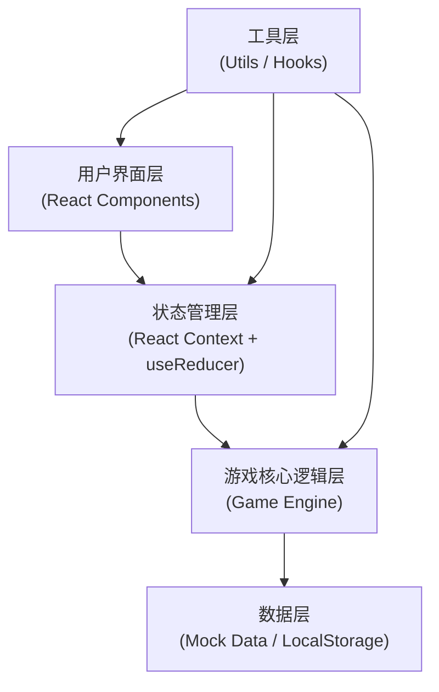
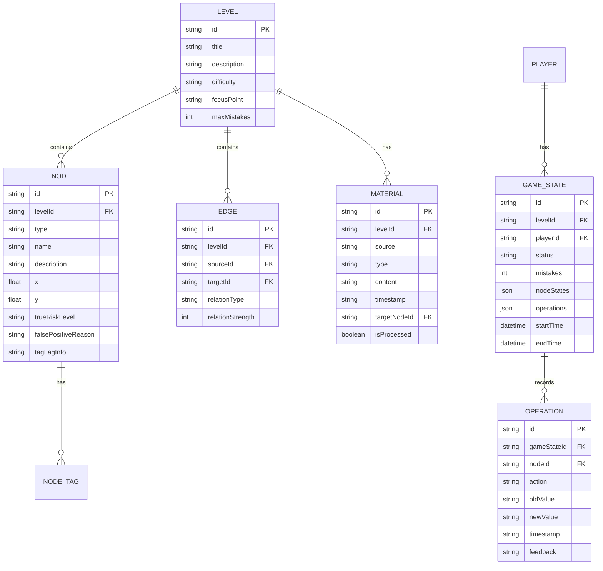

## 1. 架构设计
本项目为纯前端单页应用，无需后端服务，所有数据使用Mock数据存储在前端。采用分层架构设计，确保游戏逻辑、UI渲染、状态管理职责分离。



**模块说明：**
- 用户界面层：负责页面渲染和用户交互，包含首页、游戏页、复盘页、报告页等组件
- 状态管理层：使用 React Context + useReducer 管理全局游戏状态，支持撤销/重做/回放
- 游戏核心逻辑层：关卡判定逻辑、规则引擎、关系图谱算法、报告生成逻辑
- 数据层：关卡Mock数据、节点/关系数据模型、本地存储游戏进度
- 工具层：自定义Hooks、SVG图谱绘制工具、导出工具、动画工具

## 2. 技术描述
- **前端框架**：React@18 + TypeScript
- **构建工具**：Vite@5
- **样式方案**：TailwindCSS@3 + CSS变量
- **路由管理**：React Router@6
- **状态管理**：React Context + useReducer（轻量级，无需Redux）
- **图谱可视化**：原生SVG + 自定义力导向布局算法（避免引入重型图库）
- **导出功能**：html2canvas（图片导出） + 原生File API（文本导出）
- **图标方案**：React Icons（线性图标库）
- **动画方案**：CSS Animations + Framer Motion（复杂交互动画）

## 3. 路由定义
| 路由路径 | 页面名称 | 主要功能 |
|----------|----------|----------|
| `/` | 首页大厅 | 关卡选择、规则说明、游戏介绍 |
| `/game/:levelId` | 游戏主界面 | 关系图谱、材料面板、操作区、规则反馈 |
| `/review/:levelId` | 复盘页面 | 操作回放、关系图回顾、误伤详情、报告导出 |
| `/report/:levelId` | 报告预览 | 结构化报告展示、导出功能 |

## 4. 数据模型

### 4.1 核心数据结构



### 4.2 TypeScript 类型定义

```typescript
// 节点类型
type NodeType = 'account' | 'device' | 'address';

// 风险等级
type RiskLevel = 'unknown' | 'safe' | 'suspicious' | 'blacklist';

// 材料来源
type MaterialSource = 'bank' | 'police' | 'telco' | 'merchant' | 'internal';

// 关卡核心数据
interface Level {
  id: string;
  title: string;
  description: string;
  difficulty: 'easy' | 'medium' | 'hard';
  focusPoint: 'chain-length' | 'device-sharing' | 'tag-lag';
  maxMistakes: number;
  backgroundStory: string;
  nodes: GraphNode[];
  edges: GraphEdge[];
  materials: Material[];
}

// 图谱节点
interface GraphNode {
  id: string;
  type: NodeType;
  name: string;
  description: string;
  x: number;
  y: number;
  trueRiskLevel: RiskLevel;
  falsePositiveType?: 'device-sharing' | 'chain-too-long' | 'tag-lag';
  falsePositiveReason?: string;
  tagLagInfo?: {
    oldTag: RiskLevel;
    newTag: RiskLevel;
    updateTime: string;
    evidence: string;
  };
  chainLength?: number;
}

// 图谱边
interface GraphEdge {
  id: string;
  sourceId: string;
  targetId: string;
  relationType: 'uses-device' | 'resides-at' | 'related-account' | 'transacts-with';
  relationStrength: number;
}

// 材料
interface Material {
  id: string;
  source: MaterialSource;
  type: 'account-card' | 'address-clue' | 'risk-tag';
  content: string;
  timestamp: string;
  targetNodeId: string;
}

// 操作记录
interface Operation {
  id: string;
  nodeId: string;
  action: 'mark-safe' | 'mark-suspicious' | 'mark-blacklist';
  oldValue: RiskLevel;
  newValue: RiskLevel;
  timestamp: string;
  isCorrect: boolean;
  feedback?: string;
}

// 游戏状态
interface GameState {
  levelId: string;
  status: 'playing' | 'completed' | 'failed';
  mistakes: number;
  nodeStates: Record<string, RiskLevel>;
  operations: Operation[];
  startTime: string;
  endTime?: string;
}

// 风控报告
interface RiskReport {
  levelId: string;
  levelTitle: string;
  generateTime: string;
  totalNodes: number;
  blacklistCount: number;
  safeCount: number;
  suspiciousCount: number;
  falsePositives: FalsePositiveItem[];
  chainLengthIssues: ChainLengthIssue[];
  tagLagIssues: TagLagIssue[];
  playerOperations: Operation[];
  accuracyRate: number;
  trainingPoints: string[];
}

interface FalsePositiveItem {
  nodeId: string;
  nodeName: string;
  nodeType: NodeType;
  playerMark: RiskLevel;
  correctMark: RiskLevel;
  reason: string;
  evidence: string;
}

interface ChainLengthIssue {
  chain: string[];
  chainLength: number;
  description: string;
  suggestion: string;
}

interface TagLagIssue {
  nodeId: string;
  nodeName: string;
  oldTag: RiskLevel;
  newTag: RiskLevel;
  timeDiff: string;
  impact: string;
}
```

### 4.3 状态管理设计

使用 `useReducer` 管理游戏状态，支持完整的操作历史和回溯：

```typescript
type GameAction =
  | { type: 'MARK_NODE'; nodeId: string; level: RiskLevel }
  | { type: 'UNDO' }
  | { type: 'REDO' }
  | { type: 'SUBMIT' }
  | { type: 'RESET' }
  | { type: 'JUMP_TO_STEP'; stepIndex: number };

// 状态包含完整历史记录，支持撤销/重做/回放
interface GameStateWithHistory {
  past: GameState[];
  present: GameState;
  future: GameState[];
}
```

### 4.4 核心算法

1. **关系链过长检测算法**：BFS遍历检测节点到黑名单节点的路径长度，超过阈值（如>3度）标记为关系链过长问题
2. **设备共享误伤检测**：检测同一设备关联的多个账户，区分正常共享（如家人共用）和风险关联
3. **标签滞后检测**：比对材料时间戳和标签更新时间，检测标签时效性问题
4. **力导向布局算法**：简化版Fruchterman-Reingold算法，用于图谱节点自动布局
5. **答案判定算法**：基于节点真实风险等级和玩家标记的比对，计算准确率和误判类型
