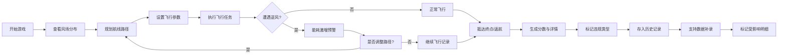

# 无人机能量返航赛 - 产品需求文档

## 1. 产品概述

无人机能量返航赛是一款策略型模拟游戏，让玩家在风场环境下规划无人机航线路径，平衡飞行效率与能量消耗。解决传统评分游戏缺乏深度策略的问题，让玩家真正理解路径规划与气象条件的博弈。

- 目标用户：航拍摄影爱好者、无人机竞赛参与者、策略游戏玩家
- 核心价值：通过沉浸式体验学习风场对能耗的影响，培养精细化路径规划能力

## 2. 核心功能

### 2.1 用户角色
| 角色 | 注册方式 | 核心权限 |
|------|---------|---------|
| 玩家 | 无需注册 | 进行游戏、查看历史记录、分析飞行数据 |

### 2.2 功能模块
1. **主游戏界面**：无人机控制面板、风场地图、航点规划器、实时能量监控
2. **飞行记录中心**：历史飞行列表、详情查看、数据对比、异常标记
3. **规则知识库**：路径规划规则、风场影响说明、常见错误案例
4. **数据补录系统**：电池数据补录、影响范围标记、变更历史追溯

### 2.3 页面详情
| 页面名称 | 模块名称 | 功能描述 |
|---------|---------|----------|
| 主游戏页 | 飞行地图 | 可视化风场分布、无人机位置、航点标记 |
| 主游戏页 | 控制面板 | 速度调节、高度设置、航点增删、起飞/返航 |
| 主游戏页 | 能量监控 | 实时电量、预估续航、逆风耗电预警 |
| 记录中心页 | 列表视图 | 飞行时间、得分、异常标记、筛选搜索 |
| 记录中心页 | 详情面板 | 完整飞行轨迹、能耗曲线、违规点高亮 |
| 记录中心页 | 补录功能 | 电池数据修正、影响明细标记、备注修改 |
| 规则说明页 | 规则库 | 路径规划原则、风场等级说明、扣分标准 |

## 3. 核心流程

## 4. 用户界面设计

### 4.1 设计风格
- **主色调**：深空蓝 (#0A1628) 搭配科技青 (#00D4FF)，体现无人机科技感
- **辅助色**：预警橙 (#FF8C00)、危险红 (#FF3B30)、成功绿 (#34C759)
- **按钮风格**：微立体圆角按钮，hover 时有发光效果
- **字体**：标题使用 Orbitron（科技感字体），正文使用 Inter（清晰易读）
- **布局风格**：左侧控制面板 + 中央地图 + 右侧数据面板的三栏布局
- **视觉元素**：网格背景、粒子风场动画、雷达扫描效果

### 4.2 页面设计概览
| 页面名称 | 模块名称 | UI 元素 |
|---------|---------|---------|
| 主游戏页 | 飞行地图 | 深色地图背景、动态风场粒子、航点连线动画 |
| 主游戏页 | 能量条 | 渐变电量条、实时数值跳动、逆风时红色闪烁 |
| 记录中心页 | 异常标记 | 彩色标签（缺字段/晚补/备注修改）、悬停显示详情 |
| 规则说明页 | 案例卡片 | 可展开的错误案例、前后对比图示 |

### 4.3 响应式设计
- 桌面端：三栏完整布局，地图占 60% 宽度
- 平板端：上下布局，地图在上，控制面板折叠为可展开面板
- 移动端：单页滚动，简化操作，重点保留核心数据显示

## 5. 游戏规则与评分机制

### 5.1 核心规则
1. **路径规划**：
   - 直线最短路径原则，但需避开强风区
   - 航点数量限制（默认最多 8 个）
   - 禁飞区不可穿越

2. **风场影响**：
   - 逆风：能耗 × 1.8，速度降低 30%
   - 侧风：能耗 × 1.3，航线偏移风险
   - 顺风：能耗 × 0.7，速度提升 20%
   - 无风：标准能耗

3. **返航规则**：
   - 剩余电量必须足够返航（含 20% 安全余量）
   - 电量不足时强制自动返航
   - 逆风条件下需增加安全余量至 35%

### 5.2 扣分机制
| 违规类型 | 扣分 | 规则说明 |
|---------|------|---------|
| 逆风耗电未识别 | -15 | 未主动规避强逆风区域导致能耗超标 |
| 航线路径低效 | -10 | 明显绕路或航点设置不合理 |
| 返航余量不足 | -20 | 电量安全余量低于标准 |
| 禁飞区穿越 | -30 | 航线穿越禁飞区域 |
| 数据缺字段 | -5 | 飞行记录关键字段缺失 |
| 晚补记录 | -3 | 超过 24 小时补录的数据 |

### 5.3 数据异常标记
- **缺字段**：黄色标签，标记缺失的具体字段名
- **晚补**：橙色标签，显示补录时间差
- **备注修改**：紫色标签，显示修改历史
- **逆风耗电**：红色高亮，不可被其他异常覆盖
