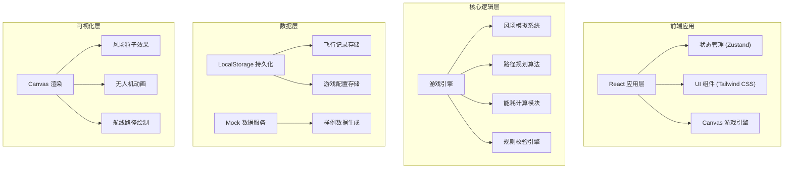
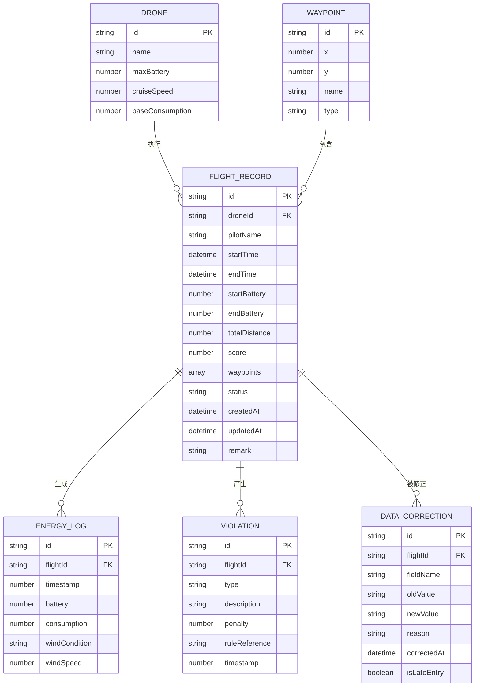

# 无人机能量返航赛 - 技术架构文档

## 1. 架构设计



## 2. 技术栈说明

- **前端框架**: React@18 + TypeScript
- **构建工具**: Vite@5
- **样式方案**: Tailwind CSS@3
- **状态管理**: Zustand (轻量级状态管理)
- **图标库**: Lucide React
- **数据可视化**: Canvas 2D API
- **数据持久化**: LocalStorage
- **字体**: Google Fonts (Orbitron + Inter)

## 3. 路由定义

| 路由 | 页面 | 功能 |
|------|------|------|
| / | 主游戏页 | 风场地图、路径规划、实时飞行模拟 |
| /records | 飞行记录中心 | 历史记录列表、详情查看、数据补录 |
| /rules | 规则说明页 | 游戏规则、风场说明、错误案例 |

## 4. 数据模型

### 4.1 ER 图



### 4.2 核心类型定义

```typescript
// 无人机类型
interface Drone {
  id: string;
  name: string;
  maxBattery: number;      // 最大电量 (mAh)
  cruiseSpeed: number;     // 巡航速度 (m/s)
  baseConsumption: number; // 基础能耗 (mAh/s)
}

// 航点类型
interface Waypoint {
  id: string;
  x: number;
  y: number;
  name: string;
  type: 'start' | 'checkpoint' | 'end';
  order: number;
}

// 风场类型
interface WindZone {
  id: string;
  x: number;
  y: number;
  radius: number;
  direction: number;  // 风向角度 (0-360)
  speed: number;      // 风速等级 (1-5)
  type: 'headwind' | 'tailwind' | 'crosswind' | 'calm';
}

// 飞行记录
interface FlightRecord {
  id: string;
  droneId: string;
  pilotName: string;
  startTime: string;
  endTime: string | null;
  startBattery: number;
  endBattery: number | null;
  waypoints: Waypoint[];
  energyLogs: EnergyLog[];
  violations: Violation[];
  score: number;
  status: 'planning' | 'flying' | 'completed' | 'failed';
  createdAt: string;
  updatedAt: string;
  remark: string;
  hasMissingFields: boolean;
  missingFields: string[];
  isLateEntry: boolean;
  remarkModified: boolean;
  remarkHistory: RemarkChange[];
}

// 能耗日志
interface EnergyLog {
  timestamp: number;
  battery: number;
  consumption: number;
  windType: string;
  windSpeed: number;
  position: { x: number; y: number };
}

// 违规记录
interface Violation {
  id: string;
  type: 'headwind_ignored' | 'inefficient_path' | 'insufficient_return' | 'no_fly_zone' | 'missing_field' | 'late_entry';
  description: string;
  penalty: number;
  ruleReference: string;
  timestamp: number;
  highlighted: boolean;
}

// 备注修改历史
interface RemarkChange {
  oldRemark: string;
  newRemark: string;
  modifiedAt: string;
}

// 数据修正记录
interface DataCorrection {
  id: string;
  flightId: string;
  fieldName: string;
  oldValue: any;
  newValue: any;
  reason: string;
  correctedAt: string;
  affectedDetails: string[];
}
```

## 5. 核心算法模块

### 5.1 风场能耗计算

```typescript
// 风场影响系数
const WIND_EFFECTS = {
  headwind: { consumptionMultiplier: 1.8, speedMultiplier: 0.7 },
  tailwind: { consumptionMultiplier: 0.7, speedMultiplier: 1.2 },
  crosswind: { consumptionMultiplier: 1.3, speedMultiplier: 0.9 },
  calm: { consumptionMultiplier: 1.0, speedMultiplier: 1.0 }
};

// 计算实时能耗
function calculateEnergyConsumption(
  baseConsumption: number,
  windType: WindType,
  speed: number
): number {
  const effect = WIND_EFFECTS[windType];
  return baseConsumption * effect.consumptionMultiplier * (speed / 10);
}
```

### 5.2 返航余量校验

```typescript
// 计算返航所需电量
function calculateReturnEnergyRequired(
  currentPosition: Point,
  startPosition: Point,
  windZones: WindZone[],
  drone: Drone
): { energy: number; safetyMargin: number } {
  const distance = calculateDistance(currentPosition, startPosition);
  const avgWindEffect = calculateAverageWindEffect(currentPosition, startPosition, windZones);
  const baseEnergy = (distance / drone.cruiseSpeed) * drone.baseConsumption;
  const adjustedEnergy = baseEnergy * avgWindEffect;
  const safetyMargin = hasHeadwindRisk(currentPosition, startPosition, windZones) ? 0.35 : 0.20;
  
  return {
    energy: adjustedEnergy * (1 + safetyMargin),
    safetyMargin: safetyMargin * 100
  };
}
```

### 5.3 规则校验引擎

```typescript
// 规则校验器
class RuleValidator {
  rules: Rule[] = [
    {
      id: 'R001',
      name: '逆风规避规则',
      check: (flight: FlightData) => flight.pathIntersectsStrongHeadwind() && !flight.hasAlternativePath(),
      penalty: 15,
      description: '未主动规避强逆风区域，建议调整航线绕过逆风带'
    },
    {
      id: 'R002',
      name: '返航余量规则',
      check: (flight: FlightData) => flight.returnMargin < (flight.hasHeadwindReturn() ? 0.35 : 0.20),
      penalty: 20,
      description: '返航电量安全余量不足，逆风条件下需保持35%以上余量'
    },
    // ... 更多规则
  ];

  validate(flightData: FlightData): Violation[] {
    return this.rules
      .filter(rule => rule.check(flightData))
      .map(rule => ({
        type: rule.id,
        description: rule.description,
        penalty: rule.penalty,
        ruleReference: rule.name
      }));
  }
}
```

## 6. 样例数据说明

系统预置 5 条样例飞行记录，包含各种异常场景：

| 记录ID | 场景类型 | 异常标记 | 说明 |
|--------|---------|---------|------|
| FL-001 | 正常飞行 | 无 | 标准参考案例，完美路径规划 |
| FL-002 | 逆风耗电 | 逆风耗电(红色高亮) | 穿越强逆风区，能耗超标 45% |
| FL-003 | 缺字段 | 缺字段(黄色) | 缺失 `endBattery` 和 `pilotName` 字段 |
| FL-004 | 晚补记录 | 晚补(橙色) | 飞行结束 36 小时后补录电池数据 |
| FL-005 | 备注修改 | 备注修改(紫色) | 备注被修改 2 次，含修改历史 |
