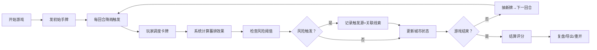

## 1. 产品概述

城市雨洪卡牌局是一款面向海绵城市运维人员的单局卡牌模拟游戏，通过卡牌调度和蓄排计算模拟真实雨洪处置场景，帮助讲解员在泵站过载等紧急情况时快速关联线索、定位问题、明确下一步处置措施。

- **目标用户**：海绵城市讲解员、运维人员、应急处置团队
- **核心价值**：将分散的雨量卡、管网、处置报告等线索自动关联，可视化追踪风险触发源，训练快速决策能力
- **游戏目标**：在限定回合内通过合理调度卡牌，避免泵站过载、低洼积水、绿地容量耗尽等风险事件，最终获得最高评分

## 2. 核心功能

### 2.1 用户角色

| 角色 | 注册方式 | 核心权限 |
|------|----------|----------|
| 玩家 | 无需注册，直接进入 | 完整游戏体验、成绩查看与导出 |

### 2.2 功能模块

1. **游戏主界面**：卡牌手牌区、城市状态面板、事件日志区、控制按钮
2. **卡牌系统**：雨量卡、管网卡、处置卡、雨水花园卡四类卡牌
3. **线索关联系统**：自动将相关线索归为同一事件链，可视化展示因果关系
4. **风险追踪系统**：实时监控泵站、低洼地、绿地三大风险点，记录触发源
5. **结算复盘系统**：风险评分明细、事件回溯、成绩导出

### 2.3 页面详情

| 页面名称 | 模块名称 | 功能描述 |
|-----------|-------------|---------------------|
| 游戏主界面 | 控制栏 | 开始、暂停、重开按钮，回合数与计时器显示 |
| 游戏主界面 | 城市状态面板 | 泵站负载率、低洼积水深度、绿地剩余容量三大指标实时显示 |
| 游戏主界面 | 卡牌手牌区 | 展示当前可用卡牌，支持拖拽或点击调度 |
| 游戏主界面 | 事件链面板 | 按事件分组展示关联线索，标注触发源与卡点 |
| 游戏主界面 | 事件日志 | 滚动显示所有操作和事件记录 |
| 结算页面 | 风险评分明细 | 逐项展示扣分原因、触发卡牌、卡点位置 |
| 结算页面 | 复盘时间线 | 可回放整局游戏的关键节点 |
| 结算页面 | 成绩导出 | 支持导出JSON格式的完整游戏记录 |
| 帮助说明 | 快速指南 | 雨量卡准备方法、泵站过载复现场景、成绩导出说明 |

## 3. 核心流程

**玩家操作流程**：
1. 点击"开始"进入游戏，初始获得5张手牌
2. 每回合系统根据雨量卡触发降雨事件
3. 玩家选择手牌中的管网、处置或雨水花园卡进行调度
4. 系统实时计算蓄排能力变化，更新三大指标
5. 当指标超过阈值时，系统自动记录是哪张卡牌（或缺少哪张卡牌）触发风险
6. 游戏结束后进入结算页，查看每项扣分的详细原因
7. 可选择复盘回看关键节点，或导出游戏记录

## 4. 用户界面设计

### 4.1 设计风格

**整体风格**：科技感+城市水务主题，采用深蓝色调搭配警示色，营造专业应急指挥氛围

- **主色调**：深海蓝 `#0F2B4E` - 代表城市水务系统
- **辅助色**：天青蓝 `#2DD4BF` - 代表雨水花园/生态设施
- **警示色**：橙红 `#F97316` - 泵站过载预警；深红 `#DC2626` - 风险触发；亮黄 `#EAB308` - 低洼积水
- **成功色**：翠绿 `#10B981` - 正常状态
- **中性色**：深灰 `#1E293B` 卡片底，浅灰 `#94A3B8` 文字

**排版**：
- 标题字体：**Space Grotesk** - 现代感强，适合数据展示
- 正文字体：**Noto Sans SC** - 确保中文可读性
- 数字字体：**JetBrains Mono** - 等宽字体增强数据专业性

**视觉元素**：
- 卡牌采用渐变边框，不同类型卡牌有独特的图案标识
- 城市状态面板使用仪表盘和进度条可视化
- 事件链使用时间线+节点连线展示因果关系
- 风险触发时有脉冲动画效果
- 背景使用 subtle 的城市管网线稿纹理

### 4.2 页面设计概述

| 页面名称 | 模块名称 | UI元素 |
|-----------|-------------|-------------|
| 游戏主界面 | 控制栏 | 固定顶部，半透明玻璃态，按钮带hover缩放动画 |
| 游戏主界面 | 城市状态面板 | 左侧三栏布局，每个指标含仪表盘、数值、状态标签，风险时红色脉冲 |
| 游戏主界面 | 卡牌手牌区 | 底部横向排列，悬停上浮，选中放大，拖动用半透明虚影 |
| 游戏主界面 | 事件链面板 | 右侧可折叠面板，按事件分组，每组含触发源卡片、卡点标记、建议措施 |
| 结算页面 | 评分明细 | 表格形式，每行可展开查看触发卡牌ID、时间、卡点说明 |
| 结算页面 | 复盘时间线 | 横向滑动时间轴，点击节点可查看当时状态快照 |
| 帮助说明 | 快速指南 | 三栏卡片式布局：准备雨量卡、复现泵站过载、导出成绩 |

### 4.3 响应性

- **桌面端优先**：针对1920×1080及以上分辨率优化
- **平板适配**：事件链面板可切换为底部抽屉
- **触摸优化**：卡牌触摸区域≥80px，按钮最小高度48px
- **布局断点**：1280px（面板调整）、768px（移动端单列）

### 4.4 动效设计

- **卡牌调度**：从手牌区飞出到目标位置，带轨迹残影
- **风险触发**：状态指示器红色脉冲扩散，事件日志高亮闪烁
- **降雨效果**：背景雨丝粒子动画，强度随雨量变化
- **页面切换**：结算页从右侧滑入，带淡入效果
- **数据更新**：数值变化时用数字滚动动画

