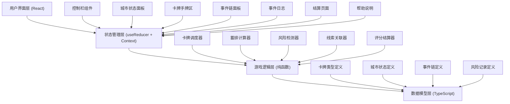
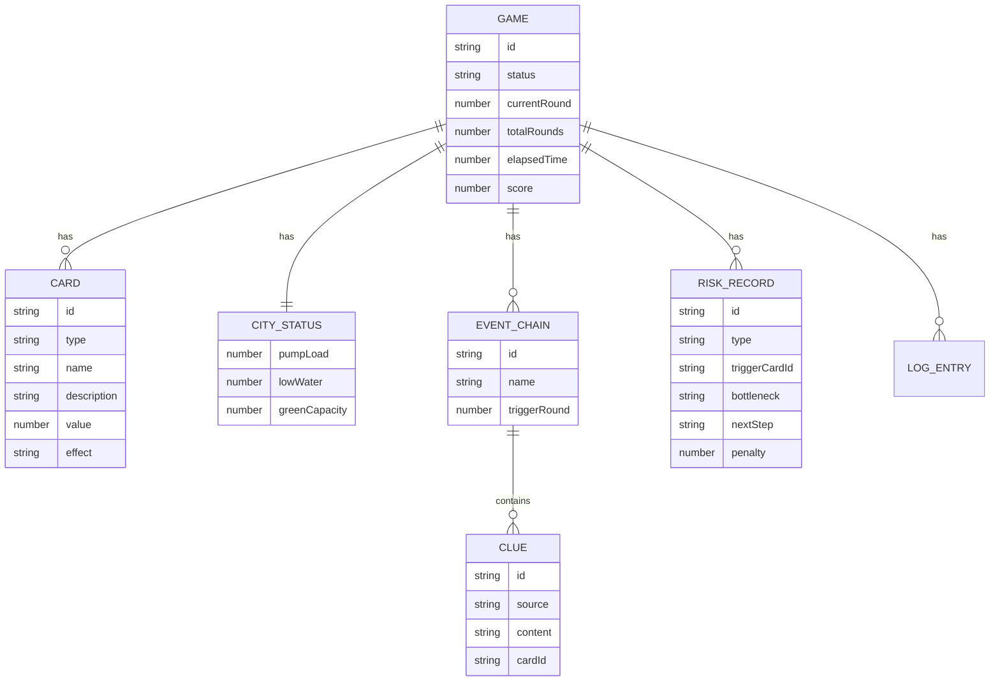

## 1. 架构设计



## 2. 技术描述

- **前端框架**：React@18 + TypeScript@5
- **构建工具**：Vite@5
- **样式方案**：TailwindCSS@3 + CSS Variables
- **状态管理**：React useReducer + Context API（避免过度依赖Redux）
- **动画库**：Framer Motion（用于卡牌动效和页面过渡）
- **图标库**：Lucide React（轻量、现代图标集）
- **后端**：无（纯前端单页应用，所有逻辑在客户端完成）
- **数据持久化**：LocalStorage 存储游戏记录
- **导出格式**：JSON（游戏记录）

### 项目目录结构

```
src/
├── types/              # 类型定义
│   ├── card.ts         # 卡牌类型
│   ├── city.ts         # 城市状态类型
│   ├── event.ts        # 事件链类型
│   ├── risk.ts         # 风险记录类型
│   └── game.ts         # 游戏状态类型
├── data/               # 静态数据
│   ├── cards.ts        # 卡牌库
│   └── scenarios.ts    # 游戏场景配置
├── engine/             # 游戏逻辑（纯函数）
│   ├── cardScheduler.ts    # 卡牌调度
│   ├── storageCalculator.ts # 蓄排计算
│   ├── riskDetector.ts     # 风险检测
│   ├── clueAssociator.ts   # 线索关联
│   └── scoreCalculator.ts  # 评分结算
├── hooks/              # 自定义Hooks
│   ├── useGame.ts      # 游戏主逻辑Hook
│   └── useTimer.ts     # 计时器Hook
├── components/         # 组件
│   ├── ControlBar.tsx      # 控制栏
│   ├── CityStatus.tsx      # 城市状态面板
│   ├── CardHand.tsx        # 卡牌手牌区
│   ├── Card.tsx            # 单张卡牌
│   ├── EventChain.tsx      # 事件链面板
│   ├── EventLog.tsx        # 事件日志
│   ├── Settlement.tsx      # 结算页面
│   ├── HelpModal.tsx       # 帮助说明
│   └── RainEffect.tsx      # 降雨动效
├── context/            # Context
│   └── GameContext.tsx
├── utils/              # 工具函数
│   ├── export.ts       # 导出功能
│   └── replay.ts       # 复盘功能
├── App.tsx
├── main.tsx
└── index.css
```

## 3. 路由定义

| Route | Purpose |
|-------|---------|
| / | 游戏主界面（单页应用，无多路由） |

## 4. 数据模型

### 4.1 数据模型定义



### 4.2 TypeScript 类型定义

```typescript
// 卡牌类型
type CardType = 'rainfall' | 'pipeline' | 'disposal' | 'garden';

interface Card {
  id: string;
  type: CardType;
  name: string;
  description: string;
  value: number; // 雨量mm / 管网能力m³ / 处置量m³ / 绿地容量m³
  rarity: 'common' | 'rare' | 'epic';
}

// 城市状态
interface CityStatus {
  pumpLoad: number;      // 泵站负载率 0-100%
  lowWater: number;      // 低洼积水深度 mm
  greenCapacity: number; // 绿地剩余容量 %
  totalStorage: number;  // 总蓄水量 m³
}

// 风险类型
type RiskType = 'pump_overload' | 'low_flooding' | 'green_depleted';

// 风险记录
interface RiskRecord {
  id: string;
  type: RiskType;
  round: number;
  timestamp: number;
  triggerCardId: string | null;  // 触发的卡牌ID
  triggerCardName: string | null;
  bottleneck: string;            // 卡点描述
  nextStep: string;              // 下一步建议
  penalty: number;               // 扣分数值
  citySnapshot: CityStatus;      // 触发时的城市状态
}

// 线索
interface Clue {
  id: string;
  source: 'rainfall' | 'pipeline' | 'report' | 'garden';
  content: string;
  cardId: string;
  round: number;
}

// 事件链
interface EventChain {
  id: string;
  name: string;
  triggerRound: number;
  clues: Clue[];
  relatedRiskId?: string;
}

// 游戏状态
type GameStatus = 'idle' | 'playing' | 'paused' | 'settled';

interface GameState {
  status: GameStatus;
  currentRound: number;
  totalRounds: number;
  elapsedTime: number;
  score: number;
  maxScore: number;
  hand: Card[];          // 手牌
  deck: Card[];          // 牌库
  discardPile: Card[];   // 弃牌堆
  city: CityStatus;
  eventChains: EventChain[];
  riskRecords: RiskRecord[];
  log: LogEntry[];
  activeRainfall: number; // 当前降雨量 mm/h
}

// 日志条目
interface LogEntry {
  id: string;
  round: number;
  timestamp: number;
  type: 'action' | 'event' | 'risk' | 'system';
  message: string;
  cardId?: string;
}
```

## 5. 核心算法

### 5.1 蓄排计算算法

```typescript
function calculateStorage(
  currentStatus: CityStatus,
  activeRainfall: number,
  playedCards: Card[]
): CityStatus {
  // 1. 计算降雨汇入量
  const inflow = activeRainfall * CATCHMENT_AREA * RUNOFF_COEFFICIENT;
  
  // 2. 计算各设施处理能力
  let pipelineCapacity = 0;
  let disposalCapacity = 0;
  let gardenCapacity = 0;
  
  playedCards.forEach(card => {
    if (card.type === 'pipeline') pipelineCapacity += card.value;
    if (card.type === 'disposal') disposalCapacity += card.value;
    if (card.type === 'garden') gardenCapacity += card.value;
  });
  
  // 3. 计算剩余水量
  const totalProcessed = pipelineCapacity + disposalCapacity + gardenCapacity;
  const remainingWater = Math.max(0, inflow - totalProcessed);
  
  // 4. 更新各指标
  const newPumpLoad = Math.min(100, (pipelineCapacity / MAX_PUMP_CAPACITY) * 100);
  const newLowWater = remainingWater / LOW_AREA * 1000; // 转为mm
  const newGreenCapacity = Math.max(0, 100 - (gardenCapacity / MAX_GARDEN_CAPACITY) * 100);
  
  return {
    pumpLoad: newPumpLoad,
    lowWater: newLowWater,
    greenCapacity: newGreenCapacity,
    totalStorage: currentStatus.totalStorage + remainingWater
  };
}
```

### 5.2 风险检测算法

```typescript
function detectRisks(
  status: CityStatus,
  round: number,
  lastPlayedCard: Card | null
): RiskRecord[] {
  const risks: RiskRecord[] = [];
  
  // 泵站过载检测 (>85%)
  if (status.pumpLoad > 85) {
    risks.push({
      id: generateId(),
      type: 'pump_overload',
      round,
      timestamp: Date.now(),
      triggerCardId: lastPlayedCard?.id || null,
      triggerCardName: lastPlayedCard?.name || '未及时调度管网',
      bottleneck: status.pumpLoad > 95 
        ? '管网输送能力严重不足，泵站满负荷运行' 
        : '管网调度不及时，泵站负载接近上限',
      nextStep: '立即调度管网扩容卡或开启备用处置通道',
      penalty: status.pumpLoad > 95 ? 30 : 15,
      citySnapshot: { ...status }
    });
  }
  
  // 低洼积水检测 (>100mm)
  if (status.lowWater > 100) {
    risks.push({
      id: generateId(),
      type: 'low_flooding',
      round,
      timestamp: Date.now(),
      triggerCardId: lastPlayedCard?.id || null,
      triggerCardName: lastPlayedCard?.name || '缺少处置措施',
      bottleneck: '低洼区域排水能力不足，积水无法及时排出',
      nextStep: '调度应急处置卡或增加临时强排设施',
      penalty: status.lowWater > 200 ? 25 : 12,
      citySnapshot: { ...status }
    });
  }
  
  // 绿地容量耗尽 (<15%)
  if (status.greenCapacity < 15) {
    risks.push({
      id: generateId(),
      type: 'green_depleted',
      round,
      timestamp: Date.now(),
      triggerCardId: lastPlayedCard?.id || null,
      triggerCardName: lastPlayedCard?.name || '雨水花园过载',
      bottleneck: '海绵设施吸纳能力接近饱和，无法继续消纳雨水',
      nextStep: '调度新增雨水花园卡或转输至其他蓄滞空间',
      penalty: status.greenCapacity < 5 ? 20 : 10,
      citySnapshot: { ...status }
    });
  }
  
  return risks;
}
```

### 5.3 线索关联算法

```typescript
function associateClues(
  chains: EventChain[],
  newClue: Clue,
  cityStatus: CityStatus
): EventChain[] {
  // 查找相关事件链（基于时间窗口和内容相似度）
  const relatedChain = chains.find(chain => {
    const recentClue = chain.clues[chain.clues.length - 1];
    if (!recentClue) return false;
    
    // 同回合或相邻回合
    const roundClose = Math.abs(newClue.round - recentClue.round) <= 1;
    
    // 内容关联（简化：相同类型或相关风险）
    const typeRelated = 
      (newClue.source === 'rainfall' && recentClue.source === 'pipeline') ||
      (newClue.source === 'pipeline' && recentClue.source === 'report');
    
    return roundClose && typeRelated;
  });
  
  if (relatedChain) {
    // 加入现有事件链
    return chains.map(chain => 
      chain.id === relatedChain.id 
        ? { ...chain, clues: [...chain.clues, newClue] }
        : chain
    );
  } else {
    // 创建新事件链
    return [...chains, {
      id: generateId(),
      name: generateEventName(newClue, cityStatus),
      triggerRound: newClue.round,
      clues: [newClue]
    }];
  }
}
```

## 6. 常量配置

```typescript
// 游戏常量
const TOTAL_ROUNDS = 15;
const INITIAL_HAND_SIZE = 5;
const CARDS_PER_ROUND = 1;
const MAX_HAND_SIZE = 8;

// 城市参数
const CATCHMENT_AREA = 1000000; // 汇水面积 m²
const RUNOFF_COEFFICIENT = 0.6; // 径流系数
const MAX_PUMP_CAPACITY = 500;  // 泵站最大能力 m³/h
const MAX_GARDEN_CAPACITY = 300; // 绿地最大容量 m³
const LOW_AREA = 50000;          // 低洼区域面积 m²

// 风险阈值
const PUMP_WARNING = 70;
const PUMP_DANGER = 85;
const LOW_WATER_WARNING = 50;
const LOW_WATER_DANGER = 100;
const GREEN_WARNING = 30;
const GREEN_DANGER = 15;
```
