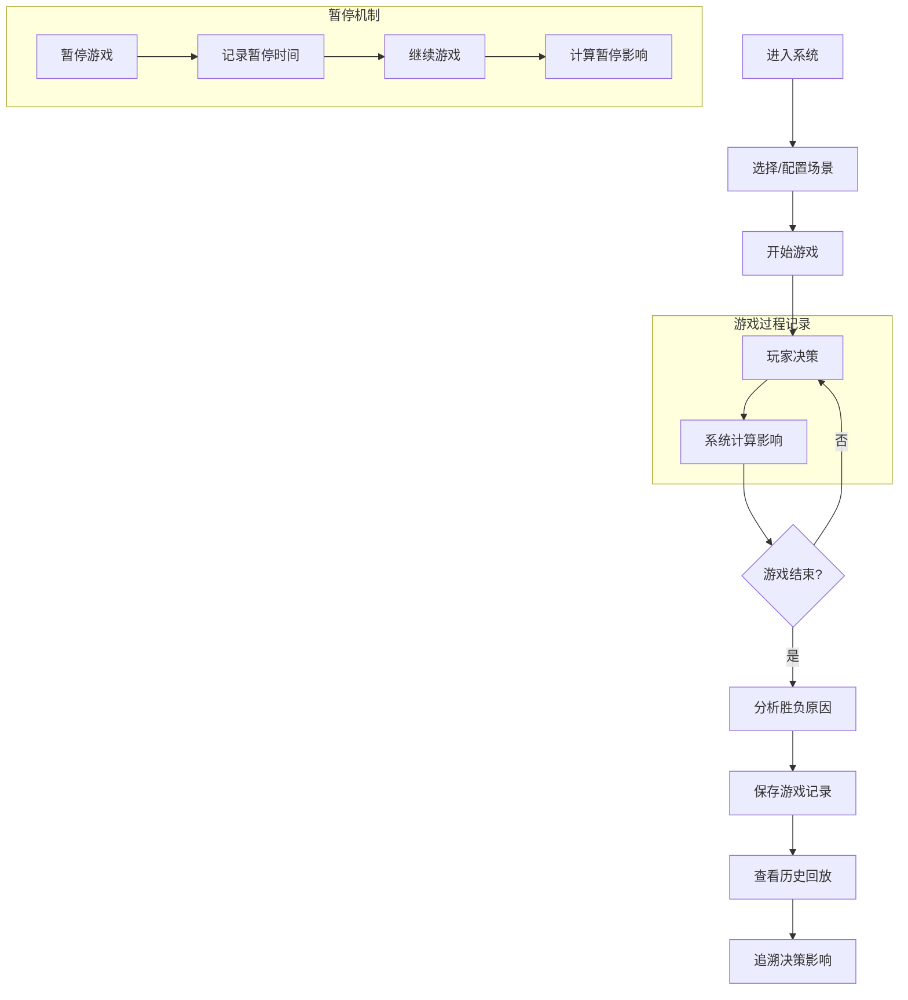

## 1. 产品概述

机器人分拣拥堵赛是一款面向课堂培训的交互式模拟系统，通过模拟仓储机器人分拣场景，让玩家学习资源调度和路径规划。系统完整记录每一步决策和游戏过程，支持历史回放和原因追溯。

- 核心价值：将抽象的调度算法转化为可操作、可复盘的培训工具
- 目标用户：仓储管理培训师、物流专业学生、企业内部培训学员

## 2. 核心功能

### 2.1 用户角色

| 角色 | 说明 | 核心权限 |
|------|------|----------|
| 玩家 | 参与游戏的学员 | 配置场景、进行游戏、查看结果 |
| 仓储经理 | 复盘分析的培训师 | 查看历史记录、回放游戏过程、分析决策影响 |

### 2.2 功能模块

1. **场景配置页**：机器人、货架、障碍物配置管理，场景导入导出
2. **游戏主界面**：实时模拟、玩家决策、游戏状态展示
3. **历史记录页**：游戏历史列表、详情查看、数据持久化
4. **回放分析页**：步骤回放、决策追溯、寻路触发点标注、暂停影响分析

### 2.3 页面详情

| 页面名称 | 模块名称 | 功能描述 |
|-----------|-------------|---------------------|
| 场景配置页 | 元素配置面板 | 可视化添加/编辑/删除机器人、货架、障碍物，支持拖拽定位 |
| 场景配置页 | 来源追溯 | 每个配置元素可点击查看来源信息，支持一路回溯 |
| 场景配置页 | 场景样例库 | 预置3个典型场景：低电接单、路径相撞、订单超时 |
| 游戏主界面 | 仓储网格 | 实时显示机器人位置、路径、状态，高亮冲突区域 |
| 游戏主界面 | 决策面板 | 玩家每一步可选择调度指令，系统实时计算影响 |
| 游戏主界面 | 暂停/重开控制 | 记录暂停时间点和时长，自动计算对成绩的影响 |
| 游戏主界面 | 结果展示 | 游戏结束时展示胜负原因，关联关键决策点 |
| 历史记录页 | 历史列表 | 按时间排序的游戏记录，支持搜索过滤 |
| 历史记录页 | 数据持久化 | localStorage存储，刷新/重启不丢失，去重机制防重复 |
| 回放分析页 | 时间轴回放 | 可逐帧/倍速回放游戏全过程 |
| 回放分析页 | 决策标记 | 标记触发网格寻路的决策步骤，高亮显示 |
| 回放分析页 | 暂停影响分析 | 量化显示暂停重开对成绩的具体影响 |

## 3. 核心流程

玩家进入系统后，可选择预置场景或自定义配置，然后进行游戏决策。每一步操作都会被记录，游戏结束后系统自动分析胜负原因并生成可回放的历史记录。

## 4. 用户界面设计

### 4.1 设计风格

- **主色调**：工业蓝 (#1e3a5f) 作为主色，科技感橙 (#ff6b35) 作为强调色
- **辅助色**：成功绿 (#22c55e)、警告黄 (#eab308)、危险红 (#ef4444)
- **按钮风格**：圆角直角混合，微阴影悬浮效果，点击有按压动画
- **字体**：标题使用 Orbitron（科技感），正文使用 JetBrains Mono（等宽易读）
- **布局风格**：三栏式布局（左侧面板 + 中央游戏区 + 右侧信息）
- **图标风格**：线性图标配合工业元素，使用 Lucide 图标库

### 4.2 页面设计概述

| 页面名称 | 模块名称 | UI 元素 |
|-----------|-------------|-------------|
| 游戏主界面 | 仓储网格 | SVG 绘制网格，机器人用圆形带方向指示，货架用方块，障碍物用斜纹填充 |
| 游戏主界面 | 决策面板 | 卡片式操作按钮，点击有波纹效果，禁用状态灰度显示 |
| 游戏主界面 | 状态信息 | 实时数据仪表板，数值变化有动画过渡 |
| 回放分析页 | 时间轴 | 线性进度条，关键决策点用标记点，悬停显示详情 |
| 回放分析页 | 决策标记 | 寻路触发点用脉冲动画高亮，可点击查看详情 |
| 场景配置页 | 元素配置 | 拖拽式交互，元素吸附网格，实时预览效果 |

### 4.3 响应式

- 桌面端优先设计，保证 1920px 最佳体验
- 平板端适配：左右面板折叠为抽屉
- 移动端：简化视图，核心功能保留

### 4.4 动效设计

- 机器人移动：平滑路径动画，速度可调节
- 寻路计算：路径探索过程可视化，渐变色展示
- 冲突检测：碰撞区域闪烁警告动画
- 页面切换：淡入淡出配合滑动过渡
- 数据更新：数字滚动动画，进度条平滑变化
