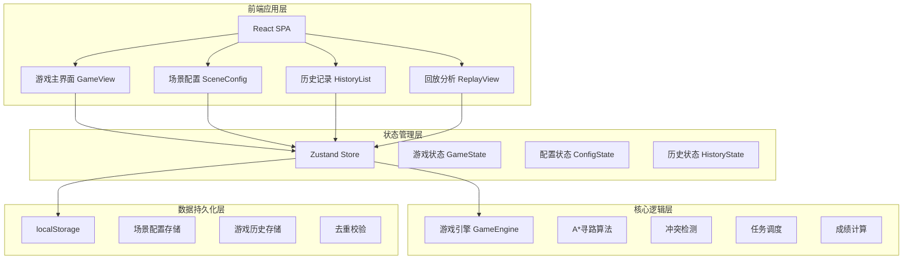
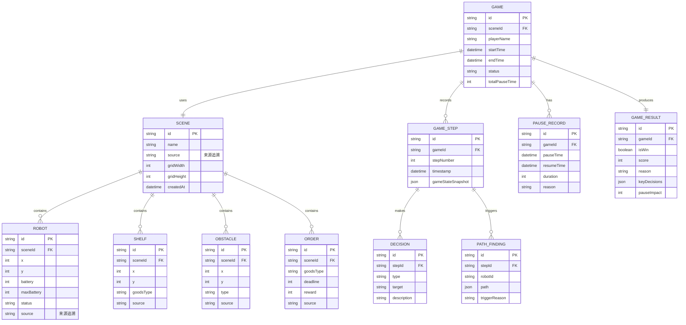

## 1. 架构设计



## 2. 技术描述

- **前端框架**: React@18 + TypeScript
- **构建工具**: Vite@5
- **样式方案**: TailwindCSS@3 + CSS Variables
- **状态管理**: Zustand (轻量级，适合游戏状态)
- **路由管理**: React Router@6
- **图标库**: Lucide React
- **数据持久化**: localStorage + IndexedDB (备选)
- **图表可视化**: Recharts (成绩分析)

## 3. 路由定义

| 路由 | 页面 | 功能 |
|------|------|------|
| / | 首页 | 游戏入口、场景选择 |
| /game | 游戏主界面 | 实时游戏、决策操作 |
| /config | 场景配置 | 自定义场景、元素管理 |
| /history | 历史记录 | 游戏历史列表、搜索筛选 |
| /replay/:id | 回放分析 | 游戏过程回放、决策分析 |

## 4. 数据模型

### 4.1 核心数据模型



### 4.2 TypeScript 类型定义

```typescript
// 位置
interface Position {
  x: number;
  y: number;
}

// 可追溯元素
interface Traceable {
  id: string;
  source: string;
  createdAt: number;
}

// 机器人
interface Robot extends Traceable {
  position: Position;
  battery: number;
  maxBattery: number;
  status: 'idle' | 'moving' | 'charging' | 'delivering';
  currentOrderId?: string;
}

// 货架
interface Shelf extends Traceable {
  position: Position;
  goodsType: string;
  stock: number;
}

// 障碍物
interface Obstacle extends Traceable {
  position: Position;
  type: 'wall' | 'restricted' | 'charging';
}

// 订单
interface Order extends Traceable {
  goodsType: string;
  quantity: number;
  deadline: number;
  reward: number;
  status: 'pending' | 'assigned' | 'completed' | 'timeout';
}

// 场景
interface Scene extends Traceable {
  name: string;
  gridWidth: number;
  gridHeight: number;
  robots: Robot[];
  shelves: Shelf[];
  obstacles: Obstacle[];
  orders: Order[];
  presetType?: 'low-battery' | 'collision' | 'timeout';
}

// 寻路记录
interface PathFindingRecord {
  id: string;
  robotId: string;
  path: Position[];
  triggerStep: number;
  triggerReason: string;
}

// 暂停记录
interface PauseRecord {
  id: string;
  pauseTime: number;
  resumeTime?: number;
  duration?: number;
  reason?: string;
}

// 游戏步骤
interface GameStep {
  stepNumber: number;
  timestamp: number;
  decisions: Decision[];
  pathFindings: PathFindingRecord[];
  stateSnapshot: GameState;
}

// 决策
interface Decision {
  id: string;
  type: 'assign-order' | 're-route' | 'charge' | 'wait';
  targetId: string;
  description: string;
  impact: string;
}

// 游戏状态
interface GameState {
  robots: Robot[];
  orders: Order[];
  currentTime: number;
  score: number;
  isGameOver: boolean;
  isPaused: boolean;
}

// 游戏结果
interface GameResult {
  isWin: boolean;
  finalScore: number;
  reason: string;
  keyDecisions: string[];
  pauseImpact: {
    totalPauseTime: number;
    scoreReduction: number;
    details: string;
  };
  pathFindingTriggers: PathFindingRecord[];
}

// 游戏记录
interface GameRecord {
  id: string;
  sceneId: string;
  sceneName: string;
  playerName: string;
  startTime: number;
  endTime: number;
  result: GameResult;
  steps: GameStep[];
  pauseRecords: PauseRecord[];
}
```

## 5. 核心算法模块

### 5.1 A* 寻路算法

```typescript
interface PathNode {
  position: Position;
  g: number;
  h: number;
  f: number;
  parent?: PathNode;
}

function findPath(
  start: Position,
  end: Position,
  obstacles: Position[],
  gridWidth: number,
  gridHeight: number
): Position[] | null {
  // A* 算法实现
  // 返回路径或 null（无法到达）
}
```

### 5.2 冲突检测

```typescript
function detectCollisions(
  robots: Robot[],
  nextPositions: Map<string, Position>
): Collision[] {
  // 检测机器人路径冲突
  // 返回冲突列表
}
```

### 5.3 成绩计算

```typescript
function calculateScore(
  completedOrders: Order[],
  timeoutOrders: Order[],
  totalPauseTime: number
): {
  score: number;
  pauseImpact: number;
  breakdown: ScoreBreakdown;
} {
  // 计算最终成绩和暂停影响
}
```

## 6. 持久化方案

### 6.1 localStorage 存储键

| 键名 | 数据类型 | 说明 |
|------|----------|------|
| `robot_game_scenes` | Scene[] | 场景配置列表 |
| `robot_game_history` | GameRecord[] | 游戏历史记录 |
| `robot_game_presets` | Scene[] | 预置场景（只读） |

### 6.2 去重机制

```typescript
function deduplicateRecords(records: GameRecord[]): GameRecord[] {
  const seen = new Set<string>();
  return records.filter(record => {
    const key = `${record.sceneId}-${record.startTime}-${record.playerName}`;
    if (seen.has(key)) return false;
    seen.add(key);
    return true;
  });
}
```

### 6.3 数据版本管理

- 存储数据包含 `version` 字段
- 版本变更时自动迁移数据
- 保证向后兼容性
