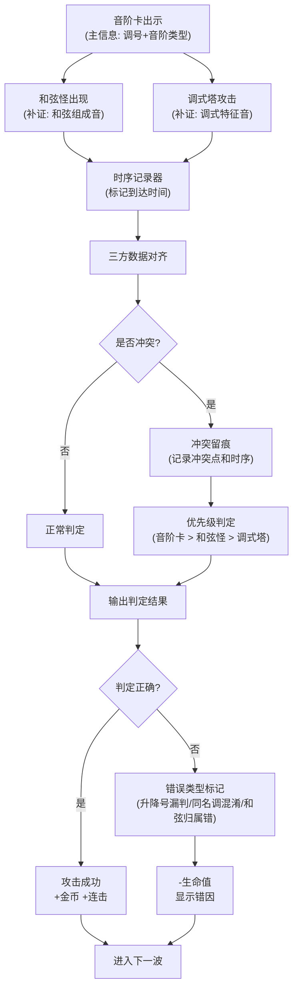
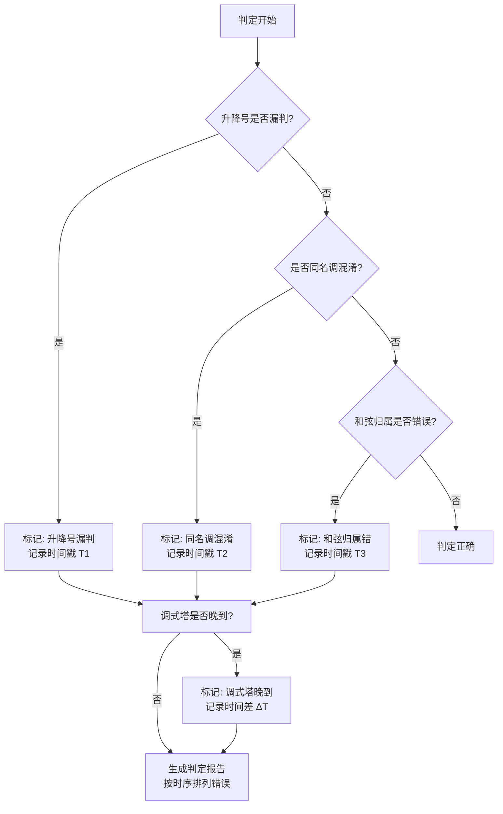

## 1. 产品概述

音阶魔法塔是一款面向音乐学习者的教育类塔防游戏，通过游戏化方式训练学生对音阶、调式和和弦的识别能力。游戏解决了传统音乐教学中抽象概念难以理解、错误归因不清晰、练习过程枯燥等问题。目标用户为音乐教师和初学乐理的学生，核心价值在于将复杂的乐理判定转化为可视化的游戏交互，并提供完整的错误追溯机制。

- 核心目的：通过塔防游戏形式，训练音阶判定能力，明确错误归因
- 解决问题：升降号漏判、同名调混淆、和弦归属错误等常见乐理学习难点
- 目标用户：音乐教师、初学乐理的学生
- 市场价值：填补乐理教育游戏化的细分领域，提供可追溯的学习数据分析

## 2. 核心功能

### 2.1 用户角色

| 角色 | 注册方式 | 核心权限 |
|------|---------|----------|
| 学生用户 | 无需注册，本地存储 | 游戏游玩、查看复盘、导出成绩 |
| 教师用户 | 无需注册，本地存储 | 自定义关卡、查看学生成绩分析 |

### 2.2 功能模块

1. **首页/关卡选择**：关卡列表、难度选择、游戏说明
2. **游戏主界面**：塔防战场、音阶卡显示、和弦怪行进、调式塔部署
3. **判定系统**：音阶卡主判定、和弦怪补证、调式塔补证、冲突留痕
4. **失败反馈**：错误类型标识、错因解释、判定时序展示
5. **复盘系统**：对局回放、错误统计、成绩导出
6. **塔防升级**：调式塔升级、技能解锁、属性增强

### 2.3 页面详情

| 页面名称 | 模块名称 | 功能描述 |
|---------|---------|----------|
| 首页 | 关卡选择 | 展示3个难度递进的关卡，显示通关状态和最高分 |
| 首页 | 游戏说明 | 图文介绍游戏规则、三种判定依据、错误类型说明 |
| 游戏界面 | 战场区域 | 8x6格子地图，显示怪物路径、塔位、和弦怪行进 |
| 游戏界面 | 音阶卡面板 | 显示当前音阶卡主信息（调号、音阶类型、升降号标记） |
| 游戏界面 | 塔部署区 | 调式塔列表，拖拽放置到战场，支持升级操作 |
| 游戏界面 | 判定反馈区 | 实时显示判定结果、冲突留痕标记、错误类型 |
| 游戏界面 | 状态栏 | 生命值、金币、波次、连击数显示 |
| 复盘界面 | 回放控制 | 进度条、播放/暂停、倍速、帧跳转 |
| 复盘界面 | 错误分析 | 错误类型统计、时序图展示、错因详细解释 |
| 复盘界面 | 成绩导出 | 生成JSON格式成绩单，支持下载 |

## 3. 核心流程

### 3.1 游戏主流程

用户选择关卡进入游戏 → 音阶卡显示当前判定目标 → 用户部署调式塔 → 和弦怪沿路径行进 → 系统进行三方判定（音阶卡+和弦怪+调式塔）→ 冲突时先留痕再最终判定 → 攻击成功/失败反馈 → 波次结束进入复盘 → 查看错误分析和导出成绩

### 3.2 判定逻辑流程

### 3.3 错误判定路径

## 4. 用户界面设计

### 4.1 设计风格

- **主色调**：深紫色(#4A1D96)作为主色，代表音乐的神秘感；金色(#FFD700)作为强调色，代表魔法塔的光辉；青色(#00CED1)作为音阶卡的主色
- **辅助色**：红色(#FF4757)表示错误，绿色(#2ED573)表示正确，橙色(#FFA502)表示冲突
- **按钮风格**：圆角矩形，带轻微3D浮雕效果，hover时有发光动画
- **字体**：标题使用 "Cinzel" 古典衬线字体，正文使用 "Noto Sans SC" 清晰易读
- **布局风格**：卡片式布局，战场区域居中，信息面板分布四周
- **图标风格**：使用音乐符号（♯♭♪♫）和魔法元素（✨⭐🔮）作为装饰图标

### 4.2 页面设计概述

| 页面名称 | 模块名称 | UI元素 |
|---------|---------|--------|
| 首页 | 关卡选择 | 大卡片展示关卡，悬浮动画，通关标记，星级评分 |
| 首页 | 游戏说明 | 折叠面板，三色编码解释三种判定依据 |
| 游戏界面 | 战场区域 | 网格地图，路径高亮，塔位发光提示，怪物动画 |
| 游戏界面 | 音阶卡面板 | 五线谱背景，升降号符号动画显示，调号清晰标注 |
| 游戏界面 | 判定反馈区 | 冲突留痕用橙色闪烁边框，错误用红色爆炸效果，时序用数字标签 |
| 游戏界面 | 塔升级面板 | 经验条，升级按钮，属性变化对比 |
| 复盘界面 | 时序分析图 | 横向时间轴，三色标记不同判定源的到达时间 |
| 复盘界面 | 错误详情卡 | 错误类型标签，原始数据对比，正确答案展示 |

### 4.3 响应式

- 桌面端优先设计，最小支持1280px宽度
- 平板端自适应布局，面板可折叠
- 移动端简化操作，改为点击放置而非拖拽
- 触摸优化：增大按钮点击区域，支持双指缩放战场

### 4.4 动画与交互

- 和弦怪行进：平滑的路径动画，被攻击时有受击反馈
- 调式塔攻击：魔法光束特效，击中时有爆炸粒子
- 音阶卡变化：翻转动画，升降号有闪烁强调
- 错误反馈：屏幕震动，红色波纹扩散
- 冲突留痕：橙色脉冲圈，时间戳标签浮动显示
- 塔升级：金色光芒向上喷射，属性数字滚动增加
