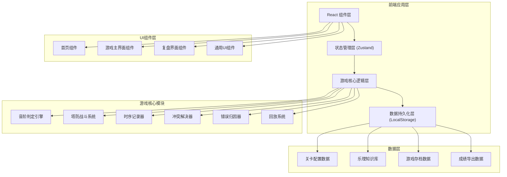

## 1. 架构设计



## 2. 技术描述

- **前端框架**：React@18 + TypeScript
- **构建工具**：Vite@5
- **样式方案**：TailwindCSS@3 + CSS Modules
- **状态管理**：Zustand（轻量级，适合游戏状态管理）
- **动画库**：Framer Motion（复杂动画和交互）
- **图标库**：Lucide React（音乐相关图标）
- **后端**：无，纯前端应用，数据存储在LocalStorage
- **数据库**：LocalStorage + IndexedDB（用于存储回放数据）

## 3. 目录结构

```
src/
├── components/           # React组件
│   ├── home/            # 首页相关组件
│   ├── game/            # 游戏界面组件
│   ├── review/          # 复盘界面组件
│   └── ui/              # 通用UI组件
├── game/                # 游戏核心逻辑
│   ├── engine/          # 判定引擎、冲突解决
│   ├── towers/          # 调式塔逻辑
│   ├── monsters/        # 和弦怪逻辑
│   └── cards/           # 音阶卡逻辑
├── store/               # Zustand状态管理
├── types/               # TypeScript类型定义
├── data/                # 静态数据（关卡、乐理知识）
├── utils/               # 工具函数
├── hooks/               # 自定义Hooks
└── App.tsx              # 应用入口
```

## 4. 路由定义

| 路由 | 页面 | 说明 |
|------|------|------|
| / | 首页 | 关卡选择、游戏说明 |
| /game/:levelId | 游戏界面 | 塔防战斗主界面 |
| /review/:gameId | 复盘界面 | 回放、错误分析、成绩导出 |

## 5. 核心数据模型

### 5.1 TypeScript类型定义

```typescript
// 乐理基础类型
type Note = 'C' | 'C#' | 'Db' | 'D' | 'D#' | 'Eb' | 'E' | 'F' | 'F#' | 'Gb' | 'G' | 'G#' | 'Ab' | 'A' | 'A#' | 'Bb' | 'B';
type ScaleType = 'major' | 'natural_minor' | 'harmonic_minor' | 'melodic_minor';
type ChordType = 'major' | 'minor' | 'diminished' | 'augmented' | 'seventh';
type ErrorType = 'accidental_miss' | 'enharmonic_confusion' | 'chord_misattribution' | 'tower_late';

// 音阶卡
interface ScaleCard {
  id: string;
  tonic: Note;
  scaleType: ScaleType;
  keySignature: Note[]; // 调号中的升降音
  accidentals: { note: Note; type: '#' | 'b' }[]; // 临时升降号
  displayNotes: Note[]; // 显示的音阶音
  intendedKey: string; // 正确答案
}

// 和弦怪
interface ChordMonster {
  id: string;
  chordNotes: Note[];
  chordType: ChordType;
  intendedKey: string; // 该和弦归属的调
  hp: number;
  speed: number;
  pathIndex: number;
  position: { x: number; y: number };
  arrivalTime: number; // 到达判定点的时间戳
}

// 调式塔
interface ModeTower {
  id: string;
  type: 'major' | 'minor' | 'modal';
  modeName: string;
  characteristicNotes: Note[]; // 调式特征音
  damage: number;
  range: number;
  attackSpeed: number;
  level: number;
  position: { x: number; y: number } | null;
  attackTime: number | null; // 攻击时间戳
  isLate: boolean; // 是否晚到
}

// 时序记录
interface TimingRecord {
  source: 'card' | 'monster' | 'tower';
  id: string;
  timestamp: number;
  data: ScaleCard | ChordMonster | ModeTower;
}

// 判定结果
interface JudgmentResult {
  id: string;
  timestamp: number;
  isCorrect: boolean;
  errorTypes: ErrorType[];
  conflictDetected: boolean;
  conflictDetails: string[];
  timingSequence: TimingRecord[];
  correctAnswer: string;
  userAnswer: string;
  explanation: string;
}

// 游戏状态
interface GameState {
  gameId: string;
  levelId: string;
  status: 'playing' | 'paused' | 'won' | 'lost';
  wave: number;
  totalWaves: number;
  lives: number;
  gold: number;
  combo: number;
  maxCombo: number;
  score: number;
  currentCard: ScaleCard | null;
  monsters: ChordMonster[];
  towers: ModeTower[];
  timingRecords: TimingRecord[];
  judgments: JudgmentResult[];
  startTime: number;
  endTime: number | null;
}

// 回放帧
interface ReplayFrame {
  frameNumber: number;
  timestamp: number;
  gameState: Partial<GameState>;
  events: GameEvent[];
}

// 游戏事件
interface GameEvent {
  type: 'card_show' | 'monster_spawn' | 'tower_place' | 'tower_attack' | 'judgment' | 'life_lost' | 'wave_start' | 'wave_end';
  timestamp: number;
  data: any;
}

// 成绩单
interface ScoreReport {
  gameId: string;
  levelId: string;
  startTime: number;
  endTime: number;
  totalScore: number;
  maxCombo: number;
  accuracy: number;
  totalJudgments: number;
  correctCount: number;
  errorBreakdown: Record<ErrorType, number>;
  judgments: JudgmentResult[];
}
```

### 5.2 冲突解决算法

```typescript
// 优先级：音阶卡 > 和弦怪 > 调式塔
const PRIORITY = {
  card: 3,
  monster: 2,
  tower: 1,
};

function resolveConflict(records: TimingRecord[]): { result: string; conflicts: string[] } {
  const sortedByPriority = [...records].sort(
    (a, b) => PRIORITY[b.source] - PRIORITY[a.source]
  );
  
  const answers = records.map(r => ({
    source: r.source,
    answer: extractAnswer(r),
    priority: PRIORITY[r.source],
  }));
  
  const uniqueAnswers = [...new Set(answers.map(a => a.answer))];
  const conflicts: string[] = [];
  
  if (uniqueAnswers.length > 1) {
    answers.forEach(a => {
      if (a.answer !== answers[0].answer) {
        conflicts.push(
          `冲突: ${a.source}判定为${a.answer}，但${answers[0].source}判定为${answers[0].answer}`
        );
      }
    });
  }
  
  return {
    result: sortedByPriority[0] ? extractAnswer(sortedByPriority[0]) : '',
    conflicts,
  };
}

function detectErrorType(
  card: ScaleCard,
  monster: ChordMonster,
  tower: ModeTower,
  timing: TimingRecord[]
): ErrorType[] {
  const errors: ErrorType[] = [];
  const monsterTiming = timing.find(t => t.source === 'monster');
  const towerTiming = timing.find(t => t.source === 'tower');
  
  // 1. 检测升降号漏判
  if (card.accidentals.length > 0 && !monster.chordNotes.some(n => 
    card.accidentals.some(a => a.note === n)
  )) {
    errors.push('accidental_miss');
  }
  
  // 2. 检测同名调混淆
  if (isEnharmonicConfusion(card.intendedKey, monster.intendedKey)) {
    errors.push('enharmonic_confusion');
  }
  
  // 3. 检测和弦归属错误
  if (!isChordInKey(monster.chordNotes, card.intendedKey)) {
    errors.push('chord_misattribution');
  }
  
  // 4. 检测调式塔晚到
  if (towerTiming && monsterTiming && towerTiming.timestamp > monsterTiming.timestamp + 1000) {
    errors.push('tower_late');
  }
  
  return errors;
}
```

## 6. 成绩导出格式

```json
{
  "gameId": "game_20240531_142301",
  "levelId": "level_1",
  "levelName": "大调入门",
  "startTime": 1717164181000,
  "endTime": 1717164421000,
  "duration": 240000,
  "totalScore": 850,
  "maxCombo": 8,
  "accuracy": 0.72,
  "totalJudgments": 25,
  "correctCount": 18,
  "errorBreakdown": {
    "accidental_miss": 3,
    "enharmonic_confusion": 2,
    "chord_misattribution": 1,
    "tower_late": 1
  },
  "judgments": [
    {
      "id": "judge_001",
      "timestamp": 1717164195000,
      "isCorrect": false,
      "errorTypes": ["accidental_miss", "tower_late"],
      "conflictDetected": true,
      "conflictDetails": [
        "冲突: tower判定为C大调，但card判定为G大调"
      ],
      "timingSequence": [
        {"source": "card", "timestamp": 1717164190000},
        {"source": "monster", "timestamp": 1717164192000},
        {"source": "tower", "timestamp": 1717164195500}
      ],
      "correctAnswer": "G大调",
      "userAnswer": "C大调",
      "explanation": "音阶卡显示F#升号，应为G大调；调式塔晚到3500ms，导致误判为C大调"
    }
  ]
}
```

## 7. 关卡配置

```typescript
const LEVELS = [
  {
    id: 'level_1',
    name: '大调入门',
    description: '识别基本大调音阶，熟悉升降号规则',
    difficulty: 'easy',
    totalWaves: 5,
    initialLives: 10,
    initialGold: 100,
    availableTowers: ['major_tower'],
    scaleTypes: ['major'],
    errorTypes: ['accidental_miss'],
    path: [
      {x: 0, y: 2}, {x: 1, y: 2}, {x: 2, y: 2}, {x: 2, y: 3},
      {x: 3, y: 3}, {x: 4, y: 3}, {x: 4, y: 2}, {x: 5, y: 2},
      {x: 6, y: 2}, {x: 7, y: 2}
    ],
    towerSlots: [
      {x: 1, y: 1}, {x: 1, y: 3}, {x: 3, y: 2}, {x: 3, y: 4},
      {x: 5, y: 1}, {x: 5, y: 3}, {x: 6, y: 1}, {x: 6, y: 3}
    ],
    waves: [
      { monsters: 3, interval: 3000, keys: ['C', 'G', 'F'] },
      { monsters: 4, interval: 2800, keys: ['D', 'Bb', 'A', 'Eb'] },
      { monsters: 5, interval: 2500, keys: ['C', 'G', 'D', 'F', 'Bb'] },
      { monsters: 5, interval: 2200, keys: ['A', 'E', 'Ab', 'Db'] },
      { monsters: 6, interval: 2000, keys: ['C', 'G', 'D', 'A', 'F', 'Bb'] }
    ]
  },
  {
    id: 'level_2',
    name: '小调挑战',
    description: '区分自然小调和和声小调，识别同名调',
    difficulty: 'medium',
    totalWaves: 6,
    initialLives: 8,
    initialGold: 150,
    availableTowers: ['major_tower', 'minor_tower'],
    scaleTypes: ['major', 'natural_minor', 'harmonic_minor'],
    errorTypes: ['accidental_miss', 'enharmonic_confusion'],
    path: [
      {x: 0, y: 3}, {x: 1, y: 3}, {x: 1, y: 2}, {x: 2, y: 2},
      {x: 3, y: 2}, {x: 3, y: 3}, {x: 4, y: 3}, {x: 4, y: 2},
      {x: 5, y: 2}, {x: 6, y: 2}, {x: 6, y: 3}, {x: 7, y: 3}
    ],
    towerSlots: [
      {x: 0, y: 2}, {x: 2, y: 1}, {x: 2, y: 3}, {x: 4, y: 1},
      {x: 4, y: 4}, {x: 5, y: 3}, {x: 7, y: 2}, {x: 7, y: 4}
    ],
    waves: [
      { monsters: 4, interval: 2800, keys: ['Am', 'Em', 'Dm', 'C'] },
      { monsters: 5, interval: 2500, keys: ['G', 'Bm', 'F#m', 'A', 'F'] },
      { monsters: 5, interval: 2200, keys: ['D', 'Bbm', 'Gm', 'E', 'Cm'] },
      { monsters: 6, interval: 2000, keys: ['C#m', 'G#m', 'Dbm', 'Gbm', 'F', 'Bb'] },
      { monsters: 6, interval: 1800, keys: ['Am', 'Em', 'Bm', 'F#m', 'C#m', 'G#m'] },
      { monsters: 7, interval: 1600, keys: ['C', 'G', 'Am', 'Em', 'F', 'Dm', 'Bbm'] }
    ]
  },
  {
    id: 'level_3',
    name: '和弦归属',
    description: '综合判定音阶、调式和和弦归属，处理时序冲突',
    difficulty: 'hard',
    totalWaves: 8,
    initialLives: 5,
    initialGold: 200,
    availableTowers: ['major_tower', 'minor_tower', 'modal_tower'],
    scaleTypes: ['major', 'natural_minor', 'harmonic_minor', 'melodic_minor'],
    errorTypes: ['accidental_miss', 'enharmonic_confusion', 'chord_misattribution', 'tower_late'],
    path: [
      {x: 0, y: 1}, {x: 1, y: 1}, {x: 2, y: 1}, {x: 2, y: 2},
      {x: 2, y: 3}, {x: 3, y: 3}, {x: 4, y: 3}, {x: 4, y: 4},
      {x: 5, y: 4}, {x: 6, y: 4}, {x: 6, y: 3}, {x: 6, y: 2},
      {x: 7, y: 2}
    ],
    towerSlots: [
      {x: 1, y: 0}, {x: 1, y: 2}, {x: 3, y: 2}, {x: 3, y: 4},
      {x: 5, y: 3}, {x: 5, y: 5}, {x: 7, y: 1}, {x: 7, y: 3}, {x: 7, y: 5}
    ],
    waves: [
      { monsters: 5, interval: 2500, keys: ['C', 'G', 'Am', 'Em', 'F'] },
      { monsters: 5, interval: 2200, keys: ['D', 'A', 'Bm', 'F#m', 'Bbm'] },
      { monsters: 6, interval: 2000, keys: ['E', 'Ab', 'Cm', 'Gm', 'Eb', 'Db'] },
      { monsters: 6, interval: 1800, keys: ['B', 'Gb', 'D#m', 'A#m', 'F', 'C#'] },
      { monsters: 7, interval: 1600, keys: ['C', 'G', 'D', 'Am', 'Em', 'Bm', 'F#m'] },
      { monsters: 7, interval: 1400, keys: ['F', 'Bb', 'Eb', 'Dm', 'Gm', 'Cm', 'Fm'] },
      { monsters: 8, interval: 1200, keys: ['C', 'Am', 'G', 'Em', 'F', 'Dm', 'Bb', 'Gm'] },
      { monsters: 10, interval: 1000, keys: ['C', 'G', 'D', 'A', 'E', 'F', 'Bb', 'Eb', 'Ab', 'Db'] }
    ]
  }
];
```

## 8. 状态管理设计

```typescript
// Zustand store 设计
interface GameStore {
  // 状态
  currentPage: 'home' | 'game' | 'review';
  gameState: GameState | null;
  replayData: ReplayFrame[] | null;
  isReplaying: boolean;
  replaySpeed: number;
  currentReplayFrame: number;
  
  // 动作
  startGame: (levelId: string) => void;
  pauseGame: () => void;
  resumeGame: () => void;
  endGame: (won: boolean) => void;
  placeTower: (towerId: string, position: {x: number, y: number}) => void;
  upgradeTower: (towerId: string) => void;
  sellTower: (towerId: string) => void;
  processJudgment: (result: JudgmentResult) => void;
  recordTiming: (record: TimingRecord) => void;
  startReview: (gameId: string) => void;
  playReplay: () => void;
  pauseReplay: () => void;
  seekReplay: (frame: number) => void;
  setReplaySpeed: (speed: number) => void;
  exportScore: () => ScoreReport;
  saveGame: () => void;
  loadGame: (gameId: string) => void;
}
```
