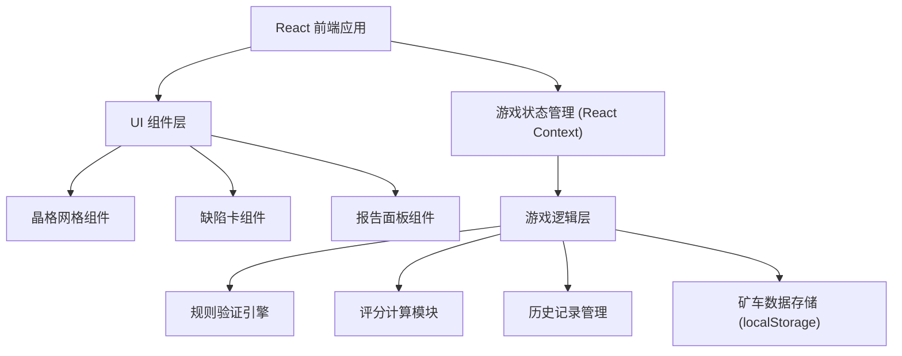

## 1. 架构设计



## 2. 技术描述
- **前端框架**: React@18 + TypeScript
- **构建工具**: Vite@5
- **样式方案**: TailwindCSS@3 + CSS Variables
- **状态管理**: React Context + useReducer
- **图标**: Lucide React
- **数据持久化**: localStorage
- **动画**: Framer Motion

## 3. 目录结构
```
src/
├── components/
│   ├── CrystalGrid/       # 晶格网格组件
│   ├── DefectCard/        # 缺陷卡组件
│   ├── ControlPanel/      # 控制面板组件
│   ├── StatusBar/         # 状态栏组件
│   └── ReportPanel/       # 报告面板组件
├── hooks/
│   ├── useGameState.ts    # 游戏状态hook
│   └── useValidation.ts   # 规则验证hook
├── types/
│   └── game.ts            # 类型定义
├── utils/
│   ├── rules.ts           # 游戏规则
│   ├── scoring.ts         # 评分逻辑
│   └── storage.ts         # 存储工具
├── contexts/
│   └── GameContext.tsx    # 游戏上下文
├── App.tsx
└── main.tsx
```

## 4. 核心类型定义

```typescript
// 缺陷类型
type DefectType = 'vacancy' | 'interstitial' | 'dislocation' | 'grain_boundary';

// 缺陷卡片
interface DefectCard {
  id: string;
  type: DefectType;
  name: string;
  nameCn: string;
  energyCost: number;
  description: string;
  material: string;
}

// 晶格位置
interface GridPosition {
  x: number;
  y: number;
}

// 已放置的缺陷
interface PlacedDefect {
  id: string;
  cardId: string;
  type: DefectType;
  position: GridPosition;
  timestamp: number;
}

// 违规记录
interface Violation {
  id: string;
  type: 'overlap' | 'energy' | 'boundary' | 'adjacency';
  position?: GridPosition;
  defectType?: DefectType;
  message: string;
  ruleBroken: string;
  timestamp: number;
}

// 游戏状态
interface GameState {
  gridSize: { width: number; height: number };
  maxEnergy: number;
  currentEnergy: number;
  score: {
    base: number;
    bonus: number;
    penalty: number;
    total: number;
  };
  selectedCard: DefectCard | null;
  placedDefects: PlacedDefect[];
  violations: Violation[];
  consecutiveSuccess: number;
  isSubmitted: boolean;
  minecartId: string;
}

// 成绩报告
interface GameReport {
  minecartId: string;
  timestamp: number;
  score: GameState['score'];
  totalDefects: number;
  totalViolations: number;
  violations: Violation[];
  placedDefects: PlacedDefect[];
}
```

## 5. 规则验证引擎接口

```typescript
interface ValidationResult {
  valid: boolean;
  violation?: Violation;
}

interface IRuleValidator {
  validate(
    position: GridPosition,
    card: DefectCard,
    gameState: GameState
  ): ValidationResult;
}

// 具体验证器
class OverlapValidator implements IRuleValidator { /* ... */ }
class EnergyValidator implements IRuleValidator { /* ... */ }
class BoundaryValidator implements IRuleValidator { /* ... */ }
class AdjacencyValidator implements IRuleValidator { /* ... */ }
```

## 6. 数据持久化

使用 localStorage 存储：
- 当前游戏状态
- 历史游戏记录（支持矿车修改前后对比）
- 矿车标识（minecartId）用于区分不同测试场景

```typescript
// 存储键名
const STORAGE_KEYS = {
  CURRENT_GAME: 'crystal_mining:current_game',
  HISTORY: 'crystal_mining:history',
  MINECART_ID: 'crystal_mining:minecart_id',
};
```
