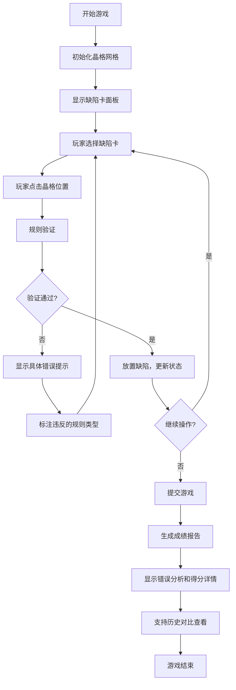

## 1. 产品概述
晶体缺陷采矿场是一款以材料科学为背景的教育性游戏，玩家通过在晶格网格上进行探索和缺陷判定来获取分数。
- 解决问题：让玩家在游戏中理解晶体缺陷（如位错、空位、间隙原子等）的概念，并学会处理复杂的缺陷叠加情况
- 目标用户：化学物理专业学生、材料科学爱好者、科普游戏玩家
- 产品价值：将抽象的晶体学概念转化为可交互的游戏体验，通过游戏化学习加深理解

## 2. 核心特性

### 2.1 用户角色
| 角色 | 注册方式 | 核心权限 |
|------|----------|----------|
| 玩家 | 无需注册 | 游戏探索、缺陷判定、查看成绩报告 |

### 2.2 功能模块
1. **游戏主界面**：晶格网格显示、缺陷卡面板、操作控制区
2. **缺陷判定系统**：点击选择、规则验证、错误提示
3. **成绩报告系统**：得分统计、错误分析、规则违反详情
4. **历史对比功能**：记录每次游戏数据，支持矿车修改前后对比

### 2.3 页面详情
| 页面名称 | 模块名称 | 功能描述 |
|----------|----------|----------|
| 游戏主界面 | 晶格网格区 | 8x8或10x10网格，显示晶格原子和缺陷位置 |
| 游戏主界面 | 缺陷卡面板 | 显示可用缺陷卡（空位、间隙、位错等），带能量值和材料类型 |
| 游戏主界面 | 操作控制区 | 放置缺陷、撤销、提交、重置按钮 |
| 游戏主界面 | 实时状态区 | 当前能量、已放置缺陷数、当前得分 |
| 成绩报告页 | 得分详情 | 基础分、奖励分、扣分明细 |
| 成绩报告页 | 错误分析 | 列出所有违规操作，标注具体规则和位置 |
| 成绩报告页 | 历史对比 | 显示本次与上次游戏的差异对比 |

## 3. 核心流程

玩家选择缺陷卡 → 点击晶格放置 → 系统实时验证规则 → 提示违规或确认放置 → 完成后提交 → 生成详细报告

## 4. 用户界面设计

### 4.1 设计风格
- **主色调**：科技蓝 (#165DFF) 为主，晶体紫 (#7B61FF) 为辅
- **辅助色**：成功绿 (#00B42A)、警告橙 (#FF7D00)、错误红 (#F53F3F)
- **按钮风格**：圆角矩形，微立体效果，hover时有轻微上浮动画
- **字体**：标题使用 Orbitron（科技感），正文使用 Roboto Mono（等宽便于数据展示）
- **布局风格**：三栏布局 - 左侧缺陷卡、中间晶格网格、右侧状态/报告
- **图标风格**：线性图标，配合晶格点阵图案，体现科技感
- **整体氛围**：实验室/科研风格，深色背景配荧光色高亮，营造晶体探索的沉浸感

### 4.2 页面设计概述
| 页面名称 | 模块名称 | UI 元素 |
|----------|----------|----------|
| 游戏主界面 | 晶格网格区 | 六边形或方形网格，原子节点用圆形表示，缺陷位置用特殊标记高亮 |
| 游戏主界面 | 缺陷卡面板 | 卡片式设计，每张卡显示缺陷类型、能量值、材料类型、示意图标 |
| 游戏主界面 | 操作控制区 | 功能按钮组，快捷键提示 |
| 游戏主界面 | 实时状态区 | 进度条显示能量值，计数器显示缺陷数量 |
| 成绩报告页 | 报告面板 | 分块布局，得分用大字号显示，错误列表带行号和位置标记 |
| 成绩报告页 | 历史对比 | 左右分栏对比，差异部分用颜色高亮 |

### 4.3 响应式
- Desktop-first 设计，主界面三栏布局
- 平板端：上下布局，缺陷卡和状态区移至顶部/底部
- 移动端：网格缩放适配，缺陷卡改为横向滚动
- 触摸优化：增大点击区域，支持双击确认

## 5. 游戏规则设计

### 5.1 缺陷类型
| 缺陷类型 | 能量消耗 | 说明 |
|----------|----------|------|
| 空位 (Vacancy) | 10 | 移除一个晶格原子 |
| 间隙原子 (Interstitial) | 15 | 在晶格间隙添加原子 |
| 位错 (Dislocation) | 25 | 线性缺陷，影响相邻晶格 |
| 晶界 (Grain Boundary) | 40 | 区域缺陷，跨越多格 |

### 5.2 判定规则
1. **缺陷重叠检测**：同一位置不能放置多个缺陷 - 提示"该位置已存在[缺陷类型]，无法叠加"
2. **能量超限检测**：总能量不能超过上限 - 提示"能量不足，当前缺陷需要[X]能量，剩余[Y]"
3. **晶格越界检测**：不能在网格外放置 - 提示"位置[X,Y]超出晶格边界"
4. **位错邻接规则**：位错必须与其他缺陷相邻 - 提示"位错需要邻接已有缺陷，不符合放置条件"

### 5.3 评分机制
- 基础分：每个成功放置的缺陷获得对应能量值分数
- 奖励分：连续正确放置 +5分/次，完成特定组合 +20分
- 扣分：每次违规操作扣除5分，并记录违规类型
- 最终得分 = 基础分 + 奖励分 - 扣分
