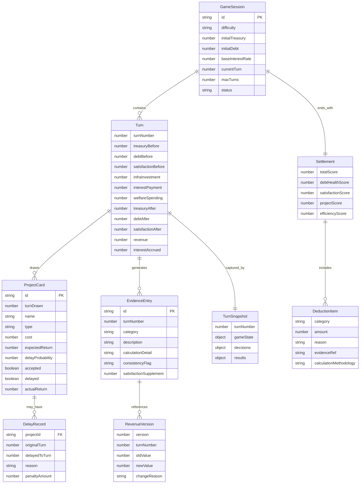

## 1. 架构设计

```mermaid
flowchart TD
    "浏览器前端" --> "React SPA"
    "React SPA" --> "GameState 状态机"
    "GameState 状态机" --> "回合引擎"
    "回合引擎" --> "项目卡生成器"
    "回合引擎" --> "利息计算器"
    "回合引擎" --> "满意度引擎"
    "回合引擎" --> "证据日志"
    "证据日志" --> "版本化收入记录"
    "证据日志" --> "利息计算留痕"
    "证据日志" --> "项目延期追踪"
    "结算引擎" --> "评分系统"
    "结算引擎" --> "扣分明细"
    "复盘引擎" --> "回合快照回放"
    "复盘引擎" --> "报告导出"
```

纯前端 SPA，无后端依赖。所有游戏逻辑、状态管理、数据持久化均在浏览器内完成，使用 localStorage 保存游戏进度。

## 2. 技术说明

- **前端框架**：React@18 + TypeScript
- **样式方案**：Tailwind CSS@3
- **构建工具**：Vite
- **状态管理**：useReducer + Context（游戏状态机）
- **数据持久化**：localStorage（游戏存档 + 证据日志）
- **图标库**：Lucide React
- **动画库**：Framer Motion
- **图表**：无外部图表库，纯 CSS/SVG 实现雷达图与进度条
- **后端**：无
- **数据库**：无

## 3. 路由定义

| 路由 | 用途 |
|------|------|
| `/` | 开局页：规则说明、难度选择、开始游戏 |
| `/game` | 经营主界面：仪表盘、项目卡、操作区、证据日志 |
| `/settlement` | 结算页：总分、扣分明细、项目收益说明 |
| `/review` | 复盘页：回合回放、证据链审计、报告导出 |

## 4. 数据模型

### 4.1 核心数据模型



### 4.2 游戏参数配置

| 难度 | 初始国库 | 初始债务 | 基础利率 | 满意度初始值 | 满意度衰减/回合 | 总回合数 |
|------|----------|----------|----------|-------------|----------------|---------|
| 简单 | 500万 | 2000万 | 4% | 75 | -2 | 12 |
| 普通 | 300万 | 3500万 | 6% | 65 | -3 | 10 |
| 困难 | 200万 | 5000万 | 8% | 55 | -4 | 8 |

### 4.3 核心计算规则

**利息计算**：
- 每回合利息 = 剩余债务 × 综合利率
- 综合利率 = 基础利率 + (债务/初始债务 - 1) × 2%（债务攀升惩罚）
- 最低偿还 = 利息的50%，低于此触发信用降级

**收入计算**：
- 基础税收 = 初始税收 × (1 + 基建累计投资系数)
- 满意度修正 = 基础税收 × (满意度/100)
- 实际收入 = 基础税收 × 满意度修正

**满意度计算**：
- 民生支出回复：每1万支出 +1 满意度
- 基建投资间接影响：每10万基建 +0.5 满意度（下回合生效）
- 利息惩罚：未足额偿还利息 → -5 满意度/回合
- 项目延期惩罚：每个延期项目 → -3 满意度

**项目卡机制**：
- 类型：基建（高成本高回报）、民生（低成本稳定回报）、偿债优化（降低利率或减免部分本金）
- 延期概率：基建15%-30%，民生5%-10%，偿债优化0%
- 延期后收益减半且产生额外扣分

### 4.4 证据日志分类

| 类别 | 标识色 | 记录内容 |
|------|--------|----------|
| 利息计算 | 琥珀金 | 每回合利息公式、实际计算、是否漏算、与上回合差异 |
| 项目延期 | 暗红 | 延期项目、原定/实际完成回合、扣罚金额、原因 |
| 收入变动 | 青灰 | 收入新旧值、变动原因、版本号（不覆盖旧值） |
| 一致性标记 | 紫色 | 项目卡结论与债务额度矛盾处、满意度补充证据 |
