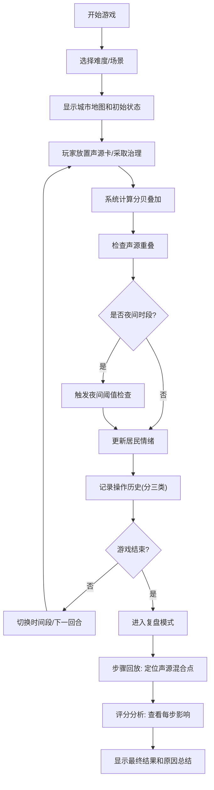

## 1. 产品概述

"声音污染调度员"是一款面向环保科普课堂的交互式培训游戏。玩家通过管理城市中的声源卡、调整治理策略，在不同时间段内维持城市声环境质量，学习噪声污染的专业知识。

- **核心目标**：让玩家理解夜间阈值、声源重叠、分贝叠加等声学概念，掌握噪声污染治理方法
- **目标用户**：环保科普老师、学生、培训参与者
- **产品价值**：将抽象的声学知识转化为可交互的游戏体验，支持教学复盘和原因追溯

## 2. 核心功能

### 2.1 用户角色
| 角色 | 使用方式 | 核心需求 |
|------|----------|----------|
| 玩家/学生 | 游戏操作、学习知识 | 清晰的操作反馈、原因说明、得分依据 |
| 科普老师 | 课堂演示、复盘分析 | 完整的操作记录、可追溯的声源来源、步骤回放 |

### 2.2 功能模块
1. **游戏主界面**：城市地图、声源卡面板、居民情绪仪表盘、时间段切换
2. **操作记录系统**：声源卡记录、居民情绪变化、治理报告，每项均可追溯来源
3. **风险分析面板**：夜间阈值、声源重叠、分贝叠加三项风险分开说明
4. **游戏结束复盘**：步骤回放、声源混合触发点定位、评分影响分析
5. **夜间阈值提示**：实时显示原因和处理建议

### 2.3 页面详情
| 页面名称 | 模块名称 | 功能描述 |
|---------|----------|----------|
| 游戏主界面 | 城市地图区域 | 可视化展示各区域声源分布、分贝热力图 |
| 游戏主界面 | 声源卡面板 | 拖拽放置声源卡，显示声源类型、分贝值、来源时间 |
| 游戏主界面 | 居民情绪仪表盘 | 分区域显示满意度，点击查看具体原因 |
| 游戏主界面 | 时间段控制 | 白天/夜间切换，夜间模式高亮显示阈值提醒 |
| 游戏主界面 | 操作记录区 | 分栏展示声源卡历史、情绪变化、治理报告，每项带时间戳和来源 |
| 风险分析面板 | 夜间阈值模块 | 显示当前夜间分贝值、阈值、超标原因、处理建议 |
| 风险分析面板 | 声源重叠模块 | 标识重叠区域、涉及声源、叠加计算过程 |
| 风险分析面板 | 分贝叠加模块 | 展示错误叠加方式、正确计算公式、修正建议 |
| 复盘界面 | 步骤回放 | 时间轴拖动、关键节点高亮、声源混合触发点定位 |
| 复盘界面 | 评分分析 | 每步操作得分/扣分详情、对最终成绩的影响 |

## 3. 核心流程

玩家从选择难度开始，在限定回合内管理城市声环境。每回合可以放置声源卡、采取治理措施，系统实时计算分贝叠加和居民情绪。夜间模式触发阈值检查，三项风险分别评估。游戏结束后进入复盘模式，可追溯每一步操作的影响。

## 4. 用户界面设计

### 4.1 设计风格
- **主色调**：深蓝色 (#1a365d) 代表专业科技感，搭配青色 (#319795) 作为环保主题色
- **警示色**：夜间阈值用橙色 (#ed8936)，声源重叠用红色 (#e53e3e)，分贝错误用紫色 (#805ad5)
- **卡片风格**：圆角8px，轻微阴影，悬停时上浮效果
- **字体**：标题使用 Noto Sans SC Bold，正文使用 Noto Sans SC Regular
- **图标风格**：线性图标，搭配emoji增强视觉识别（🔊🏙️🌙📊）
- **整体风格**：信息密度适中的仪表盘风格，数据可视化清晰，教学友好

### 4.2 页面设计概述
| 页面名称 | 模块名称 | UI元素设计 |
|---------|----------|------------|
| 游戏主界面 | 城市地图 | 网格布局，区域色块，声源图标带分贝标签，热力图渐变效果 |
| 游戏主界面 | 声源卡面板 | 可拖拽卡片，显示类型、分贝、时间段，悬停展开详情 |
| 游戏主界面 | 操作记录区 | 三栏并列布局（声源/情绪/治理），每项带彩色标签和时间戳 |
| 风险分析面板 | 三风险模块 | 独立卡片，各有专属配色，展开显示详细计算过程和建议 |
| 复盘界面 | 时间轴 | 横向拖动条，关键节点用不同颜色标记，点击跳转到对应步骤 |

### 4.3 响应式
- 桌面端优先设计（适配课堂投影）
- 平板端自适应布局，记录区改为折叠面板
- 保证所有文字在投影环境下清晰可读（最小字号14px）

### 4.4 动效设计
- 声源放置：卡片飞入动画 + 区域波纹扩散效果
- 夜间模式切换：平滑过渡，背景变暗，阈值警示灯闪烁
- 风险触发：对应卡片高亮抖动，展开原因说明
- 时间轴回放：逐步点亮节点，地图上动态显示变化过程
