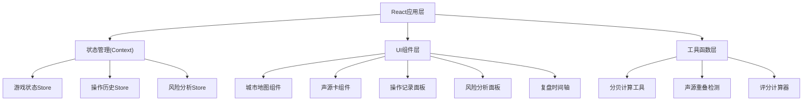

## 1. 架构设计

本项目为纯前端单页应用，采用React组件化架构。所有游戏状态、操作记录、计算逻辑均在前端管理，无需后端服务。



## 2. 技术描述

- **前端框架**: React@18 + TypeScript
- **构建工具**: Vite@5
- **样式方案**: TailwindCSS@3 + CSS Modules
- **状态管理**: React Context + useReducer
- **图标方案**: Lucide React + emoji
- **拖拽交互**: 原生HTML5 Drag & Drop API
- **动画方案**: Framer Motion
- **后端服务**: 无（纯前端应用）
- **数据持久化**: LocalStorage（可选保存游戏进度）

## 3. 路由定义

| 路由 | 页面用途 |
|------|----------|
| / | 游戏首页/开始界面 |
| /game | 游戏主界面 |
| /review | 复盘分析界面 |

## 4. 数据模型

### 4.1 核心数据类型

```typescript
// 声源类型
interface SoundSource {
  id: string;
  type: 'traffic' | 'construction' | 'commercial' | 'industrial' | 'entertainment' | 'residential';
  name: string;
  icon: string;
  baseDecibel: number;
  validPeriods: ('day' | 'night')[];
  description: string;
}

// 放置在地图上的声源实例
interface PlacedSource {
  id: string;
  sourceId: string;
  areaId: string;
  placedAt: number; // 回合数
  placedByPlayer: boolean;
  isActive: boolean;
}

// 城市区域
interface CityArea {
  id: string;
  name: string;
  type: 'residential' | 'commercial' | 'industrial' | 'park';
  sensitivity: number; // 对噪音的敏感度 1-5
  position: { row: number; col: number };
}

// 时间段
type TimePeriod = 'day' | 'night';

// 分贝计算结果
interface DecibelCalculation {
  areaId: string;
  sources: string[]; // 声源ID列表
  rawSum: number; // 简单相加（错误方式）
  correctValue: number; // 对数叠加（正确方式）
  isOverlap: boolean;
  overlapCount: number;
}

// 风险项
interface RiskItem {
  type: 'night_threshold' | 'source_overlap' | 'decibel_error';
  severity: 'low' | 'medium' | 'high';
  title: string;
  description: string;
  cause: string;
  suggestion: string;
  relatedSources?: string[];
  triggeredAt: number; // 触发回合
}

// 操作记录（分类存储）
interface OperationRecords {
  soundSources: SoundSourceRecord[];
  residentMood: MoodRecord[];
  governance: GovernanceRecord[];
}

interface SoundSourceRecord {
  id: string;
  timestamp: number;
  turn: number;
  action: 'place' | 'remove' | 'modify';
  sourceName: string;
  areaName: string;
  decibel: number;
  period: TimePeriod;
  detail: string;
}

interface MoodRecord {
  id: string;
  timestamp: number;
  turn: number;
  areaName: string;
  beforeMood: number;
  afterMood: number;
  changeReason: string;
  relatedSources: string[];
}

interface GovernanceRecord {
  id: string;
  timestamp: number;
  turn: number;
  measure: string;
  targetArea?: string;
  effect: string;
  cost: number;
}

// 游戏状态
interface GameState {
  currentTurn: number;
  maxTurns: number;
  currentPeriod: TimePeriod;
  areas: CityArea[];
  placedSources: PlacedSource[];
  availableSourceCards: SoundSource[];
  residentMood: Record<string, number>; // areaId -> mood 0-100
  score: number;
  scoreBreakdown: ScoreItem[];
  risks: RiskItem[];
  records: OperationRecords;
  isGameOver: boolean;
  gameResult: 'win' | 'lose' | null;
}

interface ScoreItem {
  turn: number;
  change: number;
  reason: string;
  category: 'source' | 'mood' | 'governance' | 'penalty';
}
```

### 4.2 分贝计算公式

分贝叠加采用对数能量叠加法则（正确方式）：
```
L_total = 10 * log10(Σ 10^(Li/10))
```

其中 Li 为第i个声源的分贝值。简单的算术相加是错误示范。

### 4.3 夜间阈值标准

根据中国《声环境质量标准》(GB3096-2008)：
- 1类区（居民区）：昼间55dB，夜间45dB
- 2类区（商住混合）：昼间60dB，夜间50dB
- 3类区（工业区）：昼间65dB，夜间55dB
- 4类区（交通干线）：昼间70dB，夜间55dB

## 5. 核心组件结构

```
src/
├── components/
│   ├── game/
│   │   ├── CityMap.tsx          # 城市地图组件
│   │   ├── CityArea.tsx         # 单个区域组件
│   │   ├── SoundCard.tsx        # 声源卡组件
│   │   ├── SoundCardPanel.tsx   # 声源卡面板
│   │   ├── MoodGauge.tsx        # 居民情绪仪表盘
│   │   ├── TimePeriodToggle.tsx # 时间段切换
│   │   └── GovernancePanel.tsx  # 治理措施面板
│   ├── records/
│   │   ├── RecordsPanel.tsx     # 操作记录总面板
│   │   ├── SoundRecords.tsx     # 声源卡记录
│   │   ├── MoodRecords.tsx      # 情绪变化记录
│   │   └── GovernanceRecords.tsx # 治理报告记录
│   ├── risks/
│   │   ├── RisksPanel.tsx       # 风险分析面板
│   │   ├── NightThreshold.tsx   # 夜间阈值模块
│   │   ├── SourceOverlap.tsx    # 声源重叠模块
│   │   └── DecibelError.tsx     # 分贝叠加错误模块
│   └── review/
│       ├── ReviewPage.tsx       # 复盘主页面
│       ├── Timeline.tsx         # 时间轴组件
│       ├── MixingPoints.tsx     # 声源混合点定位
│       └── ScoreAnalysis.tsx    # 评分影响分析
├── context/
│   └── GameContext.tsx          # 游戏状态管理
├── utils/
│   ├── decibel.ts               # 分贝计算工具
│   ├── riskAnalysis.ts          # 风险分析工具
│   └── scoring.ts               # 评分计算工具
├── data/
│   ├── soundSources.ts          # 声源卡数据
│   └── cityAreas.ts             # 城市区域数据
└── types/
    └── index.ts                 # 类型定义
```
