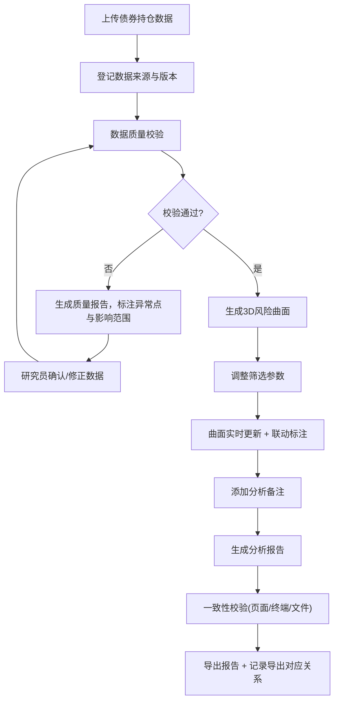
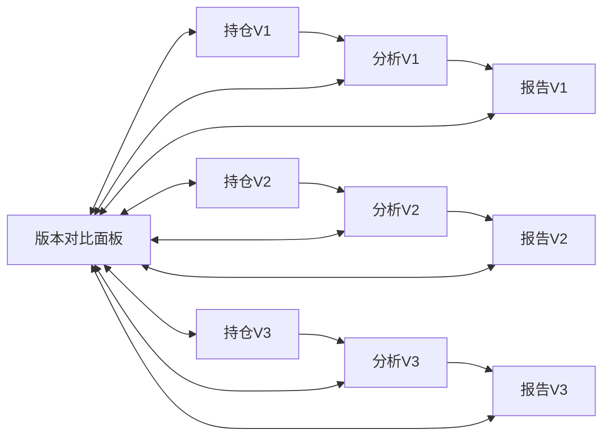

## 1. 产品概述

债券组合风险曲面是面向基金研究员的专业3D交互分析工作台，解决久期与行业标签冲突问题，通过可视化曲面稳定风险分析链路。产品核心是将债券持仓、久期、收益率等多维度数据投射到可交互的3D空间，提供数据来源追溯、版本管理、异常点检测和联动标注功能，确保分析过程可复核、结论可追溯。

- 目标用户：固定收益基金研究员、投资经理、风控人员
- 核心价值：将抽象的风险维度转化为可操作的可视化工作台，解决久期与行业标签冲突导致的分析不稳定问题
- 差异化：不是单纯的3D展示模型，而是完整的分析工作台，包含数据校验、版本追踪、联动标注、报告导出全流程

## 2. 核心功能

### 2.1 用户角色

| 角色 | 注册方法 | 核心权限 |
|------|----------|----------|
| 基金研究员 | 内部系统登录 | 上传持仓数据、调整参数、分析曲面、导出报告 |
| 投资经理 | 内部系统登录 | 查看分析结果、复核报告、对比历史版本 |
| 风控人员 | 内部系统登录 | 数据质量校验、异常点审核、导出审计报告 |

### 2.2 功能模块

1. **主工作台页面**：3D风险曲面可视化、参数控制面板、数据筛选器、联动标注
2. **数据管理页面**：债券持仓上传、数据来源登记、版本管理、历史对比
3. **详情分析页面**：单债券详情、久期分解、行业标签对比、报告导出对应关系
4. **报告导出页面**：分析报告生成、数据一致性校验、下载管理

### 2.3 页面详情

| 页面名称 | 模块名称 | 功能描述 |
|----------|----------|----------|
| 主工作台 | 3D曲面画布 | 可旋转/缩放/平移的3D风险曲面，支持点选查询、区域框选 |
| 主工作台 | 参数控制面板 | 久期区间调整、收益率阈值、行业筛选、权重设置 |
| 主工作台 | 联动标注系统 | 筛选条件变化时自动标注受影响区域，支持手动添加备注标注 |
| 主工作台 | 数据质量指示灯 | 实时显示权重缺失、异常点、行业冲突等问题及影响范围 |
| 数据管理 | 持仓上传 | 支持CSV/Excel上传，自动解析债券代码、持仓量、久期、收益率 |
| 数据管理 | 来源与版本 | 记录数据来源、上传时间、版本号，支持版本对比和回滚 |
| 数据管理 | 质量校验报告 | 权重缺失检查、异常点检测、行业标签冲突分析，逐条说明影响 |
| 详情分析 | 债券详情卡片 | 展示单只债券的持仓、久期、收益率、行业标签及变更历史 |
| 详情分析 | 久期分解面板 | 展示久期构成、与行业标签的冲突点、调整建议 |
| 详情分析 | 导出对应关系 | 记录债券持仓-久期分析-报告导出的完整链路，支持复核 |
| 报告导出 | 报告生成器 | 基于当前分析状态生成PDF/Excel报告，确保久期结论与页面一致 |
| 报告导出 | 一致性校验 | 自动核对页面数据、终端摘要、导出文件三者的久期结论 |
| 报告导出 | 下载历史 | 记录所有导出文件的版本、参数、时间，支持追溯 |

## 3. 核心流程

### 3.1 主分析流程

基金研究员上传债券持仓数据后，系统自动进行数据质量校验，通过校验后生成3D风险曲面。研究员通过调整参数筛选数据，系统实时更新曲面并标注受影响区域。分析完成后导出报告，系统自动校验数据一致性，确保页面、终端、导出文件三者结论一致。

### 3.2 版本追溯流程

## 4. 用户界面设计

### 4.1 设计风格

- **主色调**：深空蓝 (#0B1E3F) 作为主背景，金融蓝 (#1E40AF) 作为主色，琥珀金 (#D97706) 作为警示色，翠绿 (#059669) 作为通过色
- **辅色调**： slate 系列中性色构建信息层级
- **按钮风格**：精致的微立体边框，悬浮时轻微上浮，点击时有按压反馈
- **字体**：展示字体用 Space Grotesk（数字和标题），正文字体用 Inter（专业易读），等宽字体用 JetBrains Mono（数据展示）
- **布局风格**：三栏式专业工作台布局，左侧参数面板、中间3D画布、右侧信息面板，顶部版本和导出控制
- **图标风格**：线性金融专业图标，关键状态用点状指示灯
- **视觉细节**：网格背景、扫描线效果、微噪点纹理、数据流光动画

### 4.2 页面设计概述

| 页面名称 | 模块名称 | UI Elements |
|----------|----------|-------------|
| 主工作台 | 3D曲面画布 | 深蓝色渐变背景、网格辅助线、彩色曲面图层、可拖拽的标注锚点、悬浮信息卡 |
| 主工作台 | 参数面板 | 折叠式分组、滑块控件带刻度、复选框带状态指示灯、实时应用按钮 |
| 主工作台 | 联动标注 | 半透明高亮遮罩、带引线的标注卡、颜色编码区分标注类型、时间戳 |
| 主工作台 | 质量指示灯 | 三色状态灯（绿/黄/红）、悬停显示问题详情、点击跳转影响范围 |
| 数据管理 | 版本列表 | 时间线式版本展示、差异对比高亮、一键回滚按钮 |
| 数据管理 | 质量报告 | 表格化问题列表、影响范围可视化、处理建议 |
| 详情分析 | 久期分解 | 瀑布图展示久期构成、冲突点红色高亮、行业标签对比条 |
| 详情分析 | 导出对应关系 | 链路图展示持仓→分析→报告的对应关系、可追溯链接 |
| 报告导出 | 一致性校验 | 三栏对比视图（页面/终端/文件）、差异点红色标记、校验通过印章 |

### 4.3 响应式设计

- **桌面端优先**：最小支持 1440px 宽度，三栏布局完整展示
- **平板适配**：1024px-1439px，右侧面板可折叠为抽屉
- **移动适配**：768px-1023px，单栏滚动布局，3D画布简化为关键指标卡片
- **触控优化**：3D曲面支持双指缩放、单指旋转，关键按钮最小 44x44px

### 4.4 3D场景指导

- **环境/HDRI**：使用 studio 环境贴图，模拟专业金融数据室的冷色调光线
- **光照设置**：三光源配置 - 主光（冷白色，45度角）、补光（淡蓝色，侧面）、轮廓光（琥珀色，背面），营造层次感
- **相机设置**：透视相机，初始角度45度俯视，支持轨道控制，限制最小/最大缩放距离
- **构图与焦点**：曲面位于画面中心，底部投影增强空间感，四周留白放置控制面板
- **交互与动画**：
  - 曲面加载：从底部渐变升起，带粒子扩散效果
  - 参数调整：曲面平滑过渡动画（500ms），受影响区域闪烁提示
  - 点选交互：选中点放大+高亮波纹，信息卡从侧边滑入
  - 标注动画：标注锚点脉冲呼吸效果，引线绘制动画
- **后处理效果**：Bloom泛光（增强科技感）、轻微景深（聚焦中心区域）、FXAA抗锯齿
- **性能预算**：单帧渲染时间 < 16ms，曲面网格点数控制在 5000 以内，低端设备降级为 2D 热力图

## 5. 非功能性需求

### 5.1 数据一致性
- 导出文件中的久期结论必须与页面显示和终端摘要完全一致
- 所有计算过程可追溯，支持终端输出查看
- 数据变更必须记录版本号和变更时间

### 5.2 可复核性
- 债券持仓、久期分析、报告导出三者必须有明确的对应关系
- 每个分析结论必须能追溯到原始持仓数据和计算参数
- 支持快照功能，保存当前分析状态供后续复核

### 5.3 异常处理
- 权重缺失：必须标注缺失项，并说明对久期计算的影响
- 异常点：必须检测并可选择显示/隐藏，同时说明遮挡的区域
- 行业筛选错误：必须校验行业标签的合法性，标注冲突项及其影响

### 5.4 性能要求
- 3D曲面实时渲染帧率 ≥ 30fps
- 参数调整响应时间 ≤ 500ms
- 报告生成时间 ≤ 3s
- 支持最大持仓数：5000 只债券
