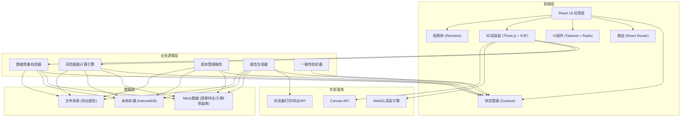
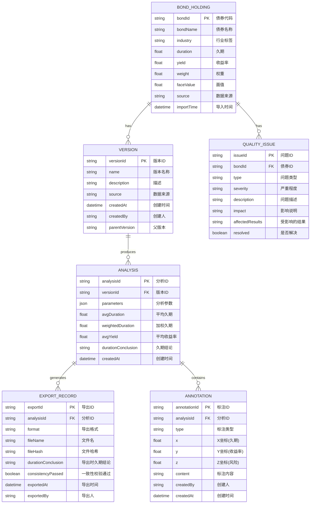

## 1. 架构设计



## 2. 技术描述

### 2.1 前端技术栈
- **框架**: React 18.2.0 + TypeScript 5.3.0
- **构建工具**: Vite 5.0.0
- **样式**: TailwindCSS 3.4.0 + CSS Variables
- **状态管理**: Zustand 4.4.0 (轻量级，适合金融数据状态)
- **路由**: React Router 6.20.0
- **UI组件库**: Radix UI (无样式组件，配合Tailwind)
- **3D渲染**: 
  - three 0.160.0
  - @react-three/fiber 8.15.0
  - @react-three/drei 9.92.0
  - @react-three/postprocessing 2.15.0
- **图表**: Recharts 2.10.0
- **文件处理**: PapaParse (CSV解析), xlsx (Excel处理)
- **导出**: html2canvas + jspdf (PDF导出)
- **本地存储**: idb (IndexedDB封装)

### 2.2 后端
- 无后端，纯前端应用，数据存储在本地IndexedDB和文件系统
- Mock数据模拟真实债券持仓数据

### 2.3 数据库
- IndexedDB (通过idb库封装)
- 存储债券持仓、分析历史、版本记录、导出记录

## 3. 路由定义

| 路由 | 页面组件 | 功能说明 |
|------|----------|----------|
| `/` | 重定向到 `/workbench` | 默认跳转到主工作台 |
| `/workbench` | WorkbenchPage | 3D风险曲面主工作台 |
| `/data` | DataManagementPage | 数据管理与版本控制 |
| `/detail/:bondId` | BondDetailPage | 债券详情分析 |
| `/export` | ExportPage | 报告导出与一致性校验 |
| `*` | NotFoundPage | 404页面 |

## 4. 数据模型

### 4.1 数据模型定义



### 4.2 TypeScript 类型定义

```typescript
// 债券持仓
interface BondHolding {
  bondId: string;
  bondName: string;
  industry: string;
  duration: number;
  yield: number;
  weight: number | null;
  faceValue: number;
  source: string;
  importTime: Date;
}

// 版本信息
interface Version {
  versionId: string;
  name: string;
  description: string;
  source: string;
  createdAt: Date;
  createdBy: string;
  parentVersion: string | null;
  holdingCount: number;
}

// 分析参数
interface AnalysisParams {
  durationRange: [number, number];
  yieldRange: [number, number];
  industries: string[];
  weightThreshold: number;
  showOutliers: boolean;
  surfaceSmoothing: number;
}

// 分析结果
interface AnalysisResult {
  analysisId: string;
  versionId: string;
  parameters: AnalysisParams;
  avgDuration: number;
  weightedDuration: number;
  avgYield: number;
  durationConclusion: string;
  surfaceData: SurfacePoint[][];
  createdAt: Date;
}

// 曲面点
interface SurfacePoint {
  x: number; // 久期
  y: number; // 收益率
  z: number; // 风险值
  bondIds: string[];
  isOutlier: boolean;
  annotation?: string;
}

// 数据质量问题
interface QualityIssue {
  issueId: string;
  bondId: string;
  type: 'weight_missing' | 'outlier' | 'industry_conflict' | 'invalid_value';
  severity: 'low' | 'medium' | 'high';
  description: string;
  impact: string;
  affectedResults: string[];
  resolved: boolean;
}

// 标注
interface Annotation {
  annotationId: string;
  analysisId: string;
  type: 'filter_impact' | 'manual_note' | 'quality_issue';
  x: number;
  y: number;
  z: number;
  content: string;
  createdBy: string;
  createdAt: Date;
}

// 导出记录
interface ExportRecord {
  exportId: string;
  analysisId: string;
  format: 'pdf' | 'excel';
  fileName: string;
  fileHash: string;
  durationConclusion: string;
  pageDurationConclusion: string;
  terminalDurationConclusion: string;
  consistencyPassed: boolean;
  exportedAt: Date;
  exportedBy: string;
}

// 导出对应关系
interface ExportCorrespondence {
  exportId: string;
  holdingSnapshot: BondHolding[];
  analysisSnapshot: AnalysisResult;
  parametersSnapshot: AnalysisParams;
  terminalLog: string;
}
```

## 5. 核心模块架构

### 5.1 风险曲面计算引擎

```
src/engine/
├── RiskSurfaceEngine.ts    # 核心计算引擎
├── DurationCalculator.ts   # 久期计算器
├── QualityValidator.ts     # 数据质量校验器
└── ConsistencyChecker.ts   # 一致性校验器
```

**核心算法：**
- 三维曲面网格化：将久期(X轴)和收益率(Y轴)离散化为网格
- 风险值计算(Z轴)：基于权重、久期偏离度、行业集中度计算综合风险
- 异常点检测：IQR四分位距法检测离群点
- 曲面平滑：高斯核平滑处理

### 5.2 状态管理结构

```typescript
// src/store/useAppStore.ts
interface AppState {
  // 数据层
  holdings: BondHolding[];
  currentVersion: Version | null;
  versions: Version[];
  
  // 分析层
  analysisParams: AnalysisParams;
  analysisResult: AnalysisResult | null;
  
  // 质量层
  qualityIssues: QualityIssue[];
  annotations: Annotation[];
  
  // 导出层
  exportRecords: ExportRecord[];
  exportCorrespondences: ExportCorrespondence[];
  
  // UI状态
  selectedBondId: string | null;
  highlightedRegion: { x: [number, number]; y: [number, number] } | null;
  terminalLog: string[];
  
  // Actions
  loadVersion: (versionId: string) => Promise<void>;
  updateParams: (params: Partial<AnalysisParams>) => void;
  runAnalysis: () => void;
  addAnnotation: (annotation: Omit<Annotation, 'annotationId' | 'createdAt'>) => void;
  exportReport: (format: 'pdf' | 'excel') => Promise<ExportRecord>;
  appendTerminalLog: (message: string) => void;
}
```

### 5.3 3D场景组件结构

```
src/components/3d/
├── RiskSurfaceCanvas.tsx   # 3D画布容器
├── RiskSurfaceMesh.tsx     # 曲面网格
├── SurfacePoints.tsx       # 数据点
├── AxesGrid.tsx            # 坐标轴网格
├── AnnotationsLayer.tsx    # 标注层
├── HighlightRegion.tsx     # 高亮区域
└── SceneLights.tsx         # 灯光配置
```

## 6. 关键技术实现

### 6.1 数据一致性保障机制

1. **单一数据源原则**：所有久期结论从同一个计算函数生成
2. **终端日志记录**：所有计算过程输出到终端日志，包括：
   - 输入参数快照
   - 计算步骤
   - 中间结果
   - 最终久期结论
3. **导出时三重校验**：
   - 页面显示值 vs 状态存储值
   - 状态存储值 vs 终端日志值
   - 状态存储值 vs 导出文件值
4. **哈希校验**：导出文件包含数据哈希，用于后续验证

### 6.2 版本追踪实现

- 每次数据导入创建新版本
- 版本包含完整数据快照和元数据
- 支持版本对比：差异高亮显示
- 支持版本回滚：一键切换到历史版本

### 6.3 异常处理机制

```typescript
// 权重缺失检测
function detectMissingWeights(holdings: BondHolding[]): QualityIssue[] {
  return holdings
    .filter(h => h.weight === null || isNaN(h.weight))
    .map(h => ({
      issueId: generateId(),
      bondId: h.bondId,
      type: 'weight_missing',
      severity: 'high',
      description: `${h.bondName} 权重缺失`,
      impact: `久期计算将使用等权重替代，影响组合久期准确性`,
      affectedResults: ['加权久期', '风险曲面Z轴值', '行业久期分布'],
      resolved: false
    }));
}

// 异常点检测
function detectOutliers(points: SurfacePoint[]): QualityIssue[] {
  const zValues = points.map(p => p.z);
  const q1 = quantile(zValues, 0.25);
  const q3 = quantile(zValues, 0.75);
  const iqr = q3 - q1;
  const upperBound = q3 + 1.5 * iqr;
  const lowerBound = q1 - 1.5 * iqr;
  
  return points
    .filter(p => p.z > upperBound || p.z < lowerBound)
    .flatMap(p => p.bondIds.map(bondId => ({
      issueId: generateId(),
      bondId,
      type: 'outlier' as const,
      severity: 'medium' as const,
      description: `债券 ${bondId} 为风险异常点`,
      impact: `可能遮挡周边正常数据点，扭曲曲面形态`,
      affectedResults: ['曲面视觉效果', '局部风险评估'],
      resolved: false
    })));
}
```

### 6.4 联动标注系统

- 参数变化时自动计算受影响的曲面区域
- 生成标注记录参数变化前后的差异
- 支持手动添加标注，绑定到3D空间坐标
- 标注导出时包含在报告中

## 7. 性能优化策略

### 7.1 3D渲染优化
- 曲面网格使用 BufferGeometry，避免频繁重建
- 使用 InstancedMesh 渲染大量数据点
- LOD（细节层次）控制，远距离降低精度
- 后处理效果可配置，低端设备自动禁用

### 7.2 计算优化
- Web Worker 执行曲面计算，不阻塞UI
- 计算结果缓存，参数未变化时复用
- 增量更新，只重新计算受影响的区域

### 7.3 数据优化
- 虚拟滚动处理大量债券列表
- 数据分页加载
- IndexedDB 索引优化查询性能

## 8. 项目目录结构

```
src/
├── assets/              # 静态资源
├── components/          # 组件
│   ├── 3d/             # 3D相关组件
│   ├── ui/             # 通用UI组件
│   ├── layout/         # 布局组件
│   ├── workbench/      # 工作台组件
│   ├── data/           # 数据管理组件
│   ├── detail/         # 详情页组件
│   └── export/         # 导出组件
├── engine/             # 计算引擎
├── store/              # 状态管理
├── types/              # TypeScript类型
├── utils/              # 工具函数
├── pages/              # 页面组件
├── mock/               # Mock数据
├── hooks/              # 自定义Hooks
├── App.tsx
├── main.tsx
└── index.css
```
