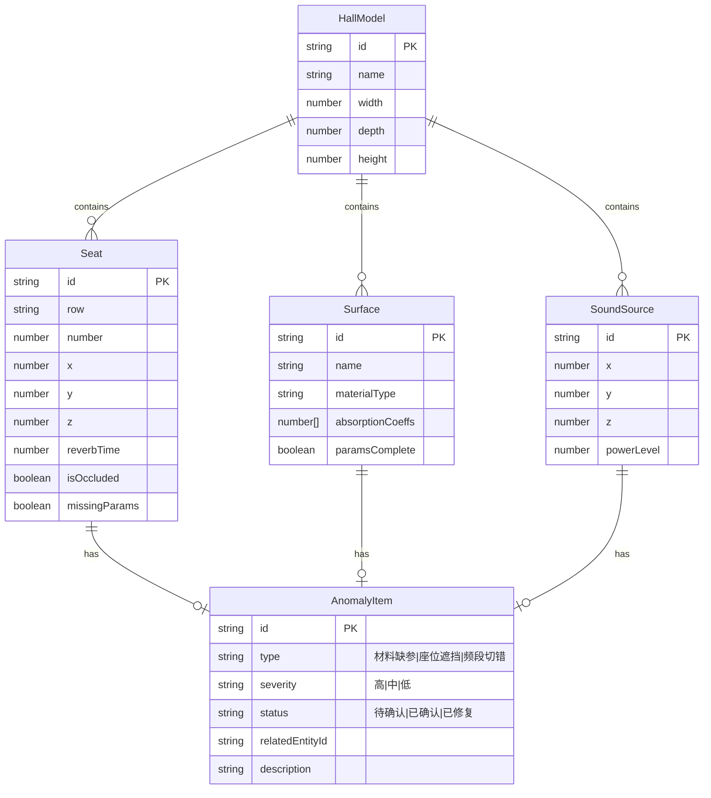

## 1. 架构设计

```mermaid
flowchart TB
    subgraph "前端层"
        "React App" --> "Zustand Store"
        "Zustand Store" --> "2D座位图引擎"
        "Zustand Store" --> "3D声场引擎"
        "Zustand Store" --> "异常清单模块"
        "Zustand Store" --> "修正对比模块"
    end
    subgraph "数据层"
        "Mock数据服务" --> "厅堂模型数据"
        "Mock数据服务" --> "声源位置数据"
        "Mock数据服务" --> "吸声材料数据"
        "Mock数据服务" --> "混响计算结果"
    end
    "前端层" --> "数据层"
```

纯前端应用，所有声学计算使用本地模拟数据，不依赖后端服务。

## 2. 技术说明

- **前端框架**：React@18 + TypeScript + Vite
- **样式**：Tailwind CSS@3
- **状态管理**：Zustand
- **3D渲染**：Three.js + @react-three/fiber + @react-three/drei
- **路由**：react-router-dom（单页面内tab切换）
- **数据**：Mock数据，内置典型音乐厅场景
- **初始化工具**：vite-init，模板 react-ts

## 3. 路由定义

| 路由 | 用途 |
|------|------|
| / | 主工作台，包含2D座位图、3D声场、异常清单、修正面板 |

## 4. 数据模型

### 4.1 核心数据模型



### 4.2 Zustand Store 划分

| Store | 职责 |
|-------|------|
| useHallStore | 厅堂模型、座位、表面、声源数据 |
| useAnomalyStore | 异常清单数据、筛选、状态变更 |
| useCorrectionStore | 修正操作、新旧对比快照 |
| useViewStore | 视图状态（2D/3D切换、选中项、面板开关） |
