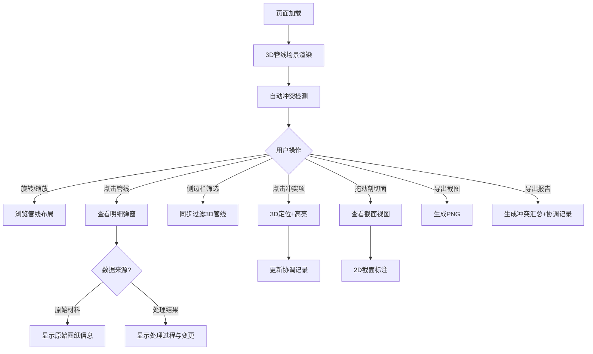

## 1. 产品概述

城市地下管网剖切Web3D平台，面向市政工程师，解决道路开挖前多专业管线图纸版本混乱、标高错配、管线交叉冲突等问题。通过3D可视化与自动化冲突检测，将燃气、电力、雨水等多源管线数据统一呈现，支持剖切查看、筛选联动、冲突高亮与报告导出，确保开挖前的管线协调有据可依。

## 2. 核心功能

### 2.1 用户角色

| 角色 | 使用方式 | 核心权限 |
|------|----------|----------|
| 市政工程师 | 直接访问 | 查看3D管线、执行剖切、筛选管线、查看冲突明细、导出截图与报告 |
| 协调员 | 直接访问 | 以上全部 + 编辑协调记录、标记处理状态 |

### 2.2 功能模块

1. **3D管线主视图**：3D管线场景渲染、旋转缩放、剖切面操控、点击选中管线
2. **侧边栏面板**：管线筛选器、剖切视图2D截面、冲突列表高亮
3. **管线明细弹窗**：选中管线的图纸版本、标高、材质、风险等级、来源追溯
4. **冲突检测引擎**：标高错配检测、旧图未作废检测、管线交叉检测
5. **导出中心**：截图导出（PNG）、冲突报告导出（含管线来源与冲突详情）
6. **协调记录**：记录冲突处理过程，关联3D视图快照与冲突高亮来源

### 2.3 页面详情

| 页面名称 | 模块名称 | 功能描述 |
|----------|----------|----------|
| 主页面 | 3D管线主视图 | 渲染地下管线3D场景，支持OrbitControls旋转/缩放/平移，剖切面拖拽调整，管线点击选中高亮 |
| 主页面 | 侧边栏-管线筛选 | 按管线类型（燃气/电力/雨水/给水/通信）、图纸版本、风险等级筛选，与3D视图同步 |
| 主页面 | 侧边栏-剖切截面 | 2D截面视图，显示剖切面处的管线横截面，标注标高与间距 |
| 主页面 | 侧边栏-冲突列表 | 列出所有检测到的冲突项，点击定位3D视图并高亮，显示冲突类型与严重程度 |
| 主页面 | 管线明细弹窗 | 点击管线后弹出，展示图纸版本号、标高值、材质、管径、风险等级、数据来源（原始/处理）、最后更新时间 |
| 主页面 | 导出功能栏 | 截图按钮（PNG）、报告导出按钮（含冲突汇总表、管线明细、协调记录） |
| 主页面 | 协调记录面板 | 冲突处理记录列表，每条记录关联冲突ID、处理状态、3D快照缩略图、处理人、时间戳 |

## 3. 核心流程

用户打开页面后，3D场景加载模拟管线数据。用户可通过旋转/缩放浏览整体管线布局，拖动剖切面查看截面。侧边栏筛选器可按类型/版本/风险过滤管线，3D视图同步更新。冲突列表自动显示检测到的冲突项，点击冲突项3D视图自动定位并高亮。选中管线可查看明细弹窗，区分原始材料与处理结果。用户可截图或导出完整报告，协调记录可追溯每条冲突的处理过程。

## 4. 用户界面设计

### 4.1 设计风格

- **主色调**：深色工业风 — 深灰背景（#1a1d23），搭配高对比度管线色彩
- **管线色系**：燃气=橙红(#ff6b35)、电力=金黄(#ffd23f)、雨水=蓝色(#4ecdc4)、给水=青色(#45b7d1)、通信=紫色(#a855f7)
- **冲突色**：严重=红(#ef4444)、警告=橙(#f97316)、提示=黄(#eab308)
- **按钮风格**：圆角矩形、微光泽、hover时亮度提升
- **字体**：数据区用等宽字体(JetBrains Mono)，UI区用无衬线字体
- **布局**：左侧3D主视图占70%宽度，右侧侧边栏占30%，顶部工具栏

### 4.2 页面设计概览

| 页面名称 | 模块名称 | UI元素 |
|----------|----------|--------|
| 主页面 | 3D管线主视图 | 深色背景3D画布，管线按类型着色，剖切面半透明平面，选中管线发光描边，底部状态栏显示坐标 |
| 主页面 | 侧边栏-筛选器 | 折叠面板，管线类型复选框带色点，版本下拉，风险等级滑块 |
| 主页面 | 侧边栏-剖切截面 | 2D Canvas截面图，管线圆形截面带标注线，标高刻度尺 |
| 主页面 | 侧边栏-冲突列表 | 紧凑列表项，左侧色条标识严重度，类型图标，点击定位按钮 |
| 主页面 | 管线明细弹窗 | 右侧滑出面板，信息卡片布局，来源标签区分"原始/处理" |
| 主页面 | 导出功能栏 | 顶部工具栏图标按钮，导出时进度提示 |
| 主页面 | 协调记录面板 | 侧边栏底部可展开区域，时间线布局，快照缩略图 |

### 4.3 响应式

- 桌面优先设计，3D视图最小宽度800px
- 侧边栏可折叠/展开，窄屏下切换为底部面板
- 所有交互支持鼠标操作

### 4.4 3D场景指引

- **环境**：地下工程场景，暗色环境光，微弱环境遮蔽
- **光照**：主方向光模拟地面投射，管线自发光辅助辨认，选中管线点光源聚焦
- **相机**：透视相机，45°俯视初始视角，OrbitControls支持自由旋转
- **剖切面**：半透明平面，可沿Y轴拖拽，使用clipping plane裁切管线
- **管线渲染**：圆柱体管道，不同管径对应不同粗细，T型/L型接头，弯头
- **冲突高亮**：冲突区域粒子闪烁效果，红色半透明包围盒
- **后处理**：选中管线Bloom发光，剖切面边缘发光
