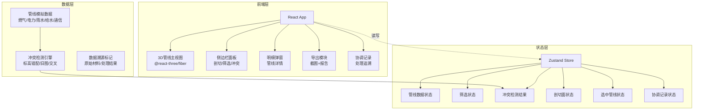

## 1. 架构设计



## 2. 技术说明

- **前端框架**：React@18 + TypeScript + Vite
- **3D渲染**：three + @react-three/fiber + @react-three/drei + @react-three/postprocessing
- **样式方案**：tailwindcss@3
- **状态管理**：zustand
- **路由**：react-router-dom（单页面，预留扩展）
- **后端**：无（纯前端，数据使用模拟数据）
- **字体**：JetBrains Mono（数据）+ DM Sans（UI）

## 3. 路由定义

| 路由 | 用途 |
|------|------|
| / | 主页面，包含3D管线视图、侧边栏、冲突检测与导出功能 |

## 4. 数据模型

### 4.1 管线数据模型

```typescript
interface Pipeline {
  id: string
  name: string
  type: "gas" | "electric" | "stormwater" | "watersupply" | "telecom"
  version: string
  versionStatus: "current" | "superseded" | "draft"
  material: string
  diameter: number
  segments: PipelineSegment[]
  riskLevel: "high" | "medium" | "low"
  dataSource: "original" | "processed"
  sourceDescription: string
  lastUpdated: string
  color: string
}

interface PipelineSegment {
  id: string
  startPoint: [number, number, number]
  endPoint: [number, number, number]
  elevation: number
  depth: number
}

interface Conflict {
  id: string
  type: "elevation_mismatch" | "outdated_drawing" | "pipeline_crossing"
  severity: "critical" | "warning" | "info"
  description: string
  involvedPipelines: string[]
  location: [number, number, number]
  elevationExpected?: number
  elevationActual?: number
  status: "unresolved" | "in_progress" | "resolved"
  coordinationRecords: CoordinationRecord[]
}

interface CoordinationRecord {
  id: string
  conflictId: string
  action: string
  handler: string
  timestamp: string
  snapshotUrl?: string
  result: string
  pipelineChanges?: {
    pipelineId: string
    field: string
    oldValue: string
    newValue: string
  }[]
}

interface ClippingPlane {
  enabled: boolean
  position: [number, number, number]
  direction: "x" | "y" | "z"
}

interface FilterState {
  pipelineTypes: string[]
  versions: string[]
  riskLevels: string[]
  showConflictsOnly: boolean
}
```

### 4.2 模拟数据说明

- 5种管线类型各2-3条管线，共约12条管线
- 每条管线3-5个管段
- 预设6-8个冲突（标高错配2个、旧图未作废2个、管线交叉3个）
- 3-4条协调记录
