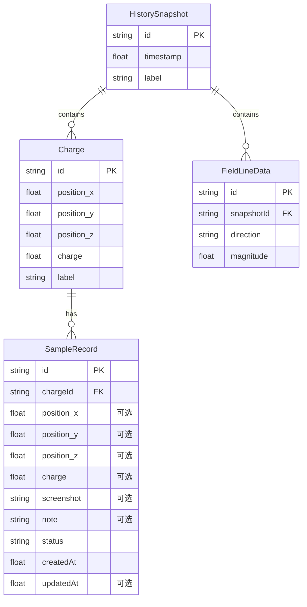

## 1. 架构设计

```mermaid
flowchart TD
    subgraph "前端层"
        "A[3D场景组件]" --> "B[电场计算引擎]"
        "C[侧边数据面板]" --> "B"
        "D[时间轴控制器]" --> "B"
    end
    subgraph "状态层"
        "B[电场计算引擎]" --> "E[Zustand Store]"
        "E" --> "A"
        "E" --> "C"
        "E" --> "D"
    end
    subgraph "数据层"
        "E" --> "F[样例记录数据]"
        "E" --> "G[历史状态快照]"
    end
```

纯前端架构，无后端服务。所有电场计算、状态管理、数据存储均在浏览器端完成。

## 2. 技术说明

- 前端：React@18 + TypeScript + Tailwind CSS@3 + Vite
- 3D渲染：Three.js + @react-three/fiber + @react-three/drei + @react-three/postprocessing
- 状态管理：Zustand
- 初始化工具：vite-init (react-ts 模板)
- 后端：无
- 数据库：无（使用内存数据 + 本地样例数据）

## 3. 路由定义

| 路由 | 用途 |
|------|------|
| / | 主页面，3D电场场景 + 侧边数据面板（单页应用） |

## 4. API定义

无后端API。所有数据交互通过 Zustand Store 完成。

### 4.1 核心类型定义

```typescript
interface Charge {
  id: string;
  position: [number, number, number];
  charge: number;
  label: string;
}

interface FieldPoint {
  position: [number, number, number];
  fieldVector: [number, number, number];
  magnitude: number;
}

interface SampleRecord {
  id: string;
  chargeId: string;
  position?: [number, number, number];
  charge?: number;
  screenshot?: string;
  note?: string;
  status: "normal" | "missing_field" | "late_supplement" | "modified_note" | "reversed_arrow";
  noteHistory?: string[];
  createdAt: number;
  updatedAt?: number;
}

interface HistorySnapshot {
  id: string;
  timestamp: number;
  charges: Charge[];
  fieldLines: FieldLineData[];
  label: string;
}

interface FieldLineData {
  points: [number, number, number][];
  direction: "normal" | "reversed";
  magnitude: number;
}
```

## 5. 服务器架构图

无后端服务。

## 6. 数据模型

### 6.1 数据模型定义



### 6.2 样例数据初始化

项目启动时预置以下样例记录：

1. **正常记录**：完整字段，status="normal"，方向箭头正确
2. **缺字段记录**：position缺失，status="missing_field"，展示缺字段处理
3. **晚补记录**：note为空后来补充，status="late_supplement"，有updatedAt
4. **备注改过记录**：note修改过，status="modified_note"，noteHistory保留历史
5. **方向箭头反记录**：direction="reversed"，status="reversed"，物理老师可确认分支生效

### 6.3 重叠保护规则

- 两电荷距离 < ε (0.1单位) 时触发重叠保护
- 场强取上限 clamp(maxFieldStrength)，不爆炸
- 方向箭头保留重叠前的原始方向，不覆盖
- 历史记录中标记重叠事件
