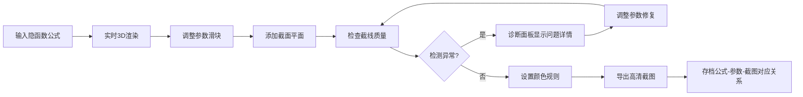

## 1. 产品概述

数学隐函数雕塑馆是一个面向数学馆策展人的交互式3D工作台，用于可视化和调试隐函数公式生成的数学雕塑。通过将隐函数公式、截线、颜色规则等线索统一管理，帮助策展人快速定位参数爆炸、截线断裂、奇点误导等问题，并提供清晰的3D曲面与截面联动标注。

- 目标用户：数学馆策展人、数学可视化设计师
- 核心价值：将隐函数公式到截图导出的完整链路透明化，提升策展效率与质量

## 2. 核心功能

### 2.1 用户角色

| 角色 | 注册方式 | 核心权限 |
|------|----------|----------|
| 策展人 | 无需注册 | 编辑隐函数公式、调整参数、导出截图、查看诊断信息 |

### 2.2 功能模块

1. **3D工作台主界面**：隐函数公式编辑器、3D曲面预览、截面控制、参数滑块
2. **诊断面板**：参数爆炸检测、截线断裂预警、奇点定位与标注
3. **详情记录区**：公式-参数-截图对应关系存档、历史版本回溯
4. **导出系统**：高清截图导出、带标注的截面图、参数配置导出

### 2.3 页面详情

| 页面名称 | 模块名称 | 功能描述 |
|----------|----------|----------|
| 主工作台 | 公式编辑器 | LaTeX语法支持、实时预览、公式历史记录 |
| 主工作台 | 3D视口 | 可旋转/缩放/平移、多视角切换、截面平面联动 |
| 主工作台 | 参数控制区 | 动态滑块、参数范围设置、参数联动约束 |
| 主工作台 | 颜色规则面板 | 按曲率/高度/法向量着色、自定义颜色映射 |
| 诊断面板 | 异常检测 | 自动检测参数爆炸、截线断裂、奇点位置 |
| 诊断面板 | 问题溯源 | 显示触发材料、卡顿位置、修复建议 |
| 详情记录区 | 链路追踪 | 公式版本、参数快照、导出截图的对应关系 |
| 导出系统 | 截图导出 | 高清PNG、带标注导出、批量导出 |

## 3. 核心流程

## 4. 用户界面设计

### 4.1 设计风格

- **主色调**：深空蓝 (#0a1628) 作为背景，配合科技感青色 (#00f5d4) 作为强调色
- **辅助色**：警示红 (#ff6b6b) 用于异常标注，成功绿 (#4ecdc4) 用于正常状态
- **字体**：标题使用 JetBrains Mono，正文使用 Inter，公式使用 KaTeX 渲染
- **布局**：三栏布局（左：公式/参数，中：3D视口，右：诊断/详情）
- **设计风格**：科技学术风，深色主题，精确的几何线条，克制的动效

### 4.2 页面设计概述

| 页面名称 | 模块名称 | UI元素 |
|----------|----------|----------|
| 主工作台 | 公式编辑器 | 代码编辑器风格，行号，语法高亮，实时预览按钮 |
| 主工作台 | 3D视口 | 无边框画布，视角控制widget，截面平面拖拽手柄 |
| 主工作台 | 参数滑块 | 数值显示，范围输入，重置按钮，联动指示器 |
| 诊断面板 | 异常列表 | 卡片式布局，错误图标，问题描述，定位按钮 |
| 详情记录区 | 历史记录 | 时间线布局，公式缩略图，参数摘要，截图预览 |

### 4.3 响应式

- 桌面端优先，三栏布局为主
- 平板端：左右面板可折叠，中央视口自适应
- 移动端：垂直堆叠布局，优先保证3D视口可见

### 4.4 3D场景指导

- **环境**：深色空间背景，微妙的网格地板，营造数学实验室氛围
- **光照**：三光源设置（主光+补光+轮廓光），突出曲面几何特征
- **相机**：透视相机，默认45度俯视角，支持轨道控制
- **交互**：曲面可拖拽旋转，截面平面可拖动调整，支持点选奇点
- **后处理**：FXAA抗锯齿，微妙的泛光效果，轮廓线高亮
- **性能**：曲面细分动态调整，保证60fps流畅体验
