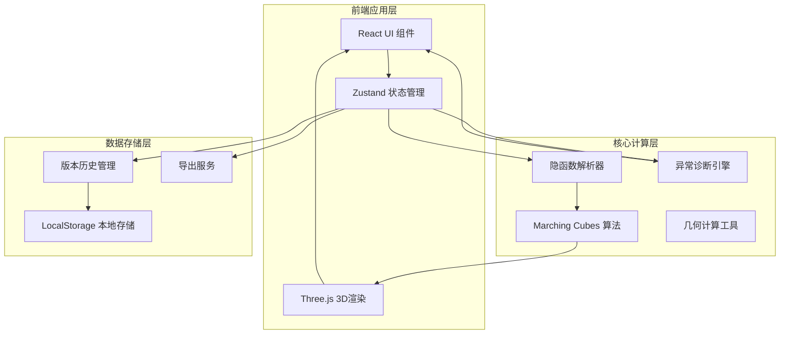

## 1. 架构设计



## 2. 技术描述

- **前端框架**：React@18 + TypeScript + Vite
- **3D渲染**：Three.js + @react-three/fiber + @react-three/drei
- **状态管理**：Zustand
- **样式方案**：TailwindCSS@3
- **公式渲染**：KaTeX
- **代码编辑**：@monaco-editor/react
- **导出功能**：html2canvas + file-saver
- **数学计算**：mathjs

## 3. 目录结构

```
src/
├── components/
│   ├── FormulaEditor/      # 公式编辑器组件
│   ├── Viewport3D/         # 3D视口组件
│   ├── ParameterPanel/     # 参数控制面板
│   ├── DiagnosticPanel/    # 诊断面板
│   ├── HistoryPanel/       # 历史记录面板
│   └── ExportPanel/        # 导出面板
├── hooks/
│   ├── useImplicitSurface/ # 隐函数曲面渲染Hook
│   ├── useDiagnostics/     # 异常诊断Hook
│   └── useHistory/         # 历史记录Hook
├── store/
│   └── workspaceStore.ts   # 工作区状态管理
├── utils/
│   ├── marchingCubes.ts    # Marching Cubes算法
│   ├── implicitParser.ts   # 隐函数解析
│   └── geometry.ts         # 几何计算工具
├── types/
│   └── index.ts            # 类型定义
└── App.tsx
```

## 4. 核心类型定义

```typescript
interface ImplicitFormula {
  id: string;
  expression: string;
  parameters: Parameter[];
  colorRule: ColorRule;
  createdAt: Date;
}

interface Parameter {
  name: string;
  value: number;
  min: number;
  max: number;
  step: number;
}

interface ColorRule {
  mode: 'curvature' | 'height' | 'normal' | 'gradient';
  colormap: string;
  range: [number, number];
}

interface SectionPlane {
  id: string;
  normal: [number, number, number];
  offset: number;
  visible: boolean;
  showIntersection: boolean;
}

interface DiagnosticIssue {
  id: string;
  type: 'parameter_explosion' | 'section_break' | 'singularity_misleading';
  severity: 'warning' | 'error';
  location?: [number, number, number];
  description: string;
  suggestion: string;
  triggeredBy: string;
}

interface HistoryRecord {
  id: string;
  formula: ImplicitFormula;
  parameters: Record<string, number>;
  screenshot?: string;
  timestamp: Date;
  note?: string;
}
```

## 5. 状态管理设计

```typescript
interface WorkspaceState {
  currentFormula: ImplicitFormula | null;
  parameters: Record<string, number>;
  sectionPlanes: SectionPlane[];
  diagnosticIssues: DiagnosticIssue[];
  history: HistoryRecord[];
  viewportSettings: ViewportSettings;
  
  setFormula: (formula: ImplicitFormula) => void;
  updateParameter: (name: string, value: number) => void;
  addSectionPlane: () => void;
  updateSectionPlane: (id: string, updates: Partial<SectionPlane>) => void;
  runDiagnostics: () => void;
  saveSnapshot: (includeScreenshot?: boolean) => void;
  exportScreenshot: (options: ExportOptions) => Promise<string>;
}
```
