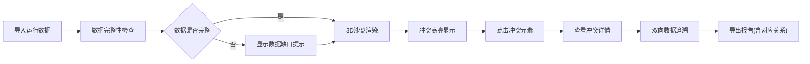

## 1. 产品概述
机场滑行冲突沙盘是面向机场运行工程师的可视化评审工具，解决机位冲突、滑行穿越、等待超时等复杂场景的展示与追溯问题。
- 核心价值：将抽象的运行数据转化为直观的3D可视化，支持冲突高亮与双向数据追溯
- 目标用户：机场运行工程师、管制员、评审专家

## 2. 核心功能

### 2.1 用户角色
| 角色 | 注册方式 | 核心权限 |
|------|----------|----------|
| 运行工程师 | 本地应用 | 3D沙盘查看、冲突追溯、报告导出 |
| 评审专家 | 本地应用 | 冲突高亮查看、数据溯源 |

### 2.2 功能模块
1. **3D机坪沙盘**：机位模型、滑行道、停机位可视化，冲突高亮显示
2. **冲突控制面板**：冲突类型筛选、时间轴控制、冲突列表
3. **数据追溯面板**：从机坪到报告、从报告反查滑行道的双向追溯
4. **数据缺口提示**：数据完整性检查，3D旁侧提示信息
5. **报告导出**：机坪、滑行道、冲突数据的对应关系导出

### 2.3 页面详情
| 页面名称 | 模块名称 | 功能描述 |
|----------|----------|----------|
| 主沙盘页 | 3D场景区 | 展示机坪3D模型，支持缩放旋转，冲突颜色高亮 |
| 主沙盘页 | 左侧冲突列表 | 机位冲突、滑行穿越、等待超时分类列表 |
| 主沙盘页 | 右侧详情面板 | 冲突详情、数据来源追溯、对应关系展示 |
| 主沙盘页 | 底部时间轴 | 时间滑动控制，冲突时间点标记 |
| 主沙盘页 | 顶部状态栏 | 数据缺口提示、当前场景信息 |

## 3. 核心流程
用户导入运行数据后，在3D沙盘中查看冲突，通过点击冲突元素查看详情并追溯数据源，最后导出包含对应关系的报告。

## 4. 用户界面设计

### 4.1 设计风格
- **主色调**：深灰蓝(#1a2332)背景，科技感暗色主题
- **冲突色系**：红色(#ff4757)表示机位冲突，橙色(#ffa502)表示等待超时，黄色(#ffd32a)表示滑行穿越
- **正常状态**：青蓝(#2ed573)表示正常机位
- **字体**：JetBrains Mono作为等宽数据字体，配合Inter作为界面字体
- **布局风格**：三栏布局，左侧冲突列表，中间3D场景，右侧详情面板
- **视觉效果**：科技感发光边框、粒子效果、渐变透明面板

### 4.2 页面设计概述
| 页面名称 | 模块名称 | UI元素 |
|----------|----------|--------|
| 主沙盘页 | 3D场景区 | Three.js 3D渲染、光晕高亮效果、鼠标悬停提示 |
| 主沙盘页 | 冲突列表 | 卡片式布局、颜色标记标签、冲突级别指示 |
| 主沙盘页 | 详情面板 | 追溯链路可视化、来源链接跳转、对应关系表格 |
| 主沙盘页 | 时间轴 | 渐变滑块、冲突点标记、播放控制按钮 |
| 主沙盘页 | 缺口提示 | 半透明悬浮卡片、警告图标、详情展开按钮 |

### 4.3 响应式
桌面端优先设计，支持1920x1080及以上分辨率，关键面板可拖拽调整宽度。

### 4.4 3D场景设计
- **环境**：暗色科技感环境，配合HDRI环境贴图
- **光照**：主方向光+补光，冲突点添加点光源发光效果
- **相机**：轨道控制器，支持全景查看和机位聚焦
- **交互**：点击机位高亮并显示详情，双击聚焦查看
- **动画**：冲突点脉冲发光动画，滑行路径轨迹动画
- **后处理**：Bloom效果增强科技感，SSAO增强空间感
