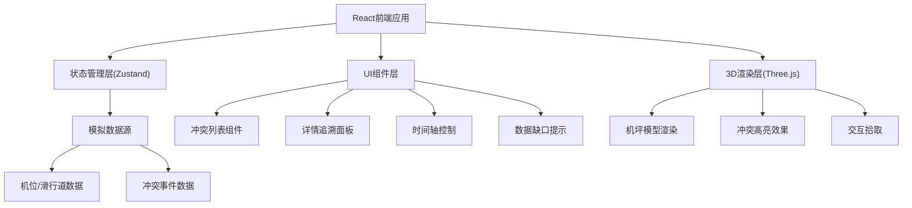
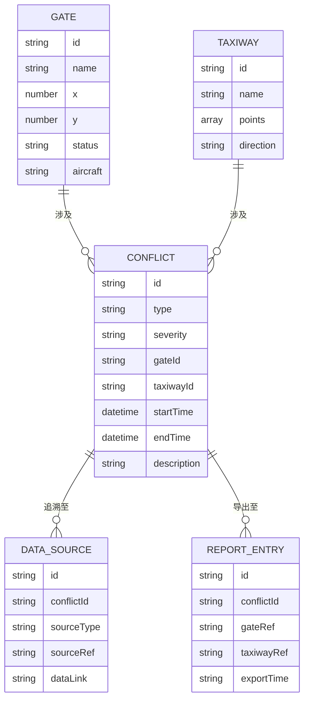

## 1. 架构设计


## 2. 技术描述
- **前端框架**: React@18 + TypeScript + Vite
- **3D渲染**: Three.js + @react-three/fiber + @react-three/drei
- **后处理**: @react-three/postprocessing
- **状态管理**: Zustand
- **样式方案**: TailwindCSS@3
- **图标**: Lucide React
- **数据**: Mock数据，内置样例冲突场景

## 3. 路由定义
| Route | Purpose |
|-------|---------|
| / | 主沙盘页面，包含3D场景和所有控制面板 |

## 4. 数据模型

### 4.1 数据模型定义


### 4.2 TypeScript类型定义
```typescript
// 机位类型
interface Gate {
  id: string;
  name: string;
  position: [number, number, number];
  status: 'available' | 'occupied' | 'conflict';
  aircraft?: string;
}

// 滑行道类型
interface Taxiway {
  id: string;
  name: string;
  points: [number, number, number][];
  width: number;
}

// 冲突类型
type ConflictType = 'gate_conflict' | 'taxi_crossing' | 'wait_timeout';
type ConflictSeverity = 'high' | 'medium' | 'low';

interface Conflict {
  id: string;
  type: ConflictType;
  severity: ConflictSeverity;
  title: string;
  description: string;
  gateIds: string[];
  taxiwayIds: string[];
  startTime: string;
  endTime: string;
  dataSources: DataSource[];
}

// 数据源追溯
interface DataSource {
  id: string;
  type: 'apron_model' | 'taxiway_data' | 'control_record' | 'report';
  name: string;
  link: string;
  timestamp: string;
}

// 数据缺口
interface DataGap {
  id: string;
  type: string;
  description: string;
  affectedAreas: string[];
}
```
