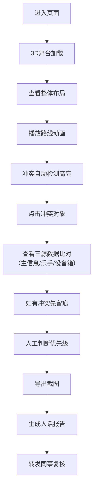

## 1. 产品概述

乐队舞台线缆模型Web3D页面，专为演出制作人设计，用于在线缆延迟到场时，可视化比对3D舞台布局与路线播放前后的变化，快速判断冲突问题并生成易懂的复核报告。

- **核心问题**：线缆晚到半天，制作人无法直观判断3D舞台与路线播放前后的差异
- **目标用户**：演出制作人、舞台技术人员、非技术同事
- **市场价值**：通过3D可视化+冲突留痕+人话报告，大幅降低舞台线缆排查沟通成本

## 2. 核心 Features

### 2.1 用户角色

| 角色 | 注册方式 | 核心权限 |
|------|----------|----------|
| 演出制作人 | 无需注册，直接使用 | 完整操作3D视图、筛选、播放路线、导出报告 |
| 技术人员 | 无需注册，直接使用 | 查看冲突详情、导出截图留痕 |
| 非技术同事 | 无需注册，直接使用 | 查看最终报告、理解冲突原因 |

### 2.2 功能模块

1. **3D主视图**：舞台模型展示、旋转缩放、对象点击、冲突高亮
2. **侧边栏**：路线播放控制、时间轴、冲突列表、筛选条件
3. **详情面板**：对象属性、三源数据比对（主信息/乐手位置/设备箱）、留痕记录
4. **报告中心**：截图导出、冲突分析报告、人话解释说明
5. **筛选同步**：3D视图与侧边栏筛选条件双向同步

### 2.3 页面详情

| 页面名称 | 模块名称 | 功能描述 |
|----------|----------|----------|
| 主页面 | 3D舞台视图 | 可旋转缩放的3D舞台，显示舞台结构、乐手位置、设备箱、线缆走向 |
| 主页面 | 侧边栏筛选 | 按时间、冲突类型、对象类型筛选，与3D视图同步 |
| 主页面 | 路线播放控制 | 播放/暂停/进度条、倍速控制、显示走位路线动画 |
| 主页面 | 冲突高亮显示 | 线缆穿越红色闪烁、设备遮挡黄色警告、走位冲突蓝色标记，按时间顺序显示 |
| 主页面 | 详情面板 | 点击对象弹出，展示三源数据、冲突留痕、截图关联 |
| 主页面 | 导出功能 | 一键截图、生成完整报告、导出CSV数据 |
| 报告弹窗 | 人话解释 | 将技术冲突转化为易懂描述："线缆A穿过了音箱B的摆放位置" |

## 3. 核心流程

用户进入页面 → 查看3D舞台整体布局 → 播放路线观察走位 → 发现冲突自动高亮 → 点击对象查看三源数据比对 → 导出截图留痕 → 生成报告供非技术同事复核

## 4. 用户界面设计

### 4.1 设计风格

- **设计方向**：科技感工业风，适合舞台技术场景
- **主色调**：深靛蓝 #1a1a2e 作为背景，营造专业感
- **强调色**：荧光红 #ff0055（线缆穿越）、琥珀黄 #ffaa00（设备遮挡）、电光蓝 #00aaff（走位冲突）、翠绿 #00ff88（正常）
- **辅助色**：深灰 #2d2d44、银灰 #8892b0
- **字体**：标题用 Space Grotesk（已替换为 Orbitron 更具科技感），正文用 Roboto Mono 保证技术数据可读性
- **按钮风格**：扁平化+霓虹光晕边框，hover时有发光效果
- **布局风格**：三栏布局，左侧筛选面板、中间3D主视图、右侧详情/时间轴
- **视觉细节**：网格背景、扫描线动效、故障艺术（Glitch）效果用于冲突提示

### 4.2 页面设计概览

| 页面名称 | 模块名称 | UI元素 |
|----------|----------|--------|
| 主页面 | 3D舞台视图 | 暗蓝背景、网格地面、聚光灯光源、对象线框高亮、选中对象描边发光 |
| 主页面 | 侧边栏筛选 | 半透明深色面板、霓虹边框按钮、分段式时间轴滑块 |
| 主页面 | 路线播放控制 | 底部悬浮控制条、大尺寸播放按钮、时间刻度标记 |
| 主页面 | 详情面板 | 右侧滑入式面板、三栏数据对比表格、留痕时间戳、截图缩略图 |
| 主页面 | 冲突列表 | 带颜色标签的卡片列表、时间排序、严重程度徽章 |
| 报告弹窗 | 人话解释 | 卡片式布局、大号图标、简洁文字描述、关联截图预览 |

### 4.3 响应式设计

- **桌面优先**：1920px及以上最佳体验，三栏布局完整展示
- **平板适配**：1024-1920px，侧边栏可折叠，详情面板改为底部弹出
- **移动适配**：768-1024px，单栏布局，通过标签页切换3D视图/列表/详情
- **触摸优化**：3D视图支持双指旋转缩放，按钮最小尺寸48px

### 4.4 3D场景指引

- **环境/HDRI**：暗蓝紫色调的舞台环境贴图，模拟演出前彩排氛围，添加轻微噪点增加胶片感
- **光照设置**：主光源用冷白色聚光灯模拟舞台灯，辅以4色点光源（红/黄/蓝/绿）照亮不同类型对象，环境光强度0.3
- **相机设置**：初始视角为45度俯角，透视相机fov=50，支持OrbitControls旋转缩放，限制最小距离5m最大距离50m
- **构图与焦点**：舞台位于场景中心，地面为50x50m网格平面，乐手位置沿舞台前缘排列，设备箱在两侧，线缆在空中连接各设备
- **交互与动画**：选中对象有脉冲发光动画，路线播放时有沿路径移动的发光小球，冲突发生时对象闪烁+颜色变深
- **后处理效果**：Bloom泛光效果（强度1.2）、Vignette暗角（0.3）、轻微Chromatic Aberration增强科技感
- **资源与性能**：所有模型使用Three.js内置几何体程序化生成，单场景不超过500个mesh，帧率目标60fps

## 5. 数据逻辑

### 5.1 三源数据冲突处理

| 数据源 | 优先级 | 作用 | 冲突处理 |
|--------|--------|------|----------|
| 舞台模型主信息 | 1（最高） | 舞台结构、固定设备位置 | 作为基准参考 |
| 乐手位置上报 | 2 | 乐手实时站位、乐器位置 | 与主信息不一致时标记为"位置偏差" |
| 设备箱补证据 | 3 | 设备实际摆放、线缆连接 | 与前两者冲突时标记为"待核实" |

### 5.2 冲突显示顺序

当多个冲突同时发生时，按以下顺序显示：
1. **线缆穿越**（红色，最高优先级）- 立即闪烁警告
2. **设备遮挡**（黄色）- 持续高亮
3. **走位冲突**（蓝色）- 显示时间先后线
4. 所有冲突标注精确时间戳，支持按时间排序回放
