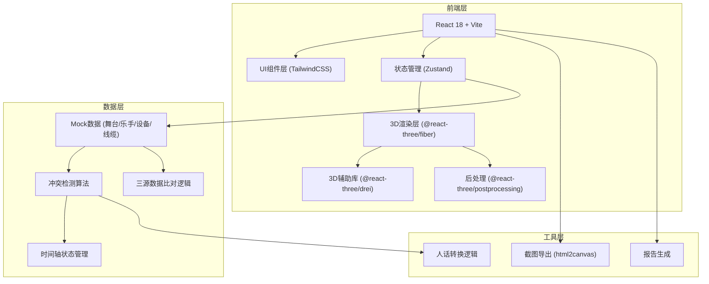
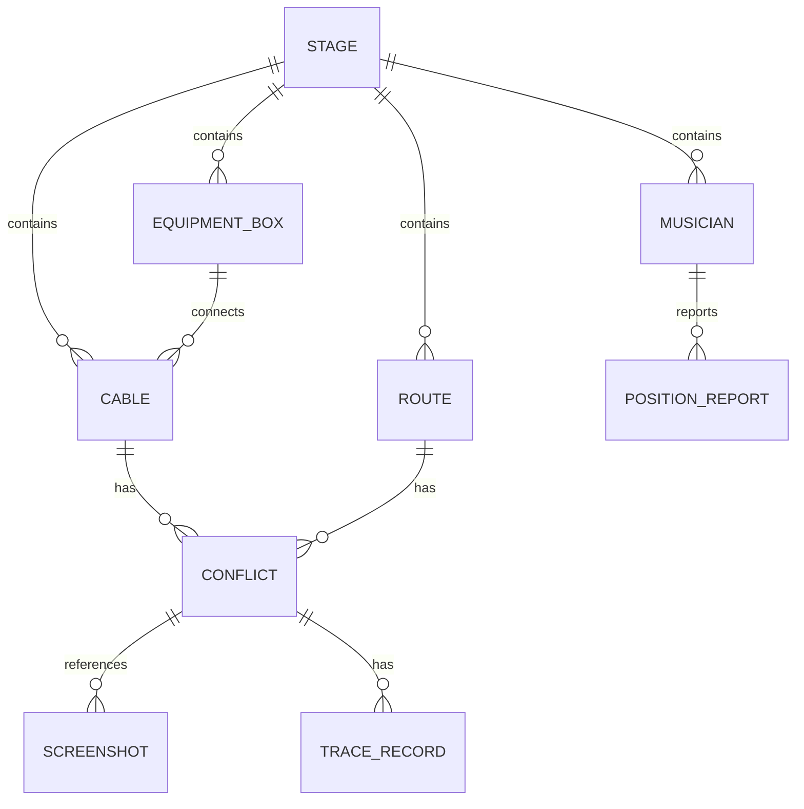

## 1. 架构设计



## 2. 技术描述

- **前端框架**：React@18.2.0 + Vite@5.0.0
- **3D引擎**：Three.js@0.160.0 + @react-three/fiber@8.15.12 + @react-three/drei@9.92.7 + @react-three/postprocessing@2.15.11
- **样式方案**：TailwindCSS@3.4.0
- **状态管理**：Zustand@4.4.7（轻量级，适合3D场景状态同步）
- **截图导出**：html2canvas@1.4.1
- **图标库**：Lucide React@0.294.0
- **初始化工具**：npm create vite@latest
- **后端**：无后端，全部使用Mock数据
- **数据库**：无，数据硬编码为TypeScript常量

## 3. 路由定义

| 路由 | 用途 |
|------|------|
| / | 主页面，包含3D视图、侧边栏、详情面板 |

单页应用，无需多路由。

## 4. 数据模型

### 4.1 核心实体定义



### 4.2 TypeScript 类型定义

```typescript
// 舞台对象基础类型
interface StageObject {
  id: string;
  name: string;
  type: 'stage' | 'musician' | 'equipment' | 'cable';
  position: [number, number, number];
  rotation: [number, number, number];
  scale: [number, number, number];
  color: string;
}

// 乐手位置
interface Musician extends StageObject {
  type: 'musician';
  instrument: string;
  role: '主唱' | '吉他手' | '贝斯手' | '鼓手' | '键盘手';
  positionReports: PositionReport[];
}

// 设备箱
interface EquipmentBox extends StageObject {
  type: 'equipment';
  equipmentType: '音箱' | '效果器' | '功放' | '混音台';
  model: string;
  cableConnections: string[];
}

// 线缆
interface Cable extends StageObject {
  type: 'cable';
  cableType: '音频线' | '电源线' | '网线';
  fromId: string;
  toId: string;
  pathPoints: [number, number, number][];
}

// 走位路线
interface Route {
  id: string;
  musicianId: string;
  name: string;
  waypoints: [number, number, number][];
  timestamps: number[];
}

// 位置上报（三源数据之一）
interface PositionReport {
  id: string;
  source: 'main_model' | 'musician_report' | 'equipment_box';
  timestamp: number;
  position: [number, number, number];
  confidence: number;
}

// 冲突类型
type ConflictType = 'cable_cross' | 'equipment_block' | 'route_conflict';

// 冲突记录
interface Conflict {
  id: string;
  type: ConflictType;
  severity: 'critical' | 'warning' | 'info';
  timestamp: number;
  objectIds: string[];
  description: string;
  humanReadableDesc: string;
  traceRecords: TraceRecord[];
  screenshotIds: string[];
  resolved: boolean;
}

// 留痕记录
interface TraceRecord {
  id: string;
  timestamp: number;
  source: 'main_model' | 'musician_report' | 'equipment_box';
  action: string;
  note: string;
  user: string;
}

// 截图
interface Screenshot {
  id: string;
  timestamp: number;
  dataUrl: string;
  conflictId?: string;
  description: string;
  cameraPosition: [number, number, number];
  cameraTarget: [number, number, number];
}

// 应用状态
interface AppState {
  currentTime: number;
  isPlaying: boolean;
  playbackSpeed: number;
  selectedObjectId: string | null;
  filters: {
    conflictTypes: ConflictType[];
    objectTypes: string[];
    timeRange: [number, number];
  };
  showDetailPanel: boolean;
  activeTab: 'conflicts' | 'routes' | 'screenshots';
}
```

## 5. 目录结构

```
src/
├── components/
│   ├── 3d/
│   │   ├── Stage.tsx              # 3D舞台主组件
│   │   ├── StageObject3D.tsx      # 舞台对象3D渲染
│   │   ├── Cable3D.tsx            # 线缆3D渲染
│   │   ├── Musician3D.tsx         # 乐手3D渲染
│   │   ├── Equipment3D.tsx        # 设备3D渲染
│   │   ├── RoutePath3D.tsx        # 路线3D渲染
│   │   ├── ConflictIndicator3D.tsx # 冲突指示器
│   │   └── SceneEffects.tsx       # 后处理效果
│   ├── ui/
│   │   ├── Sidebar.tsx            # 左侧筛选面板
│   │   ├── DetailPanel.tsx        # 右侧详情面板
│   │   ├── PlaybackControls.tsx   # 底部播放控制
│   │   ├── ConflictList.tsx       # 冲突列表
│   │   ├── Timeline.tsx           # 时间轴组件
│   │   ├── FilterPanel.tsx        # 筛选面板
│   │   ├── ReportModal.tsx        # 报告弹窗
│   │   └── HumanReadableCard.tsx  # 人话解释卡片
│   └── layout/
│       └── AppLayout.tsx          # 整体布局
├── store/
│   └── useAppStore.ts             # Zustand状态管理
├── data/
│   ├── mockStage.ts               # 舞台Mock数据
│   ├── mockMusicians.ts           # 乐手Mock数据
│   ├── mockEquipment.ts           # 设备Mock数据
│   ├── mockCables.ts              # 线缆Mock数据
│   ├── mockRoutes.ts              # 路线Mock数据
│   └── mockConflicts.ts           # 冲突Mock数据
├── utils/
│   ├── conflictDetection.ts       # 冲突检测算法
│   ├── dataSync.ts                # 筛选同步逻辑
│   ├── humanizer.ts               # 人话转换逻辑
│   ├── screenshot.ts              # 截图导出工具
│   ├── reportGenerator.ts         # 报告生成器
│   └── threeHelpers.ts            # Three.js辅助函数
├── types/
│   └── index.ts                   # TypeScript类型定义
├── hooks/
│   ├── useAnimationLoop.ts        # 动画循环Hook
│   ├── useObjectSelection.ts      # 对象选择Hook
│   └── useConflictHighlight.ts    # 冲突高亮Hook
├── App.tsx
├── main.tsx
└── index.css
```

## 6. 核心算法说明

### 6.1 冲突检测算法

1. **线缆穿越检测**：
   - 计算所有线缆线段对的最近点距离
   - 距离小于阈值（0.1m）且不在端点处 → 标记为线缆穿越
   - 记录精确时间戳和参与线缆ID

2. **设备遮挡检测**：
   - 计算线缆路径点到设备包围盒的距离
   - 距离小于设备半径 → 标记为设备遮挡
   - 记录遮挡时间和设备、线缆ID

3. **走位冲突检测**：
   - 沿时间轴采样乐手位置
   - 同一时间点两乐手距离小于安全距离（0.5m）→ 标记为走位冲突
   - 按时间顺序记录，生成时间先后线

### 6.2 三源数据比对逻辑

```
输入：对象ID + 时间点
输出：三源数据 + 冲突标记
步骤：
  1. 从主模型（stage model）获取基准位置 P1
  2. 从乐手上报（musician_report）获取位置 P2
  3. 从设备箱补证（equipment_box）获取位置 P3
  4. 计算|P1-P2|、|P1-P3|、|P2-P3|
  5. 任一距离 > 阈值 → 生成留痕记录
  6. 优先级：主模型 > 乐手上报 > 设备箱
  7. 显示最终位置并标记数据来源
```

### 6.3 人话转换逻辑

将技术描述转换为易懂语言：
- `cable_cross between cable_01 and cable_02` → "音频线A和电源线B在空中缠绕了，可能产生信号干扰"
- `equipment_block cable_03 by box_05` → "主音箱挡住了去往调音台的线缆，需要调整位置"
- `route_conflict musician_01 and musician_02 at t=12.5s` → "第12.5秒时，主唱和吉他手会撞到一起，建议调整走位路线"
