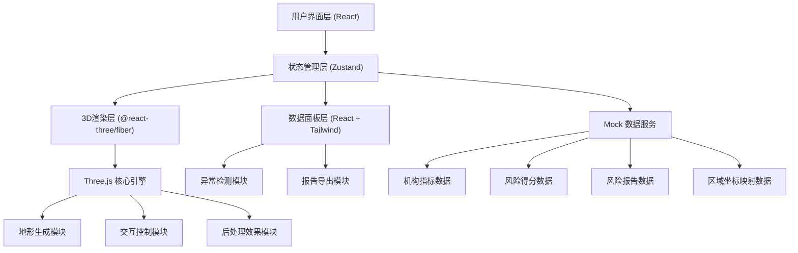
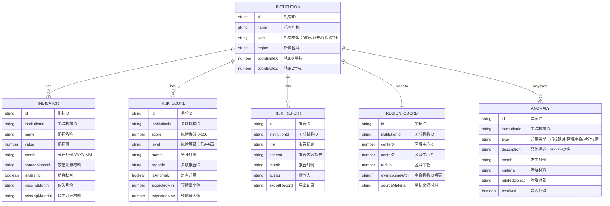

## 1. 架构设计



## 2. 技术描述

- **前端框架**: React@18 + TypeScript
- **构建工具**: Vite@5
- **样式方案**: TailwindCSS@3
- **3D渲染**: 
  - three@0.160
  - @react-three/fiber@8.15
  - @react-three/drei@9.92
  - @react-three/postprocessing@2.15
- **状态管理**: Zustand@4.4
- **数据可视化**: recharts@2.10
- **图标库**: lucide-react@0.294
- **后端**: 无后端，使用Mock数据
- **数据**: 内置Mock数据，包含机构指标、风险得分、风险报告、区域坐标、异常记录

## 3. 路由定义

| Route | 用途 |
|-------|------|
| `/` | 主控制台 - 3D风险山脉全景 + 侧边数据面板 + 时间轴 + 筛选栏 |
| `/institution/:id` | 机构详情页 - 指标明细 + 坐标映射 + 导出记录 |
| `/anomalies` | 异常提示中心 - 指标缺月/区域重叠/得分异常列表 |

## 4. 数据模型

### 4.1 数据模型定义



### 4.2 TypeScript 类型定义

```typescript
// 机构类型
type InstitutionType = 'bank' | 'securities' | 'insurance' | 'trust';
type RiskLevel = 'low' | 'medium' | 'high';
type AnomalyType = 'missing_month' | 'region_overlap' | 'score_anomaly';

interface Institution {
  id: string;
  name: string;
  type: InstitutionType;
  region: string;
  coordinateX: number;
  coordinateZ: number;
}

interface Indicator {
  id: string;
  institutionId: string;
  name: string;
  value: number;
  month: string;
  sourceMaterial: string;
  isMissing: boolean;
  missingMonth?: string;
  missingMaterial?: string;
}

interface RiskScore {
  id: string;
  institutionId: string;
  score: number;
  level: RiskLevel;
  month: string;
  reportId: string;
  isAnomaly: boolean;
  expectedMin: number;
  expectedMax: number;
}

interface RiskReport {
  id: string;
  institutionId: string;
  title: string;
  content: string;
  month: string;
  author: string;
  exportRecords: ExportRecord[];
}

interface RegionCoord {
  id: string;
  institutionId: string;
  centerX: number;
  centerZ: number;
  radius: number;
  overlappingWith: string[];
  sourceMaterial: string;
}

interface Anomaly {
  id: string;
  institutionId: string;
  type: AnomalyType;
  description: string;
  month: string;
  material: string;
  relatedObject: string;
  resolved: boolean;
}

interface ExportRecord {
  id: string;
  exportTime: string;
  operator: string;
  exportType: 'indicators' | 'coordinates' | 'report';
  materialCorrespondence: string;
}

interface AppState {
  selectedMonth: string;
  selectedInstitution: Institution | null;
  institutionTypes: InstitutionType[];
  riskLevels: RiskLevel[];
  indicatorDimension: string;
  isPlaying: boolean;
  institutions: Institution[];
  indicators: Indicator[];
  riskScores: RiskScore[];
  riskReports: RiskReport[];
  regionCoords: RegionCoord[];
  anomalies: Anomaly[];
}
```

## 5. 核心模块说明

### 5.1 3D地形渲染模块
- **地形生成**: 使用Simplex噪声生成基础地形，根据机构风险得分调整顶点高度
- **颜色映射**: 根据风险等级(低/中/高)映射渐变色，支持自定义色阶
- **交互控制**: OrbitControls支持旋转、缩放、平移，限制操作范围
- **悬停检测**: Raycaster实现鼠标悬停机构检测，显示信息卡片
- **动画系统**: 帧动画实现时间轴播放时地形平滑过渡、异常机构脉冲发光

### 5.2 状态管理模块 (Zustand)
- 统一管理筛选条件、时间轴状态、选中机构、数据集合
- 提供筛选后数据的派生计算(getters)
- 异常检测逻辑集中处理
- 支持时间轴播放状态控制

### 5.3 异常检测模块
- **指标缺月检测**: 遍历机构指标，比对完整月份序列，标记缺失月份和对应材料
- **区域重叠检测**: 计算机构区域坐标的圆形碰撞检测，记录重叠机构和坐标
- **得分异常检测**: 比对风险得分与预期范围，标记异常并关联对应报告
- 所有异常检测结果精确到具体材料和对象，不做业务口径修正

### 5.4 报告导出模块
- 导出机构指标数据(CSV)，包含材料来源标记
- 导出区域坐标对应关系(CSV)，包含机构-坐标-材料映射
- 导出风险分析报告(PDF/Markdown)，保留指标-坐标-报告的完整对应关系
- 记录每次导出的时间、操作人、材料对应关系，供后续复核

### 5.5 数据联动机制
- 筛选条件变更 → Zustand状态更新 → 3D地形和数据面板同时订阅状态变化并更新
- 时间轴拖动 → 按月份过滤数据 → 重新计算地形高度和颜色 → 数据面板同步
- 机构选中(3D场景或列表) → 更新选中状态 → 侧边面板展示详情 → 3D场景聚焦相机
- 异常点击 → 定位对应机构 → 更新选中状态 → 跳转详情页或3D定位
