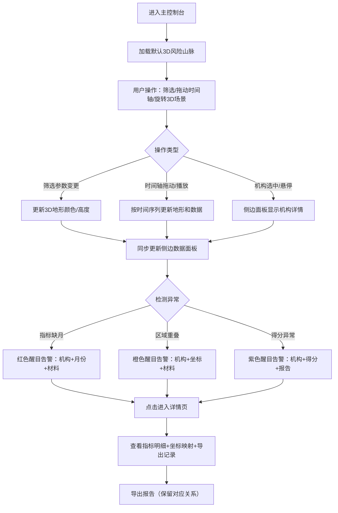

## 1. 产品概述
金融机构风险山脉3D可视化系统，通过Three.js构建的3D地形直观展示各金融机构的风险分布状态。系统核心解决3D场景与侧边数据联动更新、异常风险高亮、指标缺漏检测、区域重叠判定等问题，为风险分析人员提供可交互、可追溯的风险分析工具。

- 核心用户：金融风险分析师、合规审查人员、机构监管人员
- 核心价值：将抽象的风险指标转化为直观的3D地形，参数变化实时联动，异常问题醒目提示，支持报告导出与复核追溯

## 2. 核心 Features

### 2.1 用户角色
| 角色 | 注册方式 | 核心权限 |
|------|----------|----------|
| 风险分析师 | 系统内置账号 | 查看3D地形、筛选指标、播放时间轴、导出报告 |
| 合规审查员 | 系统内置账号 | 复核数据对应关系、标记异常处理状态、导出审查报告 |

### 2.2 Feature Module
1. **主控制台**：3D风险山脉场景、侧边数据面板、顶部筛选栏、时间轴控制
2. **机构详情面板**：机构指标明细、区域坐标映射、报告导出记录
3. **异常提示中心**：指标缺月告警、区域重叠告警、得分异常告警
4. **报告导出模块**：机构指标导出、区域坐标对应关系导出、风险报告生成

### 2.3 页面详情
| 页面名称 | 模块名称 | 功能描述 |
|----------|----------|----------|
| 主控制台 | 3D地形场景 | Three.js渲染风险山脉，支持拖动旋转、缩放、鼠标悬停查看机构信息，颜色映射风险得分，高度映射风险等级 |
| 主控制台 | 侧边数据面板 | 显示当前选中机构的指标数据、风险得分明细、异常标记，与3D场景实时联动 |
| 主控制台 | 顶部筛选栏 | 机构类型筛选、风险等级筛选、指标维度选择、时间范围选择，所有筛选同步更新3D场景和侧边面板 |
| 主控制台 | 时间轴控制 | 支持按月/季度播放，拖动时间滑块，3D地形和数据面板同步更新历史状态 |
| 机构详情页 | 指标明细模块 | 展示机构各项指标的完整历史数据，标记缺月数据，显示具体缺失的月份和对应材料 |
| 机构详情页 | 坐标映射模块 | 显示机构在3D地形中的区域坐标、与相邻机构的空间关系、重叠区域检测结果 |
| 机构详情页 | 报告导出模块 | 导出机构指标数据、区域坐标对应关系、风险分析报告，保留导出记录供后续复核 |
| 异常提示中心 | 指标缺月告警 | 醒目红色标识，显示具体机构、缺失月份、涉及材料名称，支持一键跳转详情 |
| 异常提示中心 | 区域重叠告警 | 橙色标识，显示重叠机构、重叠区域坐标、数据来源材料，支持3D场景定位 |
| 异常提示中心 | 得分异常告警 | 紫色标识，显示异常得分、正常值范围、对应报告编号，支持对比查看 |

## 3. 核心流程

用户进入主控制台后，首先查看默认时间点的3D风险山脉全景。可通过顶部筛选栏选择机构类型、风险等级或指标维度，3D场景和侧边面板立即联动更新。用户可拖动时间轴或点击播放按钮查看历史变化，每次变更均同步更新地形高度、颜色分布和数据指标。当存在指标缺月、区域重叠或得分异常时，系统在异常提示中心醒目显示并可一键定位到3D场景中的对应机构。点击机构进入详情页，可查看完整指标明细、区域坐标映射关系和导出报告记录，所有数据均保留材料来源和对象标识，不做业务口径调整。

## 4. 用户界面设计

### 4.1 设计风格
- 主色调：深空蓝（#0a1628）作为背景，营造专业金融科技氛围
- 辅色调：风险渐变色系 - 低风险蓝绿（#00d4aa）→ 中风险橙黄（#ffb300）→ 高风险红色（#ff3b30）
- 异常标识：指标缺月（#ff0040 红色闪烁）、区域重叠（#ff8c00 橙色）、得分异常（#9c27b0 紫色）
- 字体：展示字体采用 Space Grotesk（数字和标题），正文字体采用 JetBrains Mono（确保数据对齐可读性）
- 布局：左侧3D场景主视窗（占70%宽度），右侧数据面板（占30%宽度），底部时间轴，顶部筛选栏
- 视觉层次：3D场景使用雾化效果营造空间深度，异常机构使用脉冲发光效果突出显示

### 4.2 页面设计概览
| 页面名称 | 模块名称 | UI 元素 |
|----------|----------|---------|
| 主控制台 | 3D地形场景 | 低多边形山脉模型、顶点颜色映射风险值、鼠标悬停显示机构信息卡片、选中机构高亮发光、雾化背景 |
| 主控制台 | 侧边数据面板 | 卡片式布局、指标进度条、风险得分仪表盘、异常标记徽章、实时数据更新动效 |
| 主控制台 | 顶部筛选栏 | 下拉选择器、多维度标签切换、搜索框、重置按钮、玻璃拟态风格 |
| 主控制台 | 时间轴 | 横向滑块、播放/暂停按钮、时间刻度标记、关键异常节点标记 |
| 机构详情页 | 指标明细 | 数据表格、缺月单元格红色背景+具体材料标注、折线图趋势展示 |
| 机构详情页 | 坐标映射 | 2D俯视图+坐标数据、相邻机构连线、重叠区域半透明红色填充 |
| 机构详情页 | 报告导出 | 导出按钮组、历史导出列表（含时间、用户、材料对应关系）、下载图标 |
| 异常提示中心 | 告警列表 | 醒目颜色条、图标+文字描述、跳转按钮、材料来源标签 |

### 4.3 响应式
- 桌面端优先设计（1440px+），保证3D渲染性能
- 平板端（768px-1440px）：调整侧边面板宽度比例，优化触摸交互
- 移动端（<768px）：3D场景自适应全屏，数据面板改为底部抽屉式，保证核心功能可用

### 4.4 3D Scene Guidance
- **环境与氛围**：深空蓝色渐变背景，指数级雾化（FogExp2），营造科技感与空间深度
- **光照设置**：半球光（环境光）+ 两盏方向光（主光和补光），异常机构添加点光源动态发光
- **相机设置**：PerspectiveCamera，初始俯视角45度，支持OrbitControls拖动旋转、缩放、平移，限制最小/最大距离
- **构图与焦点**：风险山脉居中，高风险区域（山峰）自然成为视觉焦点，相机自动平滑过渡到选中机构
- **交互与动画**：
  - 机构悬停：顶点颜色提亮、轻微上浮
  - 机构选中：脉冲发光动画、相机平滑聚焦
  - 时间轴播放：地形顶点高度平滑过渡动画（0.5s duration）
  - 异常机构：持续低频脉冲发光，频率与风险等级正相关
- **后处理效果**：Bloom泛光效果（异常机构）、FXAA抗锯齿、轻微色调映射
- **性能优化**：使用InstancedMesh批量渲染机构，LOD细节层次控制，限制同时发光的异常机构数量
