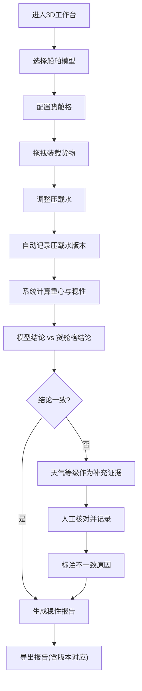

## 1. 产品概述

船舶稳性装载舱交互式3D工作台，为航运安全员提供可视化的船舶稳性计算与复核工具。解决船舶模型修改、压载水版本更新、人工核算等场景下的证据留存和结论一致性问题。

- 核心价值：将抽象的稳性参数转化为可交互的3D可视化工作台，保留计算过程证据，降低人为失误
- 目标用户：航运安全员、船舶稳性计算人员、港口作业人员
- 解决问题：重心偏移凭印象、舱位超载漏检、压载水版本覆盖、模型与货舱格结论不一致、标注不清沟通困难

## 2. 核心功能

### 2.1 用户角色

| 角色 | 注册方式 | 核心权限 |
|------|----------|----------|
| 航运安全员 | 系统账号登录 | 3D装载操作、稳性计算、版本管理、报告导出、证据留存 |
| 复核人员 | 系统账号登录 | 查看历史版本、比对计算结果、复核签字 |

### 2.2 功能模块

1. **3D装载工作台**：交互式船舶模型、货舱格可视化、拖拽装载操作
2. **稳性计算引擎**：重心偏移计算、舱位超载检测、倾角计算
3. **证据留存系统**：压载水版本管理、操作日志、人工核算记录
4. **报告导出模块**：PDF报告生成、版本对应关系、复核追踪
5. **详情面板**：天气等级证据、模型与货舱格对比、标注详情

### 2.3 页面详情

| 页面名称 | 模块名称 | 功能描述 |
|---------|----------|---------|
| 3D工作台主页面 | 船舶3D视图 | 可旋转缩放的船舶模型，显示吃水线、纵倾横倾角度 |
| 3D工作台主页面 | 货舱格视图 | 网格化货舱显示，每个舱位标注载重、重心、超载状态 |
| 3D工作台主页面 | 装载操作面板 | 拖拽货物到舱位、调整压载水、输入重心修正值 |
| 3D工作台主页面 | 稳性标注系统 | 重心偏移矢量标注、超载舱位红色边框+数值标注、倾角仪表 |
| 版本管理页面 | 压载水版本列表 | 历史版本对比、版本备注、恢复功能，旧版本不被覆盖 |
| 版本管理页面 | 人工核算记录 | 重心偏移人工核对记录、舱位超载人工确认、签字留痕 |
| 详情面板 | 结论对比 | 船舶模型计算结论 vs 货舱格计算结论，不一致高亮显示 |
| 详情面板 | 天气证据 | 装载时天气等级、风力浪高、对稳性的影响系数 |
| 报告导出页面 | 报告生成 | 包含3D截图、标注数据、版本对应关系、计算过程的完整PDF |
| 报告导出页面 | 复核追踪 | 船舶模型ID、货舱格ID、报告ID的一一对应关系表 |

## 3. 核心流程

### 3.1 装载计算流程

航运安全员进入工作台 → 选择船舶模型和货舱格配置 → 拖拽货物到指定舱位 → 调整压载水（自动记录版本） → 系统自动计算重心和稳性 → 与货舱格结论对比 → 如有不一致，天气等级自动作为补充证据 → 人工核对并记录 → 生成报告导出

### 3.2 版本复核流程

复核人员进入系统 → 选择历史报告 → 查看关联的船舶模型和货舱格版本 → 比对压载水历史版本 → 检查人工核算记录 → 确认或提出异议

## 4. 用户界面设计

### 4.1 设计风格

- **主色调**：深海蓝 (#0A2463) 作为主色，代表海事专业感；橙红 (#E63946) 作为警示色；钢灰 (#3E5C76) 作为辅助色
- **按钮风格**：直角矩形，细边框，轻微按压效果，专业工业感
- **字体**：标题使用 "Noto Sans SC" 粗体，正文使用 "JetBrains Mono" 等宽字体确保数字对齐
- **布局风格**：三栏布局，左侧操作面板、中间3D视图、右侧详情面板，信息密度适中
- **标注风格**：所有关键数据采用"数值+单位+边框"的形式，不依赖颜色传递信息

### 4.2 页面设计概述

| 页面名称 | 模块名称 | UI元素 |
|---------|----------|--------|
| 3D工作台主页面 | 船舶3D视图 | 半透明船壳、内部舱格线、吃水线标注、倾角指示器、重心矢量箭头 |
| 3D工作台主页面 | 货舱格视图 | 网格线、每个舱位的载重数值标签、超载舱位红色边框+感叹号图标 |
| 3D工作台主页面 | 稳性标注 | 重心偏移距离标注(带箭头)、横倾/纵倾角度仪表、GM值实时显示 |
| 版本管理页面 | 压载水版本列表 | 时间线布局、版本卡片、版本号、备注、修改人、对比按钮 |
| 详情面板 | 结论对比 | 左右两列对比表格，不一致行高亮，天气证据卡片折叠展开 |
| 报告导出页面 | 版本对应表 | 三列表格：船舶模型ID、货舱格ID、报告ID，可点击跳转 |

### 4.3 响应性

- 桌面端优先设计，保证1920×1080分辨率下的最佳体验
- 支持平板横屏适配，3D视图自适应缩放
- 关键标注文字最小14px，确保截图后可辨识

### 4.4 3D场景指导

- **环境**：冷色调工业环境光，顶部主光+底部补光，无过度阴影
- **光照**：平行光模拟自然光，强度0.8，环境光强度0.4，确保舱内细节可见
- **相机**：初始角度45°俯视，支持轨道控制，最小距离5m，最大距离50m
- **交互**：鼠标悬停舱位显示详情，点击选中，拖拽放置货物，滚轮缩放
- **后处理**：轻微泛光效果突出标注，FXAA抗锯齿，无过度滤镜
- **性能**：船舶模型面数控制在5万以内，帧率稳定60fps

## 5. 非功能性需求

- **证据完整性**：所有操作日志、版本变更、人工修改均不可删除，仅可追加备注
- **标注清晰度**：3D视图标注带有连接线和文字标签，截图后无需放大即可辨识
- **版本独立性**：压载水新版本不覆盖旧版本，每个版本独立存储，可回溯对比
- **导出完整性**：报告包含3D视图截图、所有标注数据、版本对应关系、计算过程
