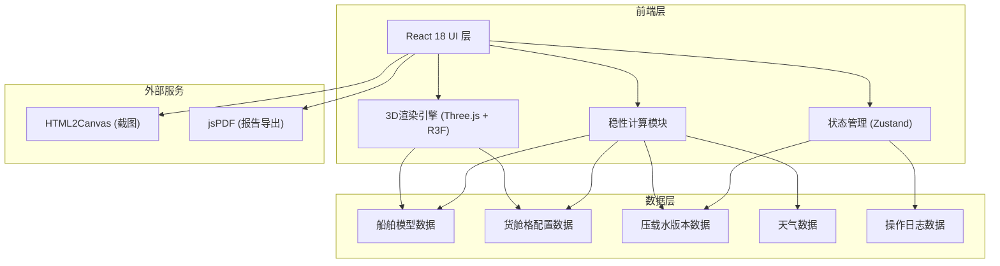
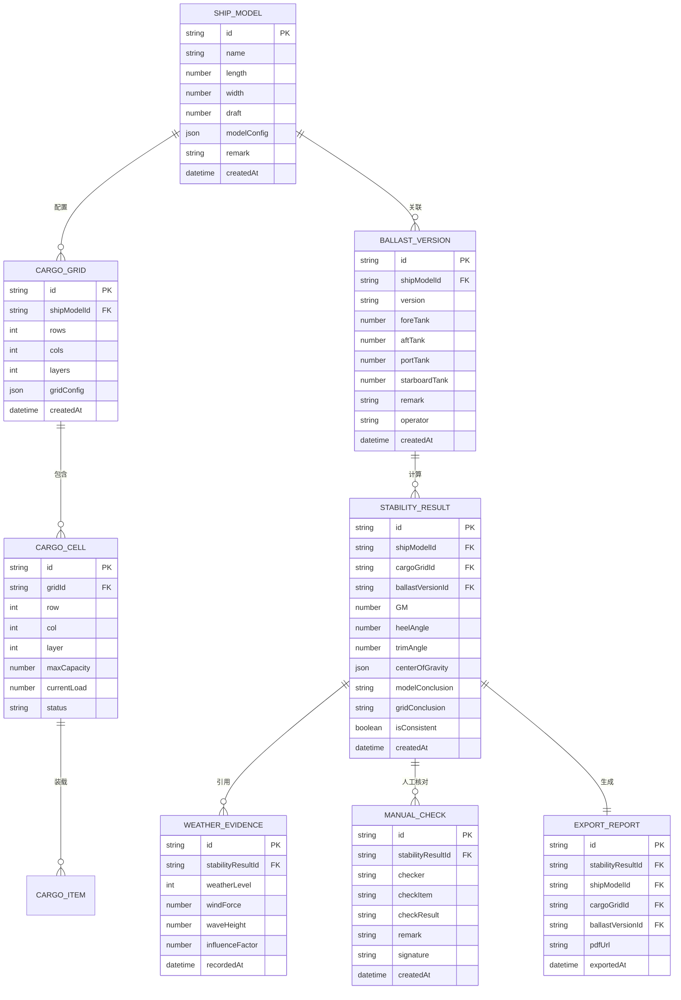

## 1. 架构设计



## 2. 技术描述

- **前端框架**: React@18 + TypeScript@5 + Vite@5
- **3D引擎**: three@0.160 + @react-three/fiber@8.15 + @react-three/drei@9.92 + @react-three/postprocessing@2.15
- **状态管理**: zustand@4.4
- **样式方案**: tailwindcss@3.4
- **UI组件**: 自定义工业风组件，不引入第三方UI库
- **报告导出**: html2canvas@1.4 + jspdf@2.5
- **图标**: lucide-react@0.294
- **后端**: 无后端，使用本地mock数据 + localStorage持久化
- **数据存储**: localStorage存储版本记录和操作日志

## 3. 路由定义

| 路由 | 页面组件 | 用途 |
|------|----------|------|
| / | WorkbenchPage | 3D工作台主页面 |
| /versions | VersionsPage | 压载水版本管理页面 |
| /report | ReportPage | 报告生成与导出页面 |

## 4. 目录结构

```
src/
├── components/
│   ├── 3d/
│   │   ├── ShipModel.tsx          # 船舶3D模型
│   │   ├── CargoGrid.tsx          # 货舱格组件
│   │   ├── StabilityAnnotations.tsx  # 稳性标注组件
│   │   └── CameraControls.tsx     # 相机控制
│   ├── panels/
│   │   ├── LoadingPanel.tsx       # 左侧装载操作面板
│   │   ├── DetailPanel.tsx        # 右侧详情面板
│   │   └── WeatherEvidence.tsx    # 天气证据组件
│   ├── common/
│   │   ├── GaugeMeter.tsx         # 倾角仪表
│   │   ├── DataLabel.tsx          # 数据标注标签
│   │   └── VersionCard.tsx        # 版本卡片
│   └── layout/
│       └── WorkbenchLayout.tsx    # 三栏布局
├── store/
│   ├── useShipStore.ts            # 船舶状态
│   ├── useCargoStore.ts           # 货舱状态
│   ├── useVersionStore.ts         # 版本管理
│   └── useStabilityStore.ts       # 稳性计算状态
├── types/
│   ├── ship.ts                    # 船舶类型定义
│   ├── cargo.ts                   # 货舱类型定义
│   └── stability.ts               # 稳性类型定义
├── utils/
│   ├── stabilityCalculator.ts     # 稳性计算引擎
│   ├── exportUtils.ts             # 导出工具
│   └── mockData.ts                # Mock数据
├── pages/
│   ├── WorkbenchPage.tsx
│   ├── VersionsPage.tsx
│   └── ReportPage.tsx
└── App.tsx
```

## 5. 核心数据模型

### 5.1 ER图



## 6. 核心API类型定义

```typescript
// 船舶稳性计算参数
interface StabilityCalculationParams {
  shipModelId: string;
  cargoGridId: string;
  ballastVersionId: string;
  weatherLevel: number;
}

// 稳性计算结果
interface StabilityCalculationResult {
  GM: number;           // 初稳性高度 (m)
  heelAngle: number;    // 横倾角 (°)
  trimAngle: number;    // 纵倾角 (°)
  centerOfGravity: {    // 重心坐标
    x: number;          // 纵向重心 (m)
    y: number;          // 横向重心 (m)
    z: number;          // 垂向重心 (m)
  };
  centerOfBuoyancy: {   // 浮心坐标
    x: number;
    y: number;
    z: number;
  };
  displacement: number; // 排水量 (t)
  modelConclusion: 'safe' | 'warning' | 'danger';
  gridConclusion: 'safe' | 'warning' | 'danger';
  isConsistent: boolean;
  overloadCells: string[];     // 超载舱位ID列表
  gravityOffset: {             // 重心偏移
    distance: number;          // 偏移距离 (m)
    direction: string;         // 偏移方向
    allowable: number;         // 允许偏移量 (m)
  };
}

// 压载水版本
interface BallastVersion {
  id: string;
  shipModelId: string;
  version: string;             // 如 "v1.0.2"
  foreTank: number;            // 前舱压载水 (t)
  aftTank: number;             // 后舱压载水 (t)
  portTank: number;            // 左舷压载水 (t)
  starboardTank: number;       // 右舷压载水 (t)
  totalBallast: number;        // 总压载水 (t)
  remark: string;              // 版本备注
  operator: string;            // 操作人员
  createdAt: string;
  isDeleted: boolean;          // 软删除标记，永远不真删
}

// 人工核对记录
interface ManualCheckRecord {
  id: string;
  stabilityResultId: string;
  checker: string;
  checkItem: 'gravityOffset' | 'overload' | 'ballast' | 'consistency';
  checkResult: 'confirmed' | 'adjusted' | 'rejected';
  originalValue: any;
  adjustedValue?: any;
  remark: string;
  signature: string;           // 数字签名
  createdAt: string;
}
```

## 7. 技术关键决策

### 7.1 3D渲染策略
- 使用 @react-three/fiber 声明式管理Three.js场景
- 船舶模型采用程序化生成（Box几何体组合），不依赖外部模型文件，确保可维护性
- 货舱格使用 InstancedMesh 渲染，提升性能
- 标注系统使用 Html 组件 + CSS3DRenderer，确保文字清晰度

### 7.2 版本管理策略
- 压载水版本采用追加式写入，永不删除旧版本
- 每个版本生成唯一ID，与计算结果强关联
- 使用时间线展示版本演变，支持任意版本恢复

### 7.3 证据留存策略
- 所有操作自动记录到 localStorage，包含时间戳和操作人
- 人工修改必须填写原因并签字，不可撤销
- 导出报告时自动嵌入所有关联ID，确保可追溯

### 7.4 标注清晰度策略
- 所有3D标注使用"连接线 + 边框标签 + 数值+单位"格式
- 颜色仅作为辅助，关键信息均有文字说明
- 支持截图时自动隐藏UI控件，只保留3D视图和标注
