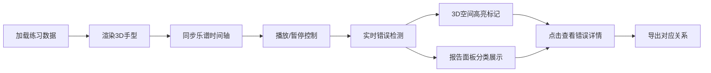

## 1. 产品概述

钢琴指法空间回放系统是一款面向钢琴教学评审的专业工具，用于可视化展示钢琴演奏的手指运动轨迹、标注演奏错误、生成详细练习报告。系统解决传统教学中仅凭感觉解释小节错位、关键点丢失等问题，为钢琴老师提供客观、可复核的评审依据。

## 2. 核心功能

### 2.1 用户角色

| 角色 | 注册方式 | 核心权限 |
|------|----------|----------|
| 钢琴老师/评审者 | 本地使用 | 3D回放、查看详细报告、导出对应关系、管理错误标签 |
| 学生/学习者 | 本地使用 | 查看自己的演奏回放和错误分析 |

### 2.2 功能模块

1. **3D手型回放空间**：左右手3D模型实时回放，关键点高亮标注，数据缺口提示
2. **练习报告面板**：分类展示关键点丢失、小节错位、左右手混淆等错误类型
3. **乐谱对应关系视图**：手指关键点、乐谱小节、时间轴的可视化对应展示
4. **错误标签管理**：错误标签的补录、追溯及影响范围高亮显示

### 2.3 页面详情

| 页面名称 | 模块名称 | 功能描述 |
|----------|----------|----------|
| 主回放页面 | 3D手型空间 | 左右手3D模型渲染，关键点颜色编码，数据缺口警告，播放控制 |
| 主回放页面 | 练习报告面板 | 错误分类统计，详细错误列表，来源追溯标记 |
| 主回放页面 | 乐谱时间轴 | 乐谱小节可视化，关键点对应标记，截图导出对应关系 |
| 主回放页面 | 错误标签管理 | 标签补录，影响范围高亮，追溯明细展示 |

## 3. 核心流程

用户加载钢琴练习数据文件 → 系统渲染3D手型并同步显示乐谱时间轴 → 用户通过播放控制查看演奏过程 → 系统在3D空间和报告面板同步显示各类错误 → 用户可点击查看具体错误的详细信息和来源 → 用户可导出关键点-小节-截图对应关系

## 4. 用户界面设计

### 4.1 设计风格
- **主色调**：深海军蓝（#0A2342）作为专业背景色，营造专注的评审氛围
- **辅助色**：
  - 关键点正常：翡翠绿（#2ECC71）
  - 关键点丢失：警示红（#E74C3C）
  - 小节错位：琥珀橙（#F39C12）
  - 左右手混淆：靛紫（#9B59B6）
  - 补录标签：天蓝（#3498DB）
- **字体**：标题使用 Playfair Display（优雅专业），正文使用 Source Code Pro（清晰易读的数据展示）
- **布局**：三栏式专业布局 - 左侧3D空间，右上报告面板，右下乐谱时间轴
- **图标风格**：线性简约图标，配合颜色编码增强辨识度

### 4.2 页面设计概述

| 页面名称 | 模块名称 | UI 元素 |
|----------|----------|----------|
| 主回放页面 | 3D手型空间 | 深色舞台背景，聚光效果，关键点球体，数据缺口半透明遮罩+文字提示，播放控制悬浮栏 |
| 主回放页面 | 练习报告面板 | 卡片式错误分类统计，可展开的错误详情列表，来源标签颜色编码 |
| 主回放页面 | 乐谱时间轴 | 小节刻度线，关键点垂直线标记，颜色编码对应，截图导出按钮 |
| 主回放页面 | 错误标签管理 | 标签编辑弹窗，影响范围时间轴高亮，追溯链接 |

### 4.3 响应式
- 桌面端优先设计，三栏布局充分利用屏幕空间
- 平板端适配为上下布局：3D空间在上，报告和时间轴在下
- 移动端简化视图，聚焦核心回放功能

### 4.4 3D 场景指导
- **环境**：深色音乐厅风格背景，柔和环境光，聚焦手部模型
- **光照设置**：主光源45度角照射，辅以柔和补光，突出手指轮廓和关键点
- **相机设置**：默认视角略高于钢琴键盘，可自由旋转缩放，平滑过渡动画
- **交互**：悬停关键点显示详细信息，点击错误点跳转报告面板，滚轮缩放
- **后处理**：轻微泛光效果增强关键点视觉，数据缺口时降低饱和度并显示警告信息
- **性能**：关键点数量控制在合理范围，LOD优化确保流畅回放
