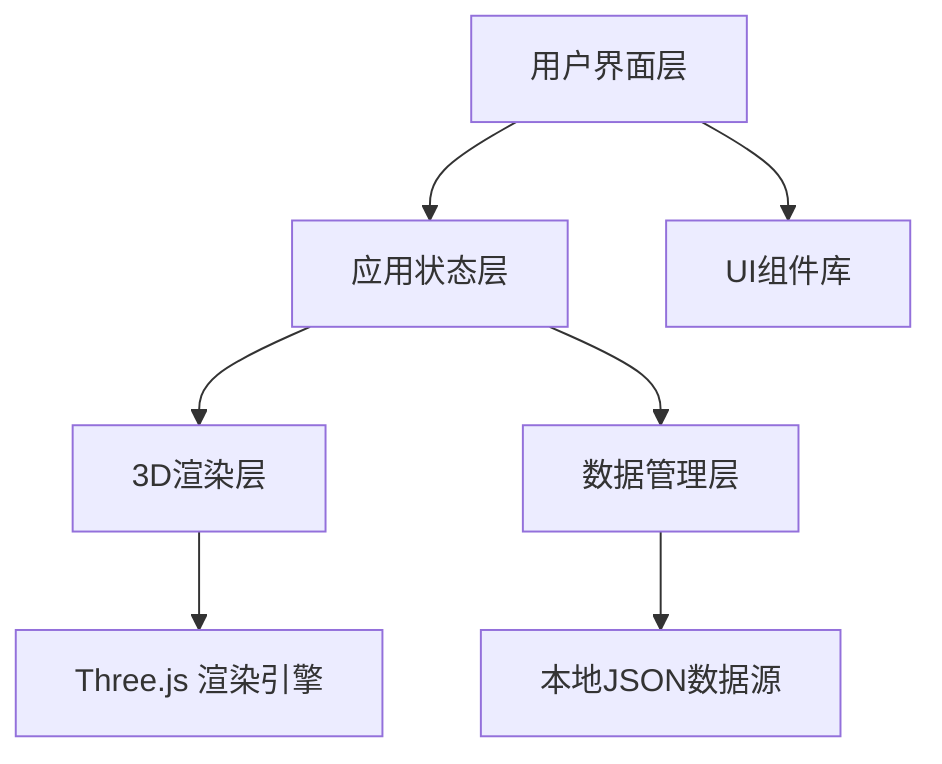
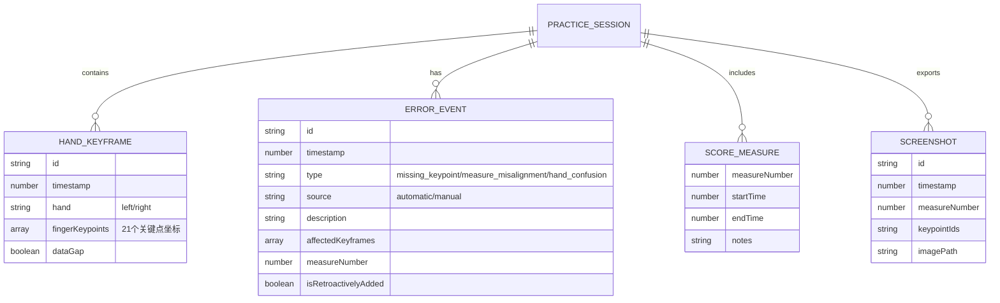

## 1. 架构设计



## 2. 技术描述

- **前端框架**: React@18 + TypeScript
- **构建工具**: Vite
- **样式方案**: TailwindCSS@3
- **3D渲染**: Three.js + @react-three/fiber + @react-three/drei + @react-three/postprocessing
- **状态管理**: Zustand
- **动画库**: Framer Motion
- **数据来源**: 本地JSON文件（模拟钢琴练习数据）

## 3. 路由定义

| 路由 | 用途 |
|------|------|
| / | 主回放页面 - 3D手型回放、练习报告、乐谱时间轴 |

## 4. 数据模型

### 4.1 数据结构定义



### 4.2 TypeScript 类型定义

```typescript
// 手指关键点
interface FingerKeypoint {
  id: string;
  x: number;
  y: number;
  z: number;
  confidence: number;
  fingerName: string;
}

// 手部关键帧
interface HandKeyframe {
  id: string;
  timestamp: number;
  hand: 'left' | 'right';
  fingerKeypoints: FingerKeypoint[];
  dataGap: boolean;
  dataGapReason?: string;
}

// 错误事件类型
type ErrorType = 'missing_keypoint' | 'measure_misalignment' | 'hand_confusion';
type ErrorSource = 'automatic' | 'manual';

// 错误事件
interface ErrorEvent {
  id: string;
  timestamp: number;
  type: ErrorType;
  source: ErrorSource;
  description: string;
  affectedKeyframeIds: string[];
  measureNumber: number;
  isRetroactivelyAdded: boolean;
  addedAt?: number;
  severity: 'low' | 'medium' | 'high';
}

// 乐谱小节
interface ScoreMeasure {
  measureNumber: number;
  startTime: number;
  endTime: number;
  notes: string[];
  hand: 'left' | 'right' | 'both';
}

// 截图导出记录
interface ScreenshotExport {
  id: string;
  timestamp: number;
  measureNumber: number;
  keypointIds: string[];
  imageDataUrl: string;
  exportedAt: number;
}

// 练习会话
interface PracticeSession {
  id: string;
  title: string;
  date: string;
  pieceName: string;
  totalDuration: number;
  keyframes: HandKeyframe[];
  errors: ErrorEvent[];
  measures: ScoreMeasure[];
  screenshots: ScreenshotExport[];
}
```

## 5. 核心模块说明

### 5.1 3D渲染模块
- 使用 `@react-three/fiber` 进行声明式Three.js开发
- 使用 `@react-three/drei` 提供的辅助组件（OrbitControls, Lights等）
- 手型关键点使用球体渲染，支持颜色编码
- 数据缺口时显示半透明遮罩和文字警告

### 5.2 状态管理模块
- 使用 Zustand 管理全局播放状态、当前时间、选中错误等
- 分离关注点：播放控制store、数据store、UI状态store

### 5.3 练习报告模块
- 错误分类统计展示
- 支持按错误类型、严重程度、来源筛选
- 点击错误跳转至对应时间点

### 5.4 时间轴模块
- 可视化乐谱小节与关键点的对应关系
- 支持点击跳转
- 导出对应关系为JSON/CSV
