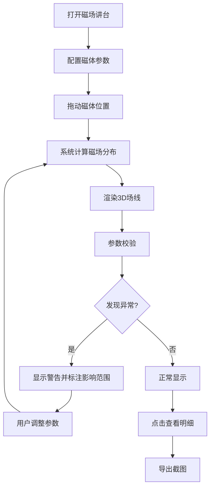

## 1. 产品概述

物理磁场线讲台是一个Web3D教学工具，帮助物理老师直观展示磁场方向和强弱分布，解决学生混淆磁场概念的教学痛点。通过交互式3D可视化，学生可拖动磁体观察场线密度变化，加深对磁场物理规律的理解。

## 2. 核心功能

### 2.1 用户角色
| 角色 | 注册方式 | 核心权限 |
|------|----------|----------|
| 物理教师 | 无需注册 | 配置磁体、导出截图、使用教学功能 |
| 学生 | 无需注册 | 观察磁场线、交互学习 |

### 2.2 功能模块
1. **3D主视图**: 磁场线3D可视化、磁体拖拽、视角旋转、对象点击查看明细
2. **侧边栏控制面板**: 磁体列表管理、磁极方向调整、采样参数设置、场强标注显示
3. **数据管理**: 磁体位置/磁极/采样点数据管理、来源版本追踪、数据验证警告
4. **导出功能**: 场景截图导出、配置参数保存

### 2.3 页面详情
| 页面名称 | 模块名称 | 功能描述 |
|-----------|-------------|---------------------|
| 磁场讲台主页 | 3D场景视图 | Three.js渲染3D磁场线、磁体模型、视角控制、点击交互 |
| 磁场讲台主页 | 左侧控制栏 | 磁体列表、添加/删除磁体、磁极反向切换、参数调整 |
| 磁场讲台主页 | 右侧信息面板 | 选中对象明细、场强数值标注、数据验证警告 |
| 磁场讲台主页 | 顶部工具栏 | 截图导出按钮、视图重置、筛选同步开关、帮助文档入口 |

## 3. 核心流程

### 3.1 教学演示流程
教师打开页面 → 添加/配置磁体参数 → 拖动磁体到目标位置 → 观察场线密度变化 → 点击磁体查看场强明细 → 导出截图用于课件 → 保存配置便于下次复现

### 3.2 数据验证流程
用户修改参数 → 系统实时校验 → 检测到磁极反向/采样过密/场强爆炸 → 显示警告信息并标注受影响的场线 → 用户确认或调整参数 → 更新可视化结果

## 4. 用户界面设计

### 4.1 设计风格
- **主色调**: 深蓝科技感 (#0a1628) 配合磁场线青色渐变 (#00d4ff)
- **强调色**: 磁体N极红色 (#ff4757)，S极蓝色 (#3742fa)，警告橙色 (#ffa502)
- **按钮风格**: 圆角矩形，微立体阴影，悬停发光效果
- **字体**: 主字体使用 JetBrains Mono（等宽科技感），辅助字体使用 Noto Sans SC
- **布局风格**: 左右分栏式，3D视窗占主导地位，侧边栏采用半透明玻璃拟态
- **图标风格**: 线性简约图标，配合霓虹发光效果

### 4.2 页面设计概述
| 页面名称 | 模块名称 | UI元素 |
|-----------|-------------|-------------|
| 磁场讲台主页 | 3D场景视图 | 深色星空背景、青色发光场线、红蓝双色磁体、坐标辅助线、光晕效果 |
| 磁场讲台主页 | 左侧控制栏 | 玻璃拟态面板、可拖拽磁体卡片、滑动条控制器、开关按钮、数据版本标签 |
| 磁场讲台主页 | 右侧信息面板 | 选中对象高亮卡片、场强数值仪表盘、警告提示条、采样点列表 |
| 磁场讲台主页 | 顶部工具栏 | 磨砂玻璃导航栏、图标按钮组、筛选同步指示器、帮助弹窗入口 |

### 4.3 响应式
- 桌面端优先：左右分栏布局，3D视窗宽度自适应
- 平板端：侧边栏可折叠，点击滑出
- 移动端：单列布局，3D视窗全屏，控制按钮悬浮

### 4.4 3D场景指引
- **环境**: 深色星空背景，轻微网格地面，营造科研实验室氛围
- **光照设置**: 环境光 + 主方向光 + 磁体自发光，场线采用发光材质
- **相机设置**: 透视相机，轨道控制器，支持缩放/平移/旋转
- **交互动效**: 磁体拖拽时的吸附反馈、场线实时更新动画、点击时的脉冲效果
- **后处理**:  bloom发光效果、轻微抗锯齿、场线透明度随距离衰减
