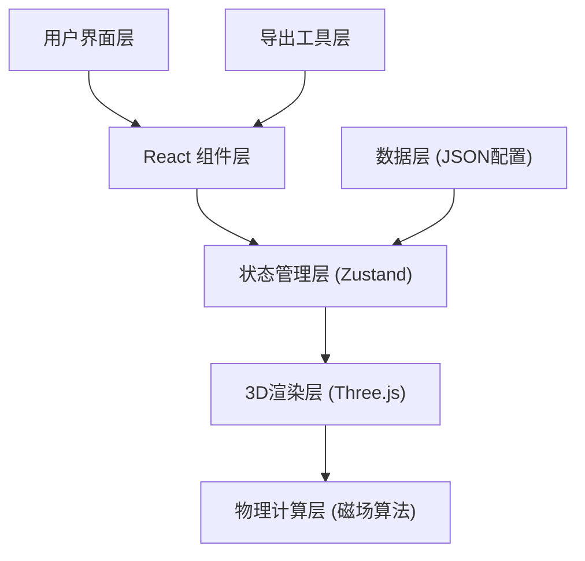

## 1. 架构设计



## 2. 技术描述

- **前端框架**: React@18 + TypeScript
- **构建工具**: Vite@5
- **样式方案**: TailwindCSS@3
- **3D渲染**: Three.js@0.160 + @react-three/fiber@8 + @react-three/drei@9
- **状态管理**: Zustand@4
- **后处理效果**: @react-three/postprocessing@2
- **图标库**: Lucide React@0.294

## 3. 核心目录结构

```
src/
├── components/
│   ├── Layout/           # 布局组件
│   ├── Sidebar/          # 侧边栏控制面板
│   ├── InfoPanel/        # 信息面板
│   ├── Toolbar/          # 顶部工具栏
│   └── Modal/            # 弹窗组件
├── store/                # Zustand 状态管理
├── hooks/                # 自定义Hooks
├── utils/                # 工具函数
│   ├── magneticField.ts  # 磁场计算算法
│   ├── export.ts         # 导出工具
│   └── validation.ts     # 参数验证
├── types/                # TypeScript类型定义
└── scenes/               # 3D场景组件
    ├── MagneticScene.tsx
    ├── Magnet.tsx
    └── FieldLines.tsx
```

## 4. 数据模型

### 4.1 磁体数据结构
```typescript
interface Magnet {
  id: string;
  name: string;
  position: { x: number; y: number; z: number };
  poleDirection: { x: number; y: number; z: number };
  strength: number;
  type: 'bar' | 'horseshoe';
  source: string;
  version: string;
  createdAt: string;
}
```

### 4.2 采样点数据结构
```typescript
interface SamplePoint {
  id: string;
  position: { x: number; y: number; z: number };
  fieldStrength: number;
  fieldDirection: { x: number; y: number; z: number };
  affectedBy: string[];
}
```

### 4.3 配置数据结构
```typescript
interface AppConfig {
  magnets: Magnet[];
  sampleDensity: number;
  showFieldLines: boolean;
  showStrengthLabels: boolean;
  syncFilters: boolean;
  version: string;
}
```

## 5. 核心算法说明

### 5.1 磁场计算
- 使用毕奥-萨伐尔定律计算磁偶极子磁场
- 多磁体叠加：矢量叠加原理
- 场线追踪：基于龙格-库塔法的流线积分

### 5.2 参数验证规则
1. **磁极反向检测**: 相邻磁体夹角 > 170°时触发警告
2. **采样过密检测**: 采样密度 > 50点/单位体积时触发警告
3. **场强爆炸检测**: 任意点场强 > 100倍平均值时触发警告

## 6. 导出功能
- 截图导出: 使用 html2canvas + three.js renderer domElement
- 配置导出: JSON格式，包含磁体参数、版本信息、来源说明
