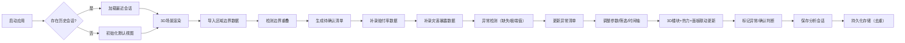

## 1. 产品概述

保险风险热力楼是一个基于Three.js的3D数据可视化平台，专为保险精算师和管理层设计，通过立体楼块直观展示各地区赔付率、保费收入和灾害暴露数据的多维关系。

- 核心目标：将复杂的保险风险数据转化为可交互的3D视觉化体验，支持决策层快速洞察风险分布
- 核心价值：实现数据来源、判断逻辑和分析结果的完整链路追溯，提升风险评估的透明度和可信度

## 2. 核心功能

### 2.1 用户角色

| 角色 | 登录方式 | 核心权限 |
|------|----------|----------|
| 管理层 | 单点登录 | 查看3D热力楼、导出报告、浏览历史记录 |
| 精算师 | 单点登录 | 数据导入、参数调整、异常标记、保存分析会话 |

### 2.2 功能模块

1. **3D热力楼主视图**：立体楼块渲染、热力映射、视角控制
2. **侧边数据面板**：地区明细、数据来源追溯、判断依据展示
3. **数据导入与增量更新**：区域边界导入、赔付率补录、灾害暴露补充
4. **异常检测与管理**：自动检测异常、待确认清单、异常标记与处理
5. **时间轴与交互控制**：时间播放、区域筛选、参数调节
6. **历史记录管理**：会话保存、历史对比、防重复机制

### 2.3 页面详情

| 页面名称 | 模块名称 | 功能描述 |
|-----------|-------------|---------------------|
| 热力楼主页面 | 3D场景模块 | 多层级立体楼块渲染、颜色映射到赔付率、高度映射到保费、深度映射到灾害暴露 |
| 热力楼主页面 | 交互控制模块 | 鼠标拖拽旋转、滚轮缩放、点击选中、框选筛选 |
| 热力楼主页面 | 时间轴模块 | 月份滑块、播放/暂停、速度调节、关键帧标记 |
| 右侧面板 | 数据明细模块 | 选中区域详情、数据来源链接、计算公式展示、异常标记 |
| 右侧面板 | 参数控制模块 | 热力阈值调整、权重配比、显示过滤条件 |
| 底部面板 | 异常清单模块 | 区域重叠预警、缺失数据标记、极端值高亮、处理状态跟踪 |
| 顶部导航 | 历史记录模块 | 会话列表、版本对比、一键恢复、导出分析 |

## 3. 核心流程

用户打开应用后，系统加载历史会话或初始化默认视图。精算师可分批导入数据（区域边界→赔付率→灾害暴露），系统自动检测异常并生成待确认清单。调整参数时，3D楼块、热力颜色和数据面板实时联动更新。分析完成后可保存会话，历史记录持久化存储且防重复。

## 4. 用户界面设计

### 4.1 设计风格
- **主色调**：深蓝 (#0A1628) 背景，科技感氛围
- **热力色阶**：蓝→青→黄→橙→红，映射赔付率从低到高
- **楼块材质**：半透明玻璃质感，边缘发光，选中时高亮脉冲
- **字体**：标题使用 Space Grotesk，正文使用 Inter Mono 等宽字体保证数据对齐
- **布局**：三栏布局，左侧工具栏、中央3D场景、右侧数据面板，底部异常状态栏

### 4.2 页面设计概述

| 页面名称 | 模块名称 | UI元素 |
|-----------|-------------|-------------|
| 热力楼主页面 | 3D场景 | 透视相机、环境光+方向光、雾效、阴影、楼块hover高亮、点击选中动画 |
| 热力楼主页面 | 时间轴 | 渐变滑块、播放按钮、进度指示、异常数据标记点、月份标签 |
| 右侧面板 | 数据卡片 | 毛玻璃效果、数据来源标签、公式展开/折叠、异常角标 |
| 右侧面板 | 参数滑块 | 自定义轨、发光滑块、实时数值显示 |
| 底部面板 | 异常清单 | 可折叠列表、严重性颜色编码、一键处理按钮 |
| 顶部导航 | 历史记录 | 下拉菜单、时间戳、版本对比图标 |

### 4.3 响应式
- Desktop-first 设计，针对1920×1080及以上分辨率优化
- 右侧面板可折叠，腾出空间给3D场景
- 异常清单可最小化为图标状态
- 触摸设备支持手势缩放和旋转

### 4.4 3D场景指导
- **环境**：深色空间，地面网格参考线，微妙的体积雾
- **光照**：主方向光+环境光，楼块自发光效果，选中物体有轮廓光
- **相机**：默认45°俯视角，支持轨道控制，有自动旋转展示模式
- **交互**：hover显示信息浮窗，点击选中后楼块上浮，双击进入详情
- **动画**：参数变化时楼块高度/颜色平滑过渡，时间轴播放时数据渐变更新
- **后处理**：Bloom发光效果，轻微色差，选中物体有发光描边
- **性能**：InstancedMesh渲染大量楼块，LOD策略，移动端降级渲染