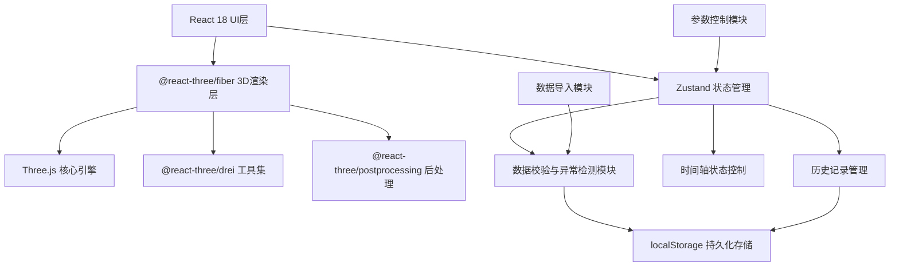
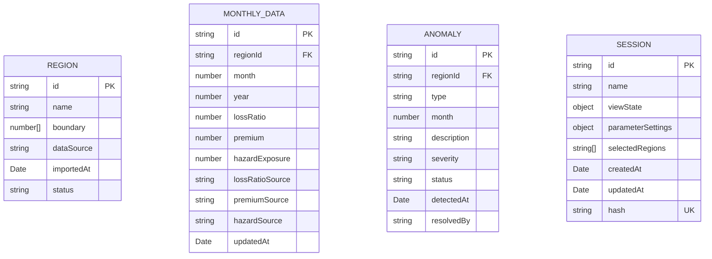

## 1. 架构设计



## 2. 技术描述

- **前端框架**：React@18 + TypeScript + Vite@5
- **3D引擎**：Three.js@0.160 + @react-three/fiber@8 + @react-three/drei@9
- **后处理**：@react-three/postprocessing@2
- **状态管理**：Zustand@4（轻量、支持持久化）
- **样式方案**：TailwindCSS@3 + CSS变量
- **数据持久化**：localStorage + IndexedDB（大容量历史记录）
- **数据校验**：自定义Schema校验器 + 异常检测引擎

## 3. 路由定义

| 路由 | 用途 |
|-------|---------|
| / | 热力楼主视图 |
| /history | 历史记录对比视图 |

## 4. 数据模型

### 4.1 数据模型定义



### 4.2 TypeScript 类型定义

```typescript
// 区域数据
interface Region {
  id: string;
  name: string;
  boundary: [number, number][]; // GeoJSON 坐标
  center: [number, number];
  dataSource: {
    boundary: DataSourceInfo;
    lossRatio?: DataSourceInfo;
    premium?: DataSourceInfo;
    hazardExposure?: DataSourceInfo;
  };
  status: 'partial' | 'complete';
}

// 数据来源追溯
interface DataSourceInfo {
  source: string;
  importedAt: Date;
  importedBy: string;
  version: string;
}

// 月度指标
interface MonthlyMetrics {
  regionId: string;
  year: number;
  month: number;
  lossRatio?: number;
  premium?: number;
  hazardExposure?: number;
}

// 异常记录
interface Anomaly {
  id: string;
  type: 'overlap' | 'missing_month' | 'extreme_value' | 'partial_data';
  regionId: string;
  month?: number;
  description: string;
  severity: 'low' | 'medium' | 'high';
  status: 'pending' | 'confirmed' | 'resolved' | 'dismissed';
  detectedAt: Date;
  judgment?: string; // 精算师判断依据
}

// 分析会话
interface AnalysisSession {
  id: string;
  name: string;
  timestamp: Date;
  viewState: {
    camera: CameraState;
    timePosition: { year: number; month: number };
    filters: FilterSettings;
  };
  parameters: {
    lossRatioThresholds: [number, number, number, number];
    colorMapping: ColorMap;
    heightScale: number;
  };
  anomalies: Record<string, Anomaly['status']>;
  hash: string; // 用于去重的内容哈希
}

// 应用状态
interface AppState {
  regions: Region[];
  monthlyData: Record<string, MonthlyMetrics[]>;
  currentTime: { year: number; month: number };
  selectedRegionId: string | null;
  anomalies: Anomaly[];
  sessions: AnalysisSession[];
  currentSessionId: string | null;
}
```

## 5. 核心模块设计

### 5.1 异常检测引擎

```typescript
// 区域重叠检测
function detectOverlaps(regions: Region[]): Anomaly[]

// 缺失月份检测
function detectMissingMonths(data: MonthlyMetrics[], regionId: string): Anomaly[]

// 极端值检测（IQR方法）
function detectExtremeValues(data: MonthlyMetrics[], field: keyof MonthlyMetrics): Anomaly[]
```

### 5.2 历史记录去重机制

```typescript
// 计算会话内容哈希
function computeSessionHash(session: AnalysisSession): string

// 检查是否重复
function isDuplicateSession(hash: string, existing: AnalysisSession[]): boolean

// 保存会话（自动去重）
function saveSession(session: AnalysisSession): string | null
```

### 5.3 增量数据更新

```typescript
// 只更新有新数据的字段，保留已有判断
function updateRegionIncrementally(regionId: string, updates: Partial<Region>): Region
```

## 6. 性能优化策略

1. **3D渲染优化**：
   - 使用 InstancedMesh 批量渲染楼块
   - 实现 LOD (Level of Detail)
   - 视锥剔除 (Frustum Culling)

2. **数据更新优化**：
   - 按需更新，避免全量重绘
   - 使用 useMemo/useCallback 减少重渲染
   - Web Worker 处理异常检测计算

3. **存储优化**：
   - 历史记录按时间分片存储
   - LRU 缓存策略限制内存占用