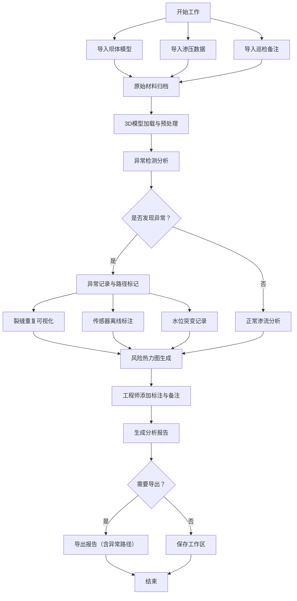

# 水库坝体渗流剖面3D交互式工作台 - PRD产品需求文档

## 1. 产品概述

水库坝体渗流剖面3D交互式工作台，为水利工程师提供专业的坝体渗流分析工作环境。解决裂缝重复、水位突变等异常情况导致结论混乱的问题，支持多源数据导入、异常路径可视化、报告导出等核心功能。

- **核心问题**：坝体模型、渗压数据、巡检备注来源分散，异常情况（裂缝重复、传感器离线、水位突变）打乱分析结论
- **目标用户**：水利工程师、坝体安全监测人员、工程质量检测人员
- **产品价值**：提供一体化的3D可视化分析工作台，完整记录分析路径，确保结论可追溯

## 2. 核心功能

### 2.1 用户角色

| 角色 | 注册方式 | 核心权限 |
|------|----------|----------|
| 水利工程师 | 本地登录 | 导入数据、3D交互分析、标注裂缝、导出报告 |
| 巡检人员 | 本地登录 | 上传巡检备注、查看分析结果 |

### 2.2 功能模块

1. **3D工作台主界面**：坝体模型展示、渗流剖面剖切、风险热力叠加、交互式操作
2. **数据导入模块**：坝体模型导入、渗压数据导入、巡检备注导入，区分原始材料与处理结果
3. **异常检测模块**：裂缝重复检测、传感器离线监测、水位突变预警
4. **分析标注模块**：裂缝标注、风险区域标记、注释添加
5. **报告导出模块**：完整分析报告导出、异常路径记录、截图导出

### 2.3 页面详情

| 页面名称 | 模块名称 | 功能描述 |
|----------|----------|----------|
| 3D工作台 | 坝体模型展示 | 可旋转、缩放、剖切的3D坝体模型，支持多视角切换 |
| 3D工作台 | 风险热力图 | 渗流风险区域热力叠加，带数值标注而非纯颜色 |
| 3D工作台 | 裂缝标注 | 裂缝点可视化标注，支持点击查看详情 |
| 数据管理 | 原始材料区 | 展示导入的原始模型、数据、备注文件 |
| 数据管理 | 处理结果区 | 展示分析后的结果数据，可追溯来源 |
| 异常面板 | 异常列表 | 列出所有检测到的异常，支持筛选和详情查看 |
| 异常面板 | 失败路径 | 可视化展示裂缝重复等失败分析路径 |
| 报告导出 | 报告预览 | 报告内容预览，支持自定义导出范围 |
| 报告导出 | 截图导出 | 3D视图截图导出，自动包含标注信息 |

## 3. 核心流程

水利工程师从导入数据到导出报告的完整工作流程：

## 4. 用户界面设计

### 4.1 设计风格

- **主色调**：深蓝色 (#1e3a5f) - 代表专业、工程、可靠
- **辅助色**：水蓝色 (#2d9cdb) - 代表水、渗流主题
- **警示色**：橙红色 (#e74c3c) - 异常、风险区域
- **安全色**：青绿色 (#27ae60) - 正常区域
- **按钮风格**：圆角8px，带微妙阴影，悬停有轻微上浮效果
- **字体**：标题使用 Noto Sans SC Bold，正文使用 Noto Sans SC Regular
- **布局风格**：三栏布局 - 左侧数据管理、中央3D视图、右侧分析面板
- **图标风格**：线性图标，工程感强，统一线条粗细

### 4.2 页面设计概述

| 页面名称 | 模块名称 | UI元素 |
|----------|----------|----------|
| 3D工作台 | 主视图区 | 深蓝色背景、3D坝体居中、网格地面、多视角按钮悬浮 |
| 3D工作台 | 工具栏 | 顶部水平工具栏，图标+文字，剖切/测量/标注工具 |
| 数据管理 | 侧边栏 | 左侧可折叠面板，原始材料/处理结果分组显示 |
| 异常面板 | 侧边栏 | 右侧可折叠面板，异常列表带状态图标，时间线展示 |
| 报告导出 | 模态框 | 居中弹窗，预览区+选项区+导出按钮 |

### 4.3 响应式

- **桌面端优先**：针对1920×1080及以上分辨率优化
- **侧边栏自适应**：支持拖拽调整宽度，小屏幕可完全折叠
- **3D画布响应**：自动适应可用空间，保持纵横比
- **触控优化**：支持手势缩放、旋转，平板设备可用

### 4.4 3D场景指导

- **环境**：专业工程风格，深蓝色渐变背景，柔和环境光
- **光照设置**：主光源（右上方45°）+ 环境光（0.4强度）+ 底部补光
- **相机设置**：透视相机，初始距离适中，支持轨道控制，限制垂直旋转角度
- **交互与动画**：模型加载渐入动画、剖切平滑动效、异常点脉冲提示
- **后处理**：轻微抗锯齿，边缘高亮效果，提升立体感
- **性能优化**：坝体模型使用LOD，标注按需加载，保持60fps
