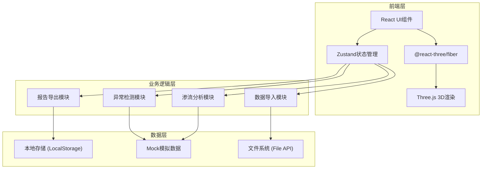
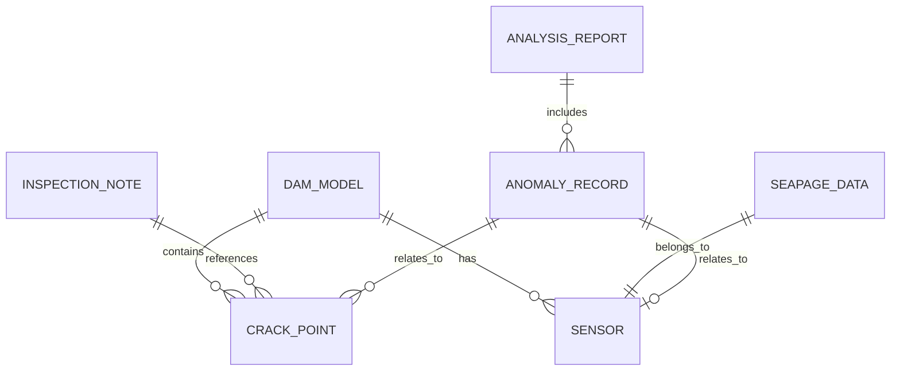

# 水库坝体渗流剖面3D交互式工作台 - 技术架构文档

## 1. 架构设计



## 2. 技术描述

- **前端框架**: React@18 + TypeScript
- **构建工具**: Vite@5
- **样式方案**: TailwindCSS@3
- **3D渲染**: Three.js + @react-three/fiber + @react-three/drei
- **状态管理**: Zustand (轻量级，适合工程工具类应用)
- **图表可视化**: @ant-design/plots (热力图、趋势图)
- **UI组件库**: Ant Design (专业工程风格)
- **后端**: 纯前端应用，无后端服务
- **数据存储**: LocalStorage + 文件导入/导出

## 3. 目录结构

```
src/
├── components/
│   ├── layout/           # 布局组件
│   │   ├── Header.tsx    # 顶部工具栏
│   │   ├── LeftPanel.tsx # 左侧数据管理面板
│   │   └── RightPanel.tsx# 右侧分析面板
│   ├── viewer3d/         # 3D视图组件
│   │   ├── DamModel.tsx  # 坝体模型
│   │   ├── HeatMap.tsx   # 风险热力图
│   │   ├── CrackMarkers.tsx # 裂缝标注
│   │   └── SectionPlane.tsx # 剖切平面
│   ├── datamanage/       # 数据管理组件
│   │   ├── RawMaterials.tsx
│   │   ├── ProcessResults.tsx
│   │   └── FileUpload.tsx
│   ├── anomaly/          # 异常检测组件
│   │   ├── AnomalyList.tsx
│   │   ├── FailurePath.tsx
│   │   └── AnomalyDetail.tsx
│   └── report/           # 报告导出组件
│       ├── ReportPreview.tsx
│       └── ScreenshotExport.tsx
├── store/                # 状态管理
│   ├── useDamStore.ts
│   ├── useDataStore.ts
│   └── useAnomalyStore.ts
├── types/                # TypeScript类型定义
│   ├── dam.ts
│   ├── data.ts
│   └── anomaly.ts
├── utils/                # 工具函数
│   ├── threeHelpers.ts
│   ├── anomalyDetector.ts
│   ├── reportGenerator.ts
│   └── mockData.ts
├── App.tsx
├── main.tsx
└── index.css
```

## 4. 路由定义

本项目为单页应用，主要使用组件切换而非路由：

| 组件/视图 | 用途 |
|-----------|------|
| / (主视图) | 3D工作台主界面，包含所有功能模块 |

## 5. 数据模型

### 5.1 数据模型定义



### 5.2 TypeScript类型定义

```typescript
// 坝体模型
interface DamModel {
  id: string;
  name: string;
  importTime: Date;
  geometry: DamGeometry;
  sourceFile: FileInfo;
}

// 裂缝点
interface CrackPoint {
  id: string;
  position: Vector3;
  length: number;
  width: number;
  depth: number;
  description: string;
  detectionTime: Date;
  isDuplicate: boolean;
  duplicateOf?: string;
}

// 传感器
interface Sensor {
  id: string;
  name: string;
  position: Vector3;
  type: 'pressure' | 'water_level' | 'flow';
  status: 'online' | 'offline' | 'warning';
  lastUpdate: Date;
}

// 渗压数据
interface SeepageData {
  id: string;
  sensorId: string;
  timestamp: Date;
  value: number;
  unit: string;
}

// 巡检备注
interface InspectionNote {
  id: string;
  author: string;
  timestamp: Date;
  content: string;
  relatedCrackIds: string[];
  images?: string[];
}

// 异常记录
interface AnomalyRecord {
  id: string;
  type: 'duplicate_crack' | 'sensor_offline' | 'water_level_spike';
  severity: 'low' | 'medium' | 'high' | 'critical';
  timestamp: Date;
  description: string;
  relatedEntityId: string;
  pathHistory?: PathNode[];
}

// 失败路径节点
interface PathNode {
  step: number;
  action: string;
  timestamp: Date;
  result: 'success' | 'failure' | 'warning';
  details: string;
}

// 分析报告
interface AnalysisReport {
  id: string;
  generatedAt: Date;
  author: string;
  summary: string;
  anomalies: AnomalyRecord[];
  riskAssessment: RiskLevel;
  screenshots: string[];
  rawMaterials: FileInfo[];
}

// 文件信息
interface FileInfo {
  id: string;
  name: string;
  type: 'model' | 'data' | 'note';
  size: number;
  uploadTime: Date;
  hash: string;
}
```

## 6. 核心功能实现方案

### 6.1 3D坝体模型
- 使用Three.js创建参数化坝体几何体（梯形截面）
- 支持多材质展示：坝体主体、防渗层、排水层
- 集成OrbitControls实现旋转、缩放、平移
- 实现剖切平面，支持任意方向剖面展示

### 6.2 异常检测
- **裂缝重复检测**：计算裂缝点空间距离，阈值内标记为重复
- **传感器离线监测**：检查最后更新时间，超时标记为离线
- **水位突变检测**：时间序列差分分析，超过阈值触发预警

### 6.3 风险热力图
- 使用Three.js的顶点着色器实现颜色渐变
- 根据渗压数据插值计算每个位置的风险值
- 悬浮显示具体数值，不依赖纯颜色判断

### 6.4 报告导出
- 生成HTML格式报告，可打印为PDF
- 自动嵌入3D视图截图
- 包含完整异常记录和失败路径
- 原始材料文件引用与校验

## 7. 性能优化策略

- 3D场景使用LOD（细节层次）技术
- 大数据量采用虚拟列表渲染
- 状态管理按需订阅，避免不必要重渲染
- 计算密集型任务使用Web Worker
