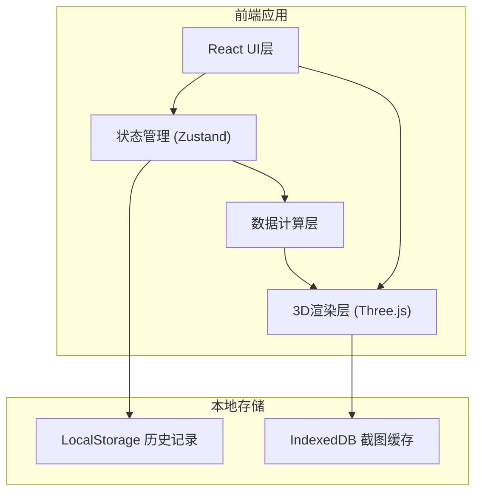
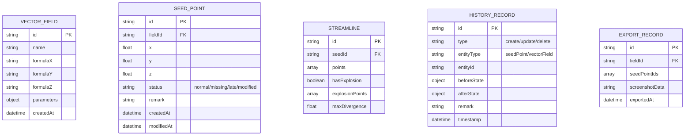

## 1. 架构设计



## 2. 技术描述

- 前端框架：React@18 + TypeScript + Vite
- 3D渲染：Three.js + @react-three/fiber + @react-three/drei
- 样式方案：TailwindCSS@3
- 状态管理：Zustand（轻量高效）
- 数据计算：自定义向量场积分器（Runge-Kutta 4阶）
- 本地存储：LocalStorage（历史记录）+ IndexedDB（截图）
- 后端：无，纯前端应用，数据本地持久化

## 3. 路由定义

| 路由 | 用途 |
|------|------|
| / | 主可视化页面（唯一页面） |

## 4. 数据模型

### 4.1 数据模型定义



### 4.2 核心类型定义

```typescript
interface Vector3 {
  x: number;
  y: number;
  z: number;
}

interface VectorField {
  id: string;
  name: string;
  formula: {
    x: string;
    y: string;
    z: string;
  };
  parameters: Record<string, number>;
  createdAt: Date;
}

type SeedPointStatus = 'normal' | 'missing_fields' | 'late_addition' | 'modified';

interface SeedPoint {
  id: string;
  fieldId: string;
  position: Vector3;
  status: SeedPointStatus;
  remark: string;
  createdAt: Date;
  modifiedAt: Date;
}

interface StreamlineData {
  id: string;
  seedId: string;
  points: Vector3[];
  hasExplosion: boolean;
  explosionRegions: { start: number; end: number; divergence: number }[];
  maxDivergence: number;
  dataGapRegions: { start: number; end: number; reason: string }[];
}

interface HistoryRecord {
  id: string;
  type: 'create' | 'update' | 'delete';
  entityType: 'seedPoint' | 'vectorField';
  entityId: string;
  before: Record<string, unknown> | null;
  after: Record<string, unknown> | null;
  remark: string;
  timestamp: Date;
}

interface ExportCorrespondence {
  field: VectorField;
  seedPoints: SeedPoint[];
  streamlines: StreamlineData[];
  screenshot: string;
  exportedAt: Date;
}
```
