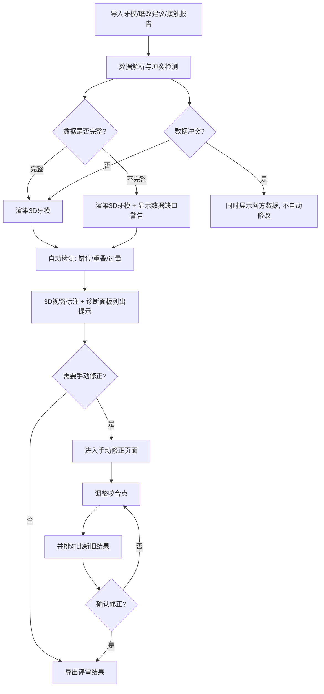

## 1. 产品概述

牙科咬合接触台是一款面向牙科技师的评审与讲解工具，用于可视化展示上下颌咬合接触关系、识别错位与重叠问题、对比磨改方案。核心价值：让上下颌错位、接触点重叠、磨改过量等关键问题一目了然，避免信息在传递中被模糊或篡改。

- 目标用户：牙科技师、口腔修复医生
- 核心场景：咬合评审会议、技师内部质量检查、医技沟通讲解

## 2. 核心功能

### 2.1 用户角色

| 角色 | 说明 | 核心权限 |
|------|------|----------|
| 牙科技师 | 主要操作者 | 导入数据、查看3D模型、手动修正咬合点、导出对比结果 |
| 口腔医生 | 评审者 | 查看3D模型、查看诊断提示、查看对比结果 |

### 2.2 功能模块

1. **咬合评审主页面**：3D牙模可视化、上下颌错位标注、接触点热力图、诊断提示面板、数据缺口警告
2. **手动修正页面**：咬合点手动调整、新旧结果并排对比

### 2.3 页面详情

| 页面名称 | 模块名称 | 功能描述 |
|----------|----------|----------|
| 咬合评审主页面 | 3D牙模视窗 | 显示上下颌3D模型，用颜色和标签区分上颌（暖色）与下颌（冷色），错位区域用醒目颜色高亮 |
| 咬合评审主页面 | 接触点热力图 | 在3D模型上叠加接触点热力图，重叠接触点用特殊标记（如脉冲动画环）标识 |
| 咬合评审主页面 | 诊断提示面板 | 右侧面板列出具体诊断提示，每条提示绑定到具体牙齿编号或材料名称，不使用模糊描述 |
| 咬合评审主页面 | 数据缺口警告 | 当输入数据不完整影响3D渲染时，在3D视窗旁显示醒目警告条，标明缺失的数据项 |
| 咬合评审主页面 | 输入面板 | 左侧面板支持导入牙模模型、磨改建议、接触报告三类输入 |
| 咬合评审主页面 | 材料冲突提示 | 当不同来源数据矛盾时，同时展示各方数据，不自动选择或修改口径 |
| 手动修正页面 | 咬合点编辑器 | 在3D模型上直接选中并拖拽调整咬合点位置 |
| 手动修正页面 | 新旧对比视图 | 修正后的咬合点与原始咬合点并排展示，差异区域用颜色渐变标注 |

## 3. 核心流程

牙科技师导入牙模数据→系统解析并渲染3D模型→系统自动检测错位/重叠/过量→在3D模型上用颜色+标签+动画标注问题→技师在诊断面板查看具体提示→如需修正，进入手动修正→调整咬合点→并排对比新旧结果→确认或继续修正

## 4. 用户界面设计

### 4.1 设计风格

- **主色调**：深灰底色（#1A1A2E）+ 医疗冷白前景，营造专业医疗仪器感
- **上颌标识色**：珊瑚橙（#FF6B6B），暖色系代表上颌
- **下颌标识色**：深海蓝（#4ECDC4），冷色系代表下颌
- **错位/警告色**：琥珀黄（#FFD93D）用于错位标注，鲜红（#FF3B3B）用于严重过量
- **重叠标记**：品红脉冲（#E040FB）带呼吸动画，视觉上不可忽略
- **字体**：DM Sans 作为UI字体，JetBrains Mono 用于牙齿编号和数据
- **布局**：左侧输入面板 + 中央3D视窗 + 右侧诊断面板，三栏布局
- **按钮风格**：圆角微3D（subtle shadow + hover抬升），主要操作用珊瑚橙填充
- **图标风格**：线性图标（lucide-react），统一2px线宽

### 4.2 页面设计概览

| 页面名称 | 模块名称 | UI元素 |
|----------|----------|--------|
| 咬合评审主页面 | 输入面板 | 左侧250px宽侧栏，卡片式输入区，拖拽上传区域，文件类型标签（牙模/磨改/报告） |
| 咬合评审主页面 | 3D牙模视窗 | 中央主区域，黑色渐变背景，模型支持旋转/缩放/平移，上方工具栏切换视图模式 |
| 咬合评审主页面 | 接触点热力图 | 3D模型叠加层，蓝→绿→黄→红色阶，重叠点品红脉冲环 |
| 咬合评审主页面 | 诊断提示面板 | 右侧300px宽面板，按严重程度分组，每条提示含牙齿编号+问题类型+具体描述 |
| 咬合评审主页面 | 数据缺口警告 | 3D视窗顶部横幅，琥珀色背景，标明缺失数据项和影响范围 |
| 咬合评审主页面 | 材料冲突提示 | 诊断面板内嵌区域，并排展示冲突数据，用分隔线和不同色标签区分来源 |
| 手动修正页面 | 咬合点编辑器 | 全屏3D视图，咬合点可拖拽，选中点高亮并显示坐标 |
| 手动修正页面 | 新旧对比视图 | 左右分屏，左侧旧结果（半透明灰调），右侧新结果（全彩），差异区域品红渐变叠加 |

### 4.3 响应式策略

- 桌面优先设计，最低支持1280px宽度
- 1366px以下：输入面板折叠为底部抽屉
- 移动端暂不支持（牙科技师工作站在桌面使用）

### 4.4 3D场景指引

- **环境**：深色工作室环境，微弱环境光，模拟牙科实验室观察灯
- **灯光**：主光偏暖白从上方45°照射，辅光冷白补底，模拟牙科操作灯
- **相机**：默认正前方45°俯视，支持自由旋转，预设"上颌俯视""下颌仰视""侧面"三个视角
- **交互**：鼠标左键旋转，右键平移，滚轮缩放，点击牙齿高亮并显示信息
- **后处理**：轻微泛光（bloom）使接触点热力图发光，增强视觉辨识度
