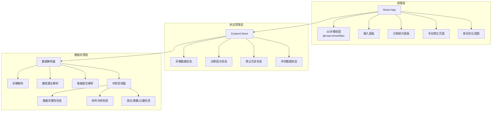
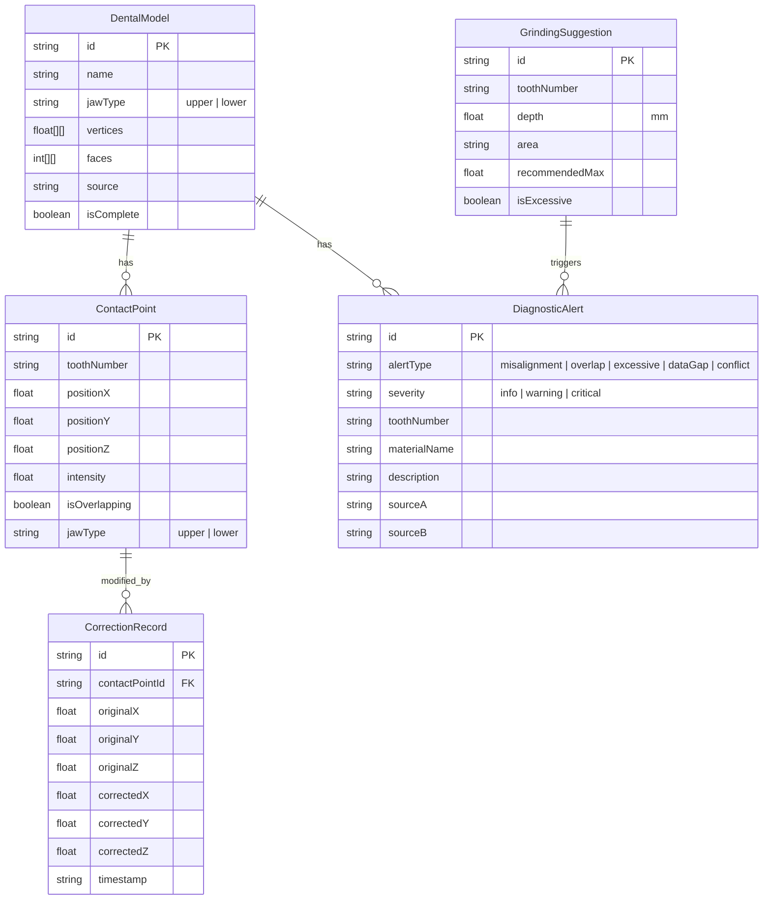

## 1. 架构设计

## 2. 技术说明

- **前端**：React@18 + TypeScript + tailwindcss@3 + vite
- **初始化工具**：vite-init（react-ts模板）
- **3D渲染**：three + @react-three/fiber + @react-three/drei + @react-three/postprocessing
- **状态管理**：zustand
- **路由**：react-router-dom
- **后端**：无（纯前端，使用模拟数据）
- **数据**：本地模拟数据，无数据库

## 3. 路由定义

| 路由 | 用途 |
|------|------|
| `/` | 咬合评审主页面：3D牙模视窗 + 输入面板 + 诊断面板 |
| `/correction` | 手动修正页面：咬合点编辑 + 新旧对比 |

## 4. 数据模型

### 4.1 核心数据模型定义

### 4.2 模拟数据说明

项目使用内置模拟数据，包含：
- 上颌+下颌各16颗牙齿的简化3D网格数据
- 8个接触点（含2个重叠点、1个错位点）
- 3条磨改建议（含1条过量建议）
- 对应的诊断提示数据
