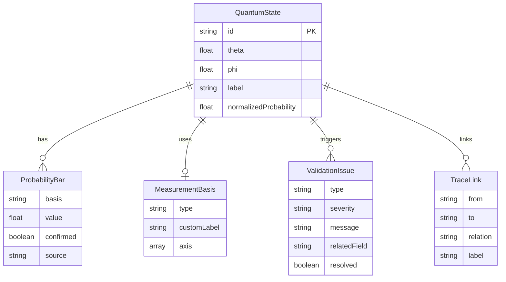

## 1. 架构设计

```mermaid
graph TB
    subgraph "前端层"
        "React App" --> "3D布洛赫球组件"
        "React App" --> "参数面板组件"
        "React App" --> "异常清单组件"
        "React App" --> "追溯面板组件"
        "React App" --> "数据输入组件"
    end
    subgraph "状态管理层"
        "Zustand Store" --> "量子态数据"
        "Zustand Store" --> "校验结果"
        "Zustand Store" --> "异常清单"
        "Zustand Store" --> "追溯链路"
    end
    subgraph "校验引擎"
        "概率归一校验" --> "异常清单"
        "相位越界校验" --> "异常清单"
        "测量基混淆校验" --> "异常清单"
    end
    "数据输入组件" --> "校验引擎"
    "校验引擎" --> "Zustand Store"
    "Zustand Store" --> "3D布洛赫球组件"
    "Zustand Store" --> "参数面板组件"
    "Zustand Store" --> "异常清单组件"
    "Zustand Store" --> "追溯面板组件"
```

## 2. 技术说明

- 前端：React@18 + TypeScript + Tailwind CSS@3 + Vite
- 3D渲染：Three.js + @react-three/fiber + @react-three/drei + @react-three/postprocessing
- 状态管理：Zustand（单store分slice，保证增量更新不覆盖已有判断）
- 初始化工具：vite-init
- 后端：无（纯前端，数据存储于内存/localStorage）
- 数据库：无（使用mock数据 + localStorage持久化）

## 3. 路由定义

| 路由 | 用途 |
|------|------|
| / | 主课件页（3D布洛赫球 + 参数面板 + 异常清单 + 追溯面板） |
| /input | 数据输入页（增量式量子态参数、测量基、概率条输入） |

## 4. 核心数据结构

### 4.1 量子态数据模型

```typescript
interface QuantumState {
  id: string;
  theta: number;
  phi: number;
  label: string;
  normalizedProbability: number | null;
  measurementBasis: MeasurementBasis | null;
  probabilityBars: ProbabilityBar[];
  validationStatus: ValidationStatus;
  traceLinks: TraceLink[];
  createdAt: number;
  updatedAt: number;
}

interface ValidationStatus {
  isNormalized: boolean | null;
  normalizationDelta: number | null;
  isPhaseInRange: boolean;
  phaseOverflow: number | null;
  measurementBasisConfusion: boolean;
  issues: ValidationIssue[];
}

interface ValidationIssue {
  type: 'UNNORMALIZED_PROBABILITY' | 'PHASE_OVERFLOW' | 'BASIS_CONFUSION';
  severity: 'error' | 'warning';
  message: string;
  relatedField: string;
  detectedAt: number;
  resolvedAt: number | null;
}

interface MeasurementBasis {
  type: 'computational' | 'hadamard' | 'circular' | 'custom';
  customLabel?: string;
  axis: [number, number, number];
}

interface ProbabilityBar {
  basis: string;
  value: number;
  confirmed: boolean;
  source: 'input' | 'calculated';
}

interface TraceLink {
  from: string;
  to: string;
  relation: 'parameter-to-result' | 'result-to-basis' | 'basis-to-parameter';
  label: string;
}
```

### 4.2 Zustand Store 结构

```typescript
interface BlochSphereStore {
  quantumStates: Map<string, QuantumState>;
  anomalyList: ValidationIssue[];
  selectedStateId: string | null;
  
  addQuantumState: (params: Partial<QuantumState>) => string;
  updateMeasurementBasis: (id: string, basis: MeasurementBasis) => void;
  updateProbabilityBars: (id: string, bars: ProbabilityBar[]) => void;
  validateState: (id: string) => ValidationStatus;
  getTraceForward: (id: string) => TraceLink[];
  getTraceBackward: (id: string) => TraceLink[];
  resolveAnomaly: (issueIndex: number) => void;
  selectState: (id: string | null) => void;
}
```

### 4.3 校验规则

| 校验项 | 条件 | 异常类型 | 严重级别 |
|--------|------|----------|----------|
| 概率归一 | |p0|²+|p1|² ≠ 1 (容差±0.01) | UNNORMALIZED_PROBABILITY | error |
| 相位范围 | φ ∉ [0, 2π) | PHASE_OVERFLOW | warning |
| 测量基混淆 | 多个测量基标记冲突 | BASIS_CONFUSION | error |

## 5. 数据模型

### 5.1 数据模型定义


