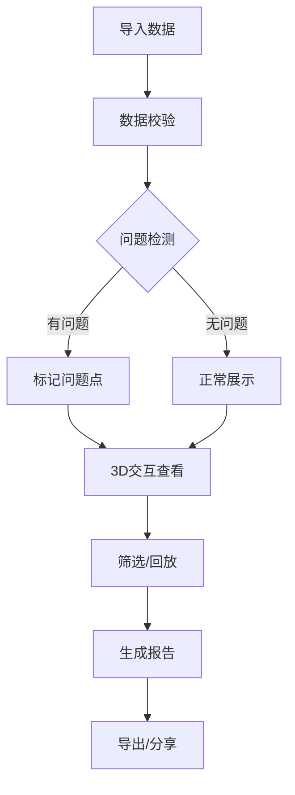

## 1. 产品概述
室内定位漂移地图是一款面向物联网工程师的Web3D可视化工具，解决蓝牙信标定位系统的质量验证问题。通过3D楼层模型直观展示定位轨迹、信号热力和设备状态，自动检测楼层串跳、信标重号、轨迹漂移等问题，并生成可分享的诊断报告。

- **目标用户**：物联网工程师、现场部署人员、项目验收人员、非技术管理者
- **核心价值**：将抽象的表格数据转化为直观的3D可视化，快速定位问题，生成可解释的验收报告

## 2. 核心功能

### 2.1 用户角色
| 角色 | 核心权限 |
|------|----------|
| 物联网工程师 | 导入数据、3D交互分析、导出报告 |
| 项目管理者 | 查看报告、问题统计、验收评估 |

### 2.2 功能模块
1. **3D主视图**：楼层模型可视化、定位轨迹展示、信标设备标记、旋转缩放交互
2. **侧边栏面板**：信号热力图、轨迹回放控制、筛选条件设置
3. **数据管理**：多源数据导入（楼层模型/定位轨迹/设备日志）、原始材料与处理结果区分
4. **问题检测**：楼层串跳检测、信标重号检测、轨迹漂移检测
5. **报告系统**：问题详情展示、截图导出、完整报告PDF生成、人话解释说明

### 2.3 页面详情
| 页面名称 | 模块名称 | 功能描述 |
|---------|---------|----------|
| 主界面 | 3D视口 | Three.js渲染楼层模型，支持鼠标旋转、缩放、平移，点击信标/轨迹点显示详情 |
| 主界面 | 左侧面板 | 信号热力图（2D俯视图）、楼层切换、时间筛选 |
| 主界面 | 右侧面板 | 轨迹回放控制条、播放/暂停/快进、问题列表 |
| 主界面 | 顶部工具栏 | 数据导入按钮、截图按钮、导出报告按钮、视图重置 |
| 主界面 | 底部状态栏 | 当前选中对象信息、数据统计、问题数量提示 |
| 导入弹窗 | 数据导入 | 拖拽上传、文件类型识别、数据预览、导入进度 |
| 报告预览 | 报告生成 | 问题汇总、3D截图嵌入、人话解释、一键下载 |

## 3. 核心流程

用户导入楼层模型、定位轨迹和设备日志数据后，系统自动进行数据校验和问题检测。工程师可以在3D视图中交互查看，通过侧边栏筛选条件同步控制热力图和轨迹回放。发现问题后可生成包含截图和人话解释的完整报告，供非技术人员理解验收。

## 4. 用户界面设计

### 4.1 设计风格
- **主色调**：深海蓝 (#0A1628) 作为背景，科技感青蓝 (#00D4FF) 作为主色，警示橙 (#FF6B35) 标记问题
- **辅助色**：轨迹绿 (#00FF88)、信号黄 (#FFD93D)、正常灰 (#6B7280)
- **字体**：标题使用 Orbitron（科技感），正文使用 Inter（易读性）
- **布局**：暗黑科技风格，深色背景配合霓虹光效，玻璃拟态面板
- **图标**：线性图标配合发光效果

### 4.2 页面设计概述
| 页面名称 | 模块名称 | UI元素 |
|---------|---------|--------|
| 主界面 | 3D视口 | 暗色背景、雾效、楼层发光边缘、轨迹渐变线、信标脉冲动画 |
| 主界面 | 侧边面板 | 半透明玻璃背景、模糊效果、圆角16px、内阴影 |
| 主界面 | 工具栏 | 悬浮按钮、hover发光效果、激活状态高亮 |
| 问题列表 | 问题项 | 问题类型图标、位置描述、严重程度标签、点击定位到3D视图 |
| 报告页 | 报告卡片 | 白色背景、问题图标、人话解释段落、3D缩略图 |

### 4.3 响应式
- Desktop-first设计，主视图占70%宽度
- 侧边栏可折叠，小屏幕自动变为底部滑出面板
- 触摸设备支持手势旋转和缩放

### 4.4 3D场景指导
- **环境**：深色空间，轻微雾效，科技感氛围
- **光照**：主方向光 + 蓝紫色环境光，楼层边缘自发光
- **相机**：透视相机，初始45度俯视角，支持轨道控制
- **交互**：鼠标悬停显示信息，点击选中高亮，双击聚焦
- **动画**：信标脉冲、轨迹线绘制动画、楼层切换过渡
- **后处理**：轻微Bloom发光效果，提升科技感
- **性能**：楼层模型使用简化几何体，轨迹线使用LineSegments

